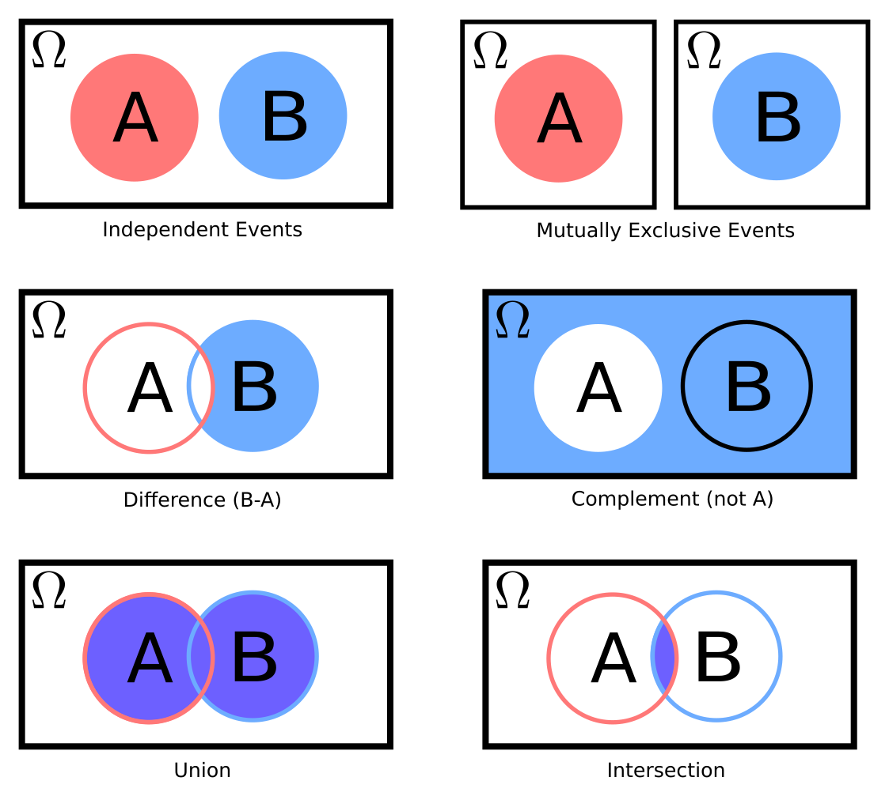
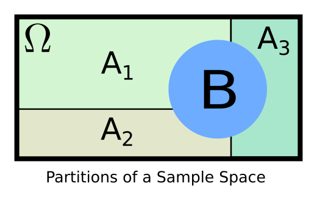

## Today
* Welcome to ProbRobo
* Probability Axioms (and Robotics)
* Day Activity

## For Next Time
* Complete the day activity for today's topics (Due Monday at 7PM): [Canvas Submission](https://canvas.olin.edu/courses/1002/assignments/17542)
* Complete YOGA: Initialization assignment (Due Monday at 7PM): [Canvas Submission](https://canvas.olin.edu/courses/1002/assignments/17537)

## Welcome
Welcome to the first iteration of _Probabilistic Robotics_. This is a class inspired by the broader field of intelligent robotics (referred to as "embodied intelligence" in modern writing), and focuses on how robots represent and interact with the messy, complex, and uncertain environments in which they find themselves. 

This class is intended to be an advanced algorithms course for robotic systems, and an applied introduction to probabilistic and statistical thinking. To further motivate this class, and set some ground rules for this semester, an introductory lecture with notes is provided [here](https://docs.google.com/presentation/d/1_jppam3AdlEDJVs64v4FJkvvowJL6GSP_NeY8L6qt6g/edit?usp=sharing).

## Probability Axioms (And Robotics)
Continuing with our [welcome lecture](https://docs.google.com/presentation/d/1_jppam3AdlEDJVs64v4FJkvvowJL6GSP_NeY8L6qt6g/edit?usp=sharing), today we'll be kicking off with a few _probability axioms and defining statistics_ -- fundamental formalisms, notation, and ideas that will start us off on our journey.

### Motivation for ProbStats in Robotics
At the highest level, let's imagine a robot as a sensory-motor loop.

A robot uses sensors to measure the world, and then uses actuators to interact with that world. The "magic" in intelligent robotics is the process by which sensor measurements get turned into useful work. Probability and statistics provide fundamental principles and processes by which robots "make sense" of measurements and translate them into motor commands. 

For instance, imagine a robot moving around a building. It is equipped with an inertial measurement unit (IMU) which provides streaming measurements of velocity. Handling this streaming data to get trends in the vehicle's motion, to estimate average speed and heading, and so on -- that's statistics. Going a step further and understanding that these measurements are noisy and imperfect, and thus we label how trustworthy we think those averages are -- that's probability.

Probability and statistics work very closely together in the field of robotics, especially as tasks for robots becoming increasingly complex compared to the sensing information a robot might have available to it to accomplish that tasks. For instance, let's take that same robot from earlier and give it a camera. We ask the robot to navigate to the mailroom on Olin's campus. Given IMU and visual information (pictures) alone, how does the robot conceptualize what a "mailroom" is? How does it plan a trajectory through the space it is in, given that it's never mapped the campus before? How does it know when it is on the right track? These are the types of questions we will explore through the lens of probstats in this class.

### The State-Action-Sense Framework for Intelligent Robots
When thinking about "smart" or "intelligent" robots and the sensory-motor loop, we will often invoke the idea of *states, actions, and perception (sensing)* to describe different conceptual features of how a robot "thinks" about the world and itself within that world.

**State** describes the state of the world and the robot in it. Example: imagine a mobile robot in a warehouse; state can describe the valid accessible areas of the warehouse to the robot, and the robot's location within that warehouse.

**Action** describes the abilities of the robot to affect change to state. Example: imagine that same warehouse robot; it can take actions like going forward, backward, turning, etc. (and if it is fancy, perhaps it has an arm, and it can pick and place objects).

**Sense** or perception describes the abilities of the robot to measure state and actions. Example: that same warehouse robot might have encoders on its wheels or a camera to see QR codes posted on the floor or other robots/people.

This framework is a useful _conceptual model_ for our robot's reasoning space; in this class, we're going to use probstats to also turn this into a useful _computational model_. 

### Sample Spaces, Events, and Partitions
Callback to ModSim: probability and statistics are fields related to abstracting the world around us into atomic forms that we can perform work over (i.e., computation). Thus, we first need to become acquainted with the language we'll be using to express the world (or robot, or actions):

**Sample Space**: (aka outcome space, possibility space) the set of all possible outcomes or results of an experiment or random trial. Example: Imagine a door-opening robot. Let's assume it makes an attempt to open a door (the experiment). Then the sample space is the set of all possible states the world could be in after a robot attempts to open a door (e.g., {door closed, door open, door ajar}).

**Event**: a specific outcome of an experiment.
Example: Take our door-opening robot again; an event would be "door closed" following an attempt at door-opening.

**Partition**: a way of dividing the sample space (and/or event). Partitions express subsets of a sampling space. Importantly, partitions are typically defined to be non-overlapping. Example: Imagine our door-opening robot once again. We might partition the sampling space into "closed" and "open" subsets, with the closed partition including the "door closed" event, and the open partition including the "door open" and "door ajar" events. 

In a classical probability class, you might learn about these topics with respect to a population, since this is easy to conceptualize. Let's try that here:

* **Exercise**: Imagine the whole Olin student population; draw partitions representing class years. Then represent the event "taking ProbRobo this semester."

Of course, we're not a classical probability class, so let's think about a robotics scenario and how we might define a sampling space, partition, and event:

* **Exercise**: Imagine a robot manipulator affixed to a table with 3 blocks, 2 apples, and a bin in front of it. Assume it knows that these objects exist in the world, but not exactly where they are. Assume the robot is equipped with a camera and a machine vision algorithm that can classify objects and roughly determine their pose in the world (but that is a noisy measurement). Further, assume that the robot is equipped with a sufficient controller to move the arm to intended locations, but it is imperfect. The robot is tasked with picking up an object and placing it in the bin. For this task, what are some possible sampling spaces we could be operating in? Pick one of those sampling spaces, and define a useful partition over that space (you may argue that there is not a useful partition for the sampling space you chose, but it must be justified). Where might an event in your sampling space appear amongst your partitions?  

Some further properties and aspects on notation:

* A sample space in probability theory may be referred to as $$S$$, $$\Omega$$, or $$U$$ (the latter representing the universal set). Importantly for this class, the sample space should be represented by a capital letter, and should always be defined as the variable representing the sample space when expressing your formalisms.
* An event is a sample of a sample space, such that $$E \in \Omega$$. All events contained in a sample space must be _mutually exclusive_ -- that is, an event must be distinct.
* Partitions are subsets of the sampling space, such that $$A \subset \Omega$$. They have the following properties:
  * $$A_i \neq 0 \forall i$$
  * They are pairwise disjoint (mutually exclusive)
  * All partitions together form the sampling space, $$\Omega$$

### Set Theory
Now we have a way of expressing some environment/robot, what can we _do_ with this formalism (asked another way, what does expressing the world like this afford us)? In this case, at least one useful thing is unlocked for us: set theory (for those of you who have taken Discrete this might be a review).

**A Set** is simply a well-defined collection of elements (called members). Examples: $$\{0, 1, 2, 3\}$$ is a finite set of integers, $$\{hello, greetings, howdy\}$$ is a finite set of strings (that semantically refer to salutations). Sets are the mathematical generalization for lists or tuples; they are more generic than vectors in that they can encode pieces of data that are not strictly numeric.

In _set theory_ we can treat a set as a variable, and perform operations on the set itself, and elements within the set. Operations can be logical or algebraic in nature. Indeed, this is good news, because if we're going to be using this notation to describe the world, we would like it to be able to express some of the complexities about that world -- that's where operations come in. Some common ones we might encounter include:

* Union: $$A \cup B$$ expresses elements that are in both $$A$$ and $$B$$ sets. Example: $$\{0, 1, 2\} \cup \{2, 3, 4\} = \{0, 1, 2, 3, 4\}$$. Notice that elements are not duplicated if shared.
* Intersection: $$A \cap B$$ expresses elements that are shared between both $$A$$ and $$B$$ sets. Example: $$\{0, 1, 2\} \cap \{2, 3, 4\} = \{2\}$$. In the event of no intersection, the result is the _null_ set (an empty set).
* Difference: $$A - B$$ expresses elements that are _only_ in $$A$$. Example: Example: $$\{0, 1, 2\} - \{2, 3, 4\} = \{0, 1\}$$.
* Complement: $$\neg A = \Omega - A$$ where $$\Omega$$ expresses all elements in a sampling space at the exclusion of set $$A$$.
* Mutual Exclusion: $$A \cap B = \{\mathbf{\emptyset\}}$$. This is when two sets have no intersecting elements. 

As we've basically already seen, we can think of our sample space as a set $$\Omega$$, and elements within this set are events. Partitions are sub-sets of our sample space. 

**Set Functions** In addition to the standard operators, functions can be applied on sets as well. _Set functions_ follow specific rules, the understanding of which could be several lectures in itself, but suffice to say the following: set functions yield a real-valued number, representing a _measure_, over a set. In math-speak, a measure is a notional attribute, such as volume, area, magnitude, mass, or (spoilers) probability. So a set function is a way of "measuring" a set with respect to an attribute. You might see set functions noted as $$\mu(E)$$ in textbooks or online resources.

### Defining Probability
Sets are statements about the world; how do we evaluate their truth or their ability to come to pass? Enter probability. Formally, probability is a set function whose outcome is a numerical indicator of how likely (probable) the input set of events is to occur. We will denote taking a probability as $$\mathcal{P}(\Omega)$$, which can be read as "the probability of events in $$\Omega$$". 

You have almost certainly encountered probability for discrete events before. For instance, how would you express the probability of a fair die rolling a 5? 

* Sampling Space: $$\Omega = \{1, 2, 3, 4, 5, 6\}$$ representing the space of all valid rolls of a die
* Event: $$E=5$$ representing the outcome of rolling a five
* Probability: $$\mathcal{P}(E) = 1/6$$ representing that there is a 1 in 6 chance of rolling a 5 on a fair die.

By treating probability as a function, we can express more complicated ideas mathematically: what is the probability that on 10 rolls of a fair die, the outcome is 5 every time? What is the probability that a fair die rolls a 6 and a fair coin flip at the same time lands on tails? 

To do this, it is useful to keep in mind the following rules:

* Probability of independent events: if $$A \cap B \neq \{\mathbf{\emptyset}\}$$ and these events can happen at the same time, then $$\mathcal{P}(A \cap B) = \mathcal{P}(A)\mathcal{P}(B)$$. 
* Probability of complements: $$\mathcal{P}(A) = 1-\mathcal{P}(\neg A)$$
* Probability of mutually exclusive events: if $$A \cap B = \{\mathbf{\emptyset}\}$$ and these events cannot happen at the same time, then $$\mathcal{P}(A \cap B) = 0$$ and $$\mathcal{P}(A \cup B) = \mathcal{P}(A) + \mathcal{P}(B)$$.
* Probability of not (necessarily) mutually exclusive events: $$\mathcal{P}(A \cup B) = \mathcal{P}(A) + \mathcal{P}(B) - \mathcal{P}(A \cap B)$$ 

As an exercise in the day activity you'll be asked to examine these claims more closely. 

* **Exercise**: Answer those seemingly rhetorical questions above (i.e., what is the probability that on 10 rolls of a fair die, the outcome is 5 every time? What is the probability that a fair die rolls a 6 and a fair coin flip at the same time lands on tails?). What rules are you using, and why? What do you notice about the outcomes? 

Of course, we're ultimately interested in expressing very, very complicated ideas in the language of probability: what is the probability that there is a dead-end around this corner of a building? What is the probability that this is the right place to grab an object to successfully lift it off the table? 

We're going to get there, but first, we need to start to set some ground rules about how probabilities work. Cue the _axioms of probability_.

### Probability Axioms
For probability to provide a meaningful numeric measurement about how probable a given event is to occur, the function must be bounded and characterized. There are three common axioms used to define the valid space for probabilities (initially developed by Andrey Kolmogorov in the 1930s, with some modern interpretation of the third):

**Axiom 1 (Non-Negativity)**: $$\mathcal{P}(A) \geq 0 \text{ }\forall \text{ } A \subset \Omega$$

**Axiom 2 (Normalizaton)**: $$\mathcal{P}(\Omega) = 1$$

**Axiom 3 (Countable Additivity)**: $$\mathcal{P}(A \cup B) = \mathcal{P}(A) + \mathcal{P}(B) \text{ if } A \cap B = \{\mathbf{\emptyset}\}$$

With these axioms, we can make the following observations:

* Numeric probabilities fall within the range of 0 and 1.
* In a given sampling space, the probability of discrete events needs to sum to one. This also implies that events have reciprocal events to balance them (the probability of "A" and the probability of "not A" must sum to 1).
* The probability of the null (or empty) set is 0; it is impossible that nothing occurs. 

### Wait...what about Statistics?
We've talked a lot about probability, but what about this whole statistics thing? 

Statistics is the science of collecting, organizing, analyzing, interpreting, and presenting of data. As the description implies, statistics is a far-ranging field. Where statistics and probability intersect is in the analysis and interpretation phases. Often, our data is imperfect in some way -- on a robot, a sensor is never noiseless, for instance. If we were to use the data directly, without accounting for the fact that there is noise, we might draw misleading or biased conclusions. We can use _probabilistic models_ of the behavior of our sensors to account for this, and _infer_ the answer to our particular queries.

For instance, say we're looking at wheel encoder data to guess how far the robot has moved. If we just naively aggregate these measurements, without considering noise, we will have a potentially large over-estimate of the distance the robot has travelled. Using a model of our noisy wheel encoder measurements to guess how much each measurement was corrupted, we can estimate the true distance the robot traveled under perfect-sensing conditions.

We'll be talking about this a lot more in coming classes -- stay tuned!

### Today's "So What"
So, what does the fact that a probability is a set function with certain properties mean for us? 

Well, we can rely on probability to be a _measure_ over events in a sampling space; which means that wherever we can define our sampling and event spaces, our probability will be meaningful. The upshot of this: **as a robot, we can use probabilities to help us make decisions about actions to take or places to go; probabilities are _informative_, and can allow us to distinguish between all the options laid out in front of us for how the world might work or how successful our interactions with the world might be**.

### Going Beyond
To learn more about the topics that we discussed today, you are invited to use our class resources. The following books and chapters are applicable:
* Chapter 1 of _Probabilistic Robotics_ by Thrun, Burgard, and Fox for motivation of prob-stats use in robotics
* Chapter 13 of _Principles of Artificial Intelligence_ by Russell and Norvig for a treatment of probability with respect to intelligent systems.

## Day Activity
For today's activity, we'll be practicing with and exploring the concepts we just discussed. Please submit a neatly handwritten response (please scan it!) to all questions provided here. While everyone will turn-in an individual assignment, collaboration is encouraged! Please note down who you worked with during this assignment to practice appropriate attribution and acknowledgement.

### Problem 1: Recap of Today's Notes
Go back through today's written notes on this page and work through each of the exercises / be sure to document your answers to the exercises discussed in class (there should be a total of 3 exercises in today's notes).

### Problem 2: State-Action-Sense
Pick a robot that you've encountered in the real-world -- a self-driving car, a warehouse robot, a roomba, an automated HVAC system, etc. (feel free to be creative!). Please be specific when working through this problem, you may need to do some research about your robot (please cite your sources). We're going to define (in plain language) the state-action-sense framework for your robot. 
* **Part 1 Scenario/Task Set-up**: Describe a scenario your robot may find itself in or a task it might be assigned. We're aiming to set the context for your state-action-sense framework in the next parts of this problem.
* **Part 2 State Definition**: Define/Describe the environment that the robot is in (the "world state"). You might approach this problem by defining the whole of the natural world first, and identifying the relevant elements of the natural world to your robot's context (callback to Tenchi Diagrams in ModSim). Define where in this world your robot is situated (the "robot state").
* **Part 3 Action Definition**: Define/Describe the actions that the robot can take. Start atomically -- what actuators/manipulators does the robot possess? With what parts of the world can/do those actuators interact with? End generally -- what are high-level actions that the robot can take within the world (e.g., pick up a block, drive down a hallway)? 
* **Part 4 Sense Definition**: Define/Describe the senses that the robot has. What sensors does the robot possess? What parts of the world or robot do those sensors measure? Be sure to define the type of data that the measurements are (scalar numbers, discrete values, images). 
* **Part 5 Evaluating Scenario/Task Challenges**: Given your state-action-sense definition for your robot, consider the original scenario/task context that you provided, and answer the following:
  * Does your robot possess "complete" or "incomplete" sensing for your task/scenario? Complete sensing means that the robot, through its sensors, can measure every relevant aspect of the world/itself in order to execute its task. If it is incomplete, what aspects are "unseen" by the robot?
  * What elements of your robot might be impacted by noise? How might this impact task performance?

### Problem 3: Sample Spaces and Events for Robots
For the robot and state-action-sense framework you just developed, map the concepts of sample spaces, events, and partitions. 
* **Part 1**: Break down the task/scenario definition -- what is a sampling space that the robot may encounter? You might find it useful to think about a sampling space as an "outcome" space attached to actions that the robot can take. When the robot takes an action in this task/scenario, what is the list of all possible outcomes?
* **Part 2**: Part 1 suggests this next part: list the "events" associated with this sampling space -- relate this to the actions of the robot. Do actions and outcomes map one-to-one in your scenario, can different actions lead to the same outcome, or can different outcomes come from the same action? Pay attention to the assumptions you might be making when performing your event-action mapping and list this explicitly.
* **Part 3**: Finally, how does your robot assess the outcome that results from an event? Develop a map of outcome-sensing for your robot. What are the consequences of imperfect, noisy, or incomplete sensing for outcome assessment?

### Problem 4: Utilizing the Probability Axioms
(Problem Inspired from Frank Daellart's _Robotics Book_) Let's imagine a robot tasked with sorting salvage for recycling. It is set up to recieve objects on a conveyor belt and exists as a large manipulator arm with a camera and joint encoders. When a piece of salvage arrives on the conveyor belt, the robot must sort the salvage accordingly: metal, plastic, organic, composite, and toxic. 

On a representative day, the robot encountered the following:
* 100 pieces of metal
* 230 pieces of plastic
* 73 organics
* 20 composites
* 5 toxic materials

Define the state-action-sense framework for this robot (basic description is OK!). The sampling/outcome space for this robot is defined by the type of salvage that the robot encounters for any particular sorting event. Define the _probability distribution_ over this outcome space (hint: you'll want to use the representative quantities provided for this...). Show that your probability distribution is valid (by using the probability axioms). 

