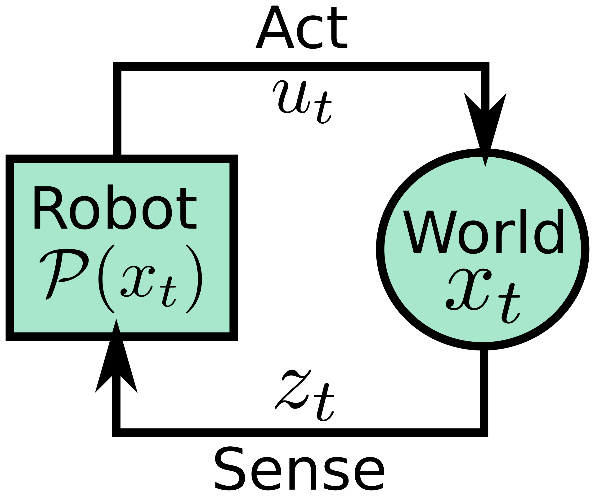
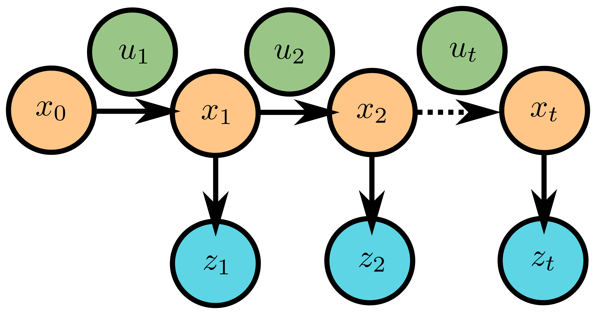

## Today
* The Many Philosophies in Statistics
* Bayesian Estimation
* Day Activity

## For Next Time
 * Complete the day activity for today's and Monday's topics (Due Monday at 7PM): [Canvas Submission](https://canvas.olin.edu/courses/1002/assignments/17543)
* Finish the out-of-class simulation assignment (Due Monday at 7PM): [Canvas Submission](https://canvas.olin.edu/courses/1002/assignments/18319)

## The Many Philosophies of Probability and Statistics
Like most academic fields, probability and statistics contains many branching philosophies that define different assumptions about the world and approaches unique to those assumptions. In engineering disciplines, control theory is a great example of a field with many branches: classical controls, learning-based controls, model-free, and model-based methods all abound, and all could be the topic of your first introductory controls class and be perfectly valid.

In probability and statistics, modern branches or definitions include:
* Descriptive Statistics (population properties, data mining)
* Inferential Statistics (estimation, hypothesis testing)
* Axiomatic Probability (Kolmogorov's axioms)
* Classical Probability (chances, countable outcomes)
* Empirical/Experimental Probability (experiments, data mining)
* Subjective Probability (vibes)

In this class, we will be leaning heavily onto Inferential Statistics, and leveraging elements of all the different branches of probability. In particular, we will be heavily influenced by the theory contained within the subfield of _Bayesian Statistics_, which we will be introduced to today.

Bayesian Statistics or Bayesian Estimation is named for Thomas Bayes, a mathematician in the 18th century who initially formulated what we would recognize today as "Bayes Rule" or "Bayes Theorem" (see the next section!) which lies at the heart of this theoretical branch of statistics. Pierre-Simon Laplace (yes, that Laplace) made common use of "Bayesian" methods in his statistical analyses. Interestingly, Bayesian methods really only fell into common use starting in the 1950s, when computing finally caught up to the theory (as we'll see today, doing Bayesian statistics by hand would be...a real pain). And roboticists started rapidly adopting this framework in the 1990s and early 2000s, helped along with the initial investment in self-driving technologies and the first "intelligent robots" challenges.

## Bayesian Estimation
At the heart of Bayesian estimation is Bayes Rule or Bayes Theorem, stated simply as thus:

$$\mathcal{P}(A \vert B) = \frac{\mathcal{P}(A,B)}{\mathcal{P}(B)} = \frac{\mathcal{P}(B \vert A)\mathcal{P}(A)}{\mathcal{P}(B)}$$

This section of notes is going to breakdown each section of this rule and provide some intuition for what this theorem is saying.

### Conditional Probabilities (Revisited)
Bayes Theorem is a method for computing a conditional probability: the probability of event A given event B. In many situations, this conditional probability is not necessarily obvious to compute; and this Bayes Rule gives us a way to compute this probabilty given knowledge of event B (which is typically more accessible to us) and an estimate for the probability of A without any context (something that is also typically more accessible to us, in a naive way). 

Take for example our warehouse robot localization problem again:
* _What is the probability that our warehouse robot is in aisle 17?_ This statement is known as our _prior_, and is expressed as $$\mathcal{P}(A)$$. In this scenario, assuming we know nothing, we might simply give this the probability of 1 over the total number of aisles in the warehouse (fun fact: this is known as the uninformative or uniform prior).
* _What is the probability that our robot sees a sign with the marker "17" in it, given that it is in Aisle 17?_ This statement is known as our _likelihood_ and is expressed as $$\mathcal{P}(B \vert A)$$. This statement forces us to consider how reliable our sensor model is. In this case, our "event B" is "observing a sign with a "17" in it" and out event A remains "being in Aisle 17". In general, knowing how well our sensor works under different conditions is accessible to us through testing and data collection.
* _What is the probability that our warehouse robot is in aisle 17, given that it sees a sign with the marker "17" in it?_ This is ultimately what we're trying to find; it is known as the posterior and is expressed as $$\mathcal{P}(A \vert B)$$. Since we have information from our sensor, and we know how well our sensor works, the aim is that our posterior estimate is _more informative_ than our prior estimate (which is typically uninformed). Thus, Bayes Rule gives us the ability to _update_ the belief about our state from sensor observations!
* _What is the probability of any given sensor observation?_ This statement is our _normalizing factor_ in Bayes Rule, expressed $$\mathcal{P}(B)$$ and simply ensures that whatever probabilities we compute follow our probability rules (that they normalize to 1).

### The Prior and the Posterior
Bayes Theorem can be viewed as an _update_ function -- we have some _prior_ over the event we want to compute the probability of, and we have some context that allows us to compute a _posterior_ over that same event. 

**Prior Probabilities** encode our (typically naive) understanding of the world. In our warehouse example, this is the straight-up probability of being in aisle 17 (with no other assumptions or knowledge about our robot's situation). Prior probabilities can be completely "uninformative" or can potentially encode some of our prior knowledge (prior bias) about the world in an intial guess. But the prior really is just a guess.

**Posterior Probabilities** reflect that some knowledge about the event has been gathered (e.g., a measurement has been made or experiment conducted) that can be informative to our understanding of the probabilty of our target event. In our warehouse robot, this is the probability that our robot is in aisle 17 given that the robot has made an observation of a sign in its vicinity. A posterior _iterates_ on our prior given some context.

Since Bayes Theorem is iterative, after the robot has drawn one observation and computed a posterior probability, that posterior can become the new prior, another observation collected, and a new posterior computed. This iterative nature of the algorithm can be very powerful in a robotics context, since we might be streaming hundreds of observations a minute, each of them helping to shape our understanding or belief about the robot's state.

### The Likelihood
The likelihood encodes our knowledge about how our sensors or actuators actually function -- you can think about this as a "trust" weighting function for our update. The likelihood is written as the probability of a particular observation given some true state of the world. For instance, let's say our camera is extremely flaky on the robot -- this likelihood function can be used to dampen how much we trust any single observation when updating our prior to our posterior. The opposite is also true -- if we had a magical sensor that was never wrong, than our likelihood will enhance our trust in a single observation and allow the posterior to be quite different from our prior.

Importantly, the likelihood is something that we can have direct access to, because it is something we can characterize through experimentation or reasonable models of our sensors or actuators. 

### Normalization with Marginalization
If we multply the likelihood by the prior, we are unlikely to get a "valid" probability out -- it will be some number that is proportional to a probability though. Bayes Rule accounts for this by including a "normalization" term, which requires us to _marginalize_ over the observation drawn under all possible scenarios (notice that this is a formula we've seen before!):

$$\mathcal{P}(B) = \sum_i\mathcal{P}(B \vert A_i)\mathcal{P}(A_i)$$

The basic idea here is that we want to ensure that for the observation we've taken, we consider how probable that observation was under any given scenario; this provides us with a way of normalizing the probability of any particular event given that self-same observation.

### Practicalities
As you might suspect, computing the denominator (the normalization term) can get challenging pretty quickly in even relatively small, discrete worlds. Thus, it is typical that when Bayes Rule is invoked, we simply compute the numerator:

$$\mathcal{P}(A|B)\propto \mathcal{P}(B|A)\mathcal{P}(A)$$

But beware! When we make this simplifying assumption for the sake of computation, _we are no longer dealing with valid probability measures_. We can still use these measures to distinguish between probable and improbable outcomes, but we should not conflate this measure as a probability itself.

### Applying Bayes Rule to A Door Opening Robot
Ok, let's try this out on a robotics problem with sensing and action commands. For those who would like, there is a [slide deck version of this discussion that can be viewed here](https://docs.google.com/presentation/d/1lS9RCEloLIBdDwG-l4k-tIiAbqZ6GUvaNGOhXD-9p9o/edit?usp=sharing). To do this, there is one extension of Bayes Rule I want to present (which will allow us to incorporate both our Sense and Action spaces):

$$\mathcal{P}(A|B,C) = \frac{\mathcal{P}(B|A,C)\mathcal{P}(A|C)}{\mathcal{P}(B|C)}$$

**Philosophy and Simplifying Assumption**

Recall that our robot interacts with a world, which has some state $$x_t$$. Our robot can affect the world by taking actions, $$u_t$$ or sense the world by taking measurements $$z_t$$. By interacting with the world, the robot can update its _belief_ about the world, which we represent as a probability distribution over possible states, $$\mathcal{P}(x_t)$$.

A robot is typically interacting _sequentially_ with the world, iteratively taking actions and drawing measurements. Under this sequential model, we make a _Markov assumption_ -- essentially, that the current state of the world is only depends on the most recent state of the world and the most recent action taken within that world. This Markov assumption means that the robot doesn't need to carry its entire history in memory and re-compute from square 1 an estimate of the state of the world; instead it can iteratively compute a new estimate from its previous estimate and new context that it collects. This Markov assumption is very common in robotics, and is also what will allow us to utilize Bayesian estimation tools effectively!

**Problem Setup**
Imagine that we have a robot that can (attempt) to open doors, and (attempt) to measure the state of a particular door. In this world, the door is either closed or open, and we don't have any particular idea where this world starts:

$$x_t = \{0 \text{ or } 1\} \text{ is our state space}$$
$$\mathcal{P}(x_0) = 1/2 \text{ is our prior probability}$$

Naturally, our robot can't directly or perfectly sense the state of the world, but it does have a noisy sensor and a noisy actuator it can use to guess the state of the world. Our robot's sensor (determined from experimentation) has the following properties:

$$\mathcal{P}(z_t = 1 \vert x_t = 1) = 3/5 $$
$$\mathcal{P}(z_t = 1 \vert x_t = 0) = 1/5 $$

Note: there are two other terms to our sensor model that aren't written down here...what are they?

Our robot's actuator has the following characteristics:

$$\mathcal{P}(x_t = 1 \vert x_{t-1} = 0, u_t = 0) = 0 $$
$$\mathcal{P}(x_t = 1 \vert x_{t-1} = 1, u_t = 0) = 1 $$
$$\mathcal{P}(x_t = 1 \vert x_{t-1} = 0, u_t = 1) = 4/5 $$
$$\mathcal{P}(x_t = 1 \vert x_{t-1} = 1, u_t = 1) = 1 $$

Note: there are four other terms in our actuator model that aren't written down here...what are they?

**Probability Question** I now pose the following question: _what is the probability that the door is open, given that the robot observes that it is open and has taken no action?_

$$\mathcal{P}(x_1 = 1 \vert z_1 = 1, u_1 = 0) = \text{ ?? }$$

**Approach Using Bayes Rule** Let's start by setting up our Bayes Rule implementation, which just follows the general pattern for Bayes Rule with two conditions:

$$\mathcal{P}(x_1 = 1 \vert z_1 = 1, u_1 = 0) = \frac{\mathcal{P}(z_1 = 1 \vert x_1 = 1, u_1 = 0)\mathcal{P}(x_1 = 1 \vert u_1 = 0)}{\mathcal{P}(z_1 = 1 \vert u_1 = 0)}$$

Now, let's take this one piece at a time, and substitute in what we know, starting with our _observation model_ or _likelihood_:

$$\mathcal{P}(z_1 = 1 \vert x_1 = 1, u_1 = 0) = \mathcal{P}(z_1 = 1 | x_1 = 1) = 3/5$$

This portion of our system is pretty straightforward -- we can nearly read it off our starting conditions! But there is one key thing we did here to help us: we realized that our observation was independent of our action; our action has no bearing on what is observed, allowing us to completely ignore that term in our conditional probability statement.

Now, let's pay attention to our _action model_ or _prior_:

$$\mathcal{P}(x_1 = 1 \vert u_1 = 0) = $$
$$\text{apply Markov assumption: } \mathcal{P}(x_1 = 1, x_0 = 1 \vert u_1 = 0) + \mathcal{P}(x_1 = 1, x_0 = 1 \vert u_1 = 0) = $$
$$\text{rearrange with conditional rules: } \mathcal{P}(x_0 = 0 \vert u_1 = 0)\mathcal{P}(x_1 = 1 \vert x_0 = 0, u_1 = 0) + \mathcal{P}(x_0 = 1 \vert u_1 = 0)\mathcal{P}(x_1 = 1 \vert x_0 = 1, u_1 = 0) = $$
$$\text{plug in from our model: } 1/2 \times 0 + 1/2 \times 1 = $$
$$\text{solve: } 1/2 $$

This portion is a little trickier, but we can use the Markov assumption to help us out and add back in our prior state -- since our current state is going to be contingent on our action and what the state of the world _was_ when we started. We expand our probability statement to include what our prior state could have been. From there, we just re-arrange the terms until we get something that we can plug in directly: our prior probability on state and our action model.

And so, our final probability (with some normalizing factor $$\mu$$) is simply:

$$\mathcal{P}(x_1 = 1 \vert z_1 = 1, u_1 = 0) = \mu \times 3/10$$
or 
$$\mathcal{P}(x_1 = 1 \vert z_1 = 1, u_1 = 0) \propto  3/10$$

**Exercise:** what is our normalizing constant $$\mu$$? Hint: the probability of $$x_1 = 1$$ and $$x_1 = 0$$ needs to sum to 1.

### Today's So What
**Bayes Rule gives us a principled way of using our Sense and Act models of our robot to estimate that robot's (or the world's) State.** This is EXCITING because our Sense and Act models are something that we can typically get to know pretty well (as in, we can characterize effectively). **It also means that we now have an _incremental_ or _iterative_ way to update our State estimate as more measurements and/or more actions are taken, without needing to retain an entire history of observations and actions.** We'll talk more about the implications of this latter idea next time, but for now, understand that Bayes Rule is giving us a relatively "cheap" way to estimate the state of the world that is bounded by our probability rules, meaning that this estimate is principled and meaningful. 

## Day Activity
For today's activity, we'll be reviewing the last two classes of notes and finishing our in-class example.

### Problem 1: Recap of Today's Notes
Finish the door-opening robot problem from today by computing the _normalized_ probability of different events, and then compute the probability $$\mathcal{P}(x_2 = 1 \vert z_1 = 1, z_2 = 1, u_1 = 0, u_2 = 1)$$. You might find the additional notes in the slides helpful for this! (hint: the answers are given there, to help you calibrate your approach - and don't forget the Markov assumption!)

### Revisit Monday's Activity and Work on the Simulator Assignment
Take some time to revisit our trash-sorting robot activity from last time; there is nothing special to turn in on this part for today's activity -- just be sure to turn in your Monday activity in full! 

And once you're satisfied with that assignment, please do get started or continue working on the simulator assignment -- let us know if you have any questions!

