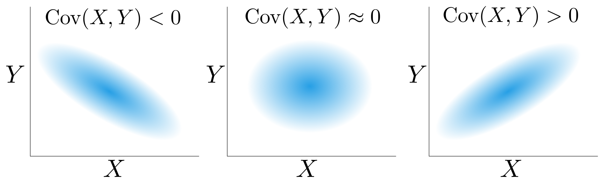

## Today
* Sensing Noise and Covariance
* Day Activity

## For Next Time
* Due Today
  * Last Week's Day Activities: [Canvas Submission](https://canvas.olin.edu/courses/1002/assignments/17543)
  * The out-of-class simulation assignment (Due Monday at 7PM): [Canvas Submission](https://canvas.olin.edu/courses/1002/assignments/18319)
* Due In The Future
  * Complete the day activity for today's topics (Due next Monday at 7PM): [Canvas Submission](https://canvas.olin.edu/courses/1002/assignments/18359)

## Sensing Noise and Covariance
Last time we were introduced to Bayes Rule:

$$\mathcal{P}(A \vert B) = \frac{\mathcal{P}(B \vert A)\mathcal{P}(A)}{\mathcal{P}(B)}$$

which is a helpful formula/algorithm to help us compute the probabilty of an event conditioned on some observable/knowable context. In a robotics context, we saw this formula take the form:

$$\mathcal{P}(x_t \vert z_t, u_t) = \frac{\mathcal{P}(z_t \vert x_t, u_t)\mathcal{P}(x_t | u_t)}{\mathcal{P}(z_t | u_t)}$$

where $$x_t$$ is some state of the world (that we would like to infer), $$u_t$$ is an action that the robot takes, and $$z_t$$ is some observation that the robot measures. 

In general, the actions and senses of our robot are imperfect either due to noise, error, or _partial observability_:

* **Noise** captures the notion that our ability to measure some signal about the world is ultimately corrupted in some way; electrical imperfection, sensor manufacturing defects, time response of an electrode, etc. are all real phenomena that can lead to a noisy signal. When our measurements are noisy, then for any instantaneous observation, there is some amount of skepticism necessary during interpretation.

* **Error** captures the notion that sometimes our measurements are _wrong_ in a fundamental way. Whereas noise assumes that under perfect conditions the measurement or action is correct, error implies that even under ideal circumstances the measurement or action is not a true reflection of reality. For instance, a constant offset in a sensor measurement or improperly tuned motor controller can produce error.

* **Partial Observability** captures the notion that what the sensors are measuring is not a direct interpretation of the state of the world. For instance, a Lidar can provide metric information about the physical proximity of objects around the sensor, but it can't read signs, tell us what the objects actually are, or provide a notion of color or even necessarily see all the possible structure that there is to see (due to range or resolution limitations). 

Today, we'll briefly discuss _noise_ as it pertains to the inference methods that we've been developing so far; this is going to be something that we will also be discussing in further detail on Thursday.

### Modeling Noise
We've been discussing the state-action-sense framework for conceptually modeling a robot, and Bayesian inference as a way of computationally leveraging that model to infer the real state of the robot at any point in time. 

As we all might recollect from ModSim, _all models are wrong and some are useful_ (paraphrased from statistician George Box). Our models for our robot are approximate, but we can add strategic sophistication to our model to make it more useful (utility, in our case, is converging to an accurate estimate of the real world state as quickly as possible). 

One common way to add sophistication to our model is capturing sensor and process noise -- perhaps one of the few things we can know for certain about our real world, embodied system is that it and our ability to measure it is imperfect; thus explicitly modeling that imperfection can help us converge on a good answer more quickly. 

There are many design choices we can make when we model noise in a system. Here are some common cases:
* Modeling noise as additive color (e.g., white noise, pink noise, brown noise) -- here, noise is added to a "true" signal, and any given sample of our noise is drawn from a well-characterized distribution. 
  * Pro: Separately modeling noise means that we can separately infer/estimate noise parameters in real time
  * Con: Restriction to analytical closed-form distributions may not well-represent asymmetric, non-linear, or complicated noise characteristics
* Drawing measurements from a closed-form distribution around the true signal, where the noise sets the bounds around the distribution -- here, any given measurement is drawn from a well-characterized distribution (e.g., normal distribution) where the parameters of that distribution are set by noise characteristics of our sensor/process.
  * Pro: Noise is modelled explicitly as how it corrupts a true measurement model, which can pose a more computationally efficient joint estimation problem
  * Con: Restriction to analytical closed-form distributions may not well-represent asymmetric, non-linear, or complicated noise characteristics
* Modeling noise directly from an empirical distribution drawn from data (prior experiments) -- here, we've performed some initial process to characterize our sensor (typically in an environment as similar as possible to our deployment scenario) and use that data to set our noise characteristics directly.
  * Pro: Empirical distributions can capture complicated noise characteristics
  * Con: It can be expensive or challenging to get a good empirical distribution to use

Mixing-and-matching these modelling techniques is also a common practice, all dependent on how explicitly/implicitly noise needs to be modeled, how complicated the noise signal is, and the availability of useful calibration data. 

### Sensing Noise and Process Noise
When we talk about noise in robotics, we need to define the domain over which we are applying our notion of noise. In these next several days, we will talk about two types of noise: _sensing noise_ and _process noise_.

**Sensing Noise** is the noise associated with the observational capacity (sensors) of the robot. You might also see this referred to as measurement noise. Computing sensing noise can be done in a number of ways, from laboratory or empirical studies of a sensor itself, or through additive noise strategies (where the form of noise and parameter space are assumed).

**Process Noise** is the noise associated with the mismatch between our model and the physical plant of the robotic system itself. Commonly, this is used to refer to unmodeled dynamics (the Act portion of our modeling framework). Computing process in practice is a bit challenging, as it depends on the relationship between the model and the physical robot hardware (and even the particular task that the robot is conducting), but a common strategies are to either (1) estimate process noise by first removing sensing/measurement noise (and whatever is leftover is "process noise") or (2) approximating process noise with an adaptive model.

### Covariance to Model Relationships
A method we will repeatedly see throughout this course for modeling noise (and other sources of _uncertainty_) is through defining a _covariance_ function; we can use covariance to model both sensing and process noise.

**Covariance** is defined as the measure of joint variability between two (or more) random variables. A _positive_ covariance implies a positive linear relationship between two variables; _negative_ covariance implies an inverse linear relationship between two variables; and a covariance near 0 implies no (linear) relationship. 

<p align="center">

</p>

Covariance matrices define the covariance between multiple variables. Take for instance the following scenario:

$$X = [x_0, x_1, x_2, ..., x_n]$$ 
is a vector containing control inputs to an actuator.

$$Y = [y_0, y_1, y_2, ..., y_n]$$ 
is a vector containing the corresponding actuator response to those control inputs.  

The covariance matrix (which will be a 2x2 matrix) between these vectors is:

$$\begin{bmatrix} \text{Cov}(X,X), \text{Cov}(X,Y) \\\ \text{Cov}(Y,X), \text{Cov}(Y,Y) \end{bmatrix}$$

where $$\text{Cov}(X,X) = \text{Var}(X)$$, or the covariance of a vector and itself is equivalent to the variance of that vector. And covariance is formally computed as:

$$\text{Cov}(X,Y) = \frac{1}{N-1}\sum_i^N(X_i - \text{mean}(X))(Y_i - \text{mean}(Y))$$

or equivalently, using _expectation_ as the definition for mean:

$$\text{Cov}(X,Y) = \frac{1}{N-1}\sum_i^N(X_i - \mathbb{E}(X))(Y_i - \mathbb{E}(Y))$$

The covariance matrix will tell us how much the control inputs varied from each other, how much the measured responses varied from each other, and how much the actuator inputs and outputs varied with respect to one another. We would say that the "on-diagonal" elements capture intra-variable variance, and the "off-diagonal" elements capture inter-variable variance.

Because of the way covariance is computed, the covariance matrix will always be symmetric.

**Exercise:** Write the form of the covariance matrix for a 3-variable system. What is the dimension of the covariance matrix?

Covariance can be a useful model to us because it can allow us to do the following:
* Learn from data (offline and online) -- prior to robot deployment, or while the robot is deployed, a covariance model can be computed during calibration procedures that can characterize noise
* This model assumes linear systems, which are typically nicer to deal with than non-linear systems computationally; "process noise" can bear some burden for when this assumption is violated
* Seed closed-form analytical models of noise with parameters that come directly from our covariance calculations

**Exercise:** Read through the [numpy documentation for the ``cov`` function](https://numpy.org/doc/2.1/reference/generated/numpy.cov.html). Implement your own covariance function (python suggested) based on these notes. Then, apply your function to the two Examples on the documentation page. Compare your output with ``np.cov``. Do you get the same answers? 

**Exercise:** The numbers provided in the covariance matrix are "machine readable" but not always intuitive for human interpretation. A _correlation coefficient_ matrix provides a normalized measurement, with values always between -1 and 1, sometimes useful for interpretation. Read through the [numpy documentation for the ``corrcoef`` function](https://numpy.org/devdocs/reference/generated/numpy.corrcoef.html) and implement your own version on the problem you just completed. 

### Residuals, Model Fit, and Noise
So how does this relate back to noise explicitly? 

Covariance so far has been used to examine the _relationships_ between measurements and "ground truth" inputs, but we can also use covariance to examine the _model fit_ between measurements and some prior model (either ideal or derived from data). To address model fit, we can compute the variance over the _residuals_ between the measured values and true values. A residual is simply the difference between the measured value and true value.

**Model Fit Case** If residual variance is close to 0, then the model is a good approximation for the real system; if residual variance is large, then the model is simply not a good approximation (perhaps there is something that was left unmodeled that is actually important). Here, variance over residuals gives us a proxy for how much we should trust _our model_.

**Noise Case** In a world where we have real ground truth, the magnitude of our variance over our residuals tells us something about the noise of our measurements. This case is what we will be thinking about when we go to seed a covariance matrix on Thursday as we start working with _Kalman Filters_.

As a final word on this for now, residual variance is how we compute single sensor noise. If we have multiple sensors, then residual _covariance_ is used to model multiple sensors' noise. And this is where it all comes together! Note that when we have multiple sensors on a robot, some may be fully independent; in that case, our off-diagonal elements will simply be 0 and our on-diagonal elements will just describe the per-sensor residual variance.


## Day Activity
Today's activity focuses on practicing computing covariance, correlation coefficients, and residuals. 

### Problem 1: Recap of Today's Notes
Go back through today's written notes on this page and work through each of the exercises / be sure to document your answers to the exercises discussed in class (there should be a total of 3 exercises in today's notes).

### Problem 2: Computing Covariances from Data
For this problem, we're going to have a look at a real dataset used for mobility tracking and localization learning algorithms: [The Oxford Inertial Odometry Dataset](http://deepio.cs.ox.ac.uk/). You can read more about this dataset on their landing page at the link. It contains IMU data (the imperfect sensor) and Video Motion Capture or Vicon data (the "ground truth") for a variety of trajectories associated with pedestrian motion.

Researchers Changhao Chen, Chris Xiaoxuan Lu, Andrew Markham, and Niki Trigoni have assembled this dataset in efforts to provide open-source labelled data for machine learning algorithms attempting to solve the "inertial drift" problem in localization (e.g., that naively integrating inertial measurements directly leads to poor trajectory estimation due to accumulating noise). Whether this is for pedestrian prediction problems (self-driving and warehouse applications), generic robotic localization (with special emphasis on complex mobile robots like legged or flying vehicles), or building out more IoT (internet-of-things) infrastructure, this is a common and thorny problem. 

A small, lightly modified subset (modification: took only the "running" subset, added header files to the raw data product, performed time alignment, added roll, pitch, and yaw columns to the vicon file) of their dataset for use in this problem has been created and made accessible to you [via this link to Canvas](https://canvas.olin.edu/courses/1002/files/folder/day04_covariance). Please download these files locally onto your machine or wherever you might want to perform some light computation in python.

Using ``pandas`` or ``numpy``, read in the data from ``imu1.csv`` and ``vi1.csv`` -- these are the corresponding sensor and ground truth datasets for the same trajectory of a person running. 

```python
import numpy as np
import pandas as pd

if __name__ == "__main__":
  # read in the data from the two files
  imu_df = pd.read_csv("./imu1.csv")  # replace filepath with yours
  vicon_df = pd.read_csv("./vi1.csv")  # replace filepath with yours
```

Then work through the following:

**Part A: Exploring the Dataset**
To start, let's first have a look at the data. Using ``matplotlib`` (or plotting library of your choice), generate a few plots of the data. At minimum, please produce plots of IMU attitude over time, Vicon attitude over time, IMU magnetic field over time, and IMU gravity over time. Consider also making a few direct comparison plots. At minimum, I suggest producing IMU attitude vs Vicon attitude. Don't forget labels, legends, and titles for your plots. 

**Part B: Comparing IMU Axes**
Let's start computing some relational covariances and correlation coefficients and see what they tell us. An Inertial Measurement Unit (IMU) is several sensors wrapped into a single package, and to begin, it would be interesting to see how these sensors align with one another. Compute the covariance and correlation coefficient matrices for the following: 
* acceleration in all three axes (x, y, z)
* attitude in all three axes (yaw, pitch, roll)
* rate of rotation in all three axes (yaw, pitch roll)
* gravity, magnetic field, and acceleration for each of the three axes (x, y, z)
* rate of rotation and acceleration for each of the three axes (x, y, z)

**Part C: Comparing IMU with Vicon Ground Truth**
Now let's have a look at IMU and Vicon alignment. There are three overlapping measurements taken by the IMU (direct measurement) and the vicon system (derived measurement from rotation, which is a direct measurement): yaw, pitch, and roll. Compute the relational covariance and correlation coefficient matrices between each corresponding axis (e.g., vicon yaw vs imu yaw, vicon roll vs imu roll, etc.). 

Please also generate a residual plot (IMU measurements subtracted from the Vicon data), and compute a mean and variance over the residuals. Comment on the relationship between the residual mean and variance, and the relational covariances. What different information is captured in these analyses?

[Optional Additional Exploration] Take a random sample of time and pull the corresponding measurements from both the IMU and Vicon, then compute the covariance and correlation coefficient matrices over these samples, and the residual mean and variance. Do this a few times. How stable are your results?

**Part D: Today's So What**
For your last prompt, please consider the following:
  * In Part B, you were using covariance and correlation coefficients to examine the _relationships_ between different sensors. Comment on relationships that may (or may not) be surprising based on the data that you're seeing. Feel free to make additional plots or diagrams to help visualize the data.
  * In Part C, you were analyzing relationships and thinking about model fit by computing residuals. What do your results tell you about the _noise_ of the IMU? Consider: the linearity of the noise, the magnitude of the relational covariance, the sign of relational covariance, the magnitude of the residual variance, and the mean of the residuals. Is variance/covariance a good model of the sensor error? Why or why not?
  * Comment on how much we should trust the IMU when performing an inference update over the odometry of a robot. Are there axes that we can trust more than others? 

