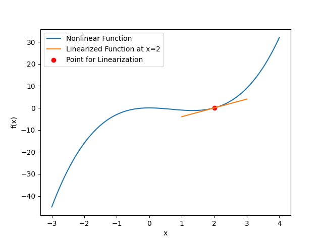

## Today
* Filtering Nonlinear Systems
* System Linearization 
* Extended Kalman Filters
* Day Activity

## For Next Time
* Week 4 Day Activities (Next _Tuesday_ at 7PM) [Canvas Submission](https://canvas.olin.edu/courses/1002/assignments/18432)
* State Estimation Simulation Assignment (Monday 23rd at 7PM) [Canvas Submission](https://canvas.olin.edu/courses/1002/assignments/18433)

## Filtering for Nonlinear Systems
Last time we had a look at the Kalman Filter, a method for performing a Bayesian update over continuous state variables under a linear-Gaussian approximation. The regular Kalman filter (or linear Kalman filter) can be written as:

$$
\text{Prediction Step:}
$$

$$
\hat{x}_{t} = F_tx_{t-1} + B_tu_t + w_t 
$$

$$
\hat{P}_{t} = F_tP_{t-1}F_t^T + Q_t 
$$

$$
\text{Update Step:}
$$

$$
y_{t} = z_t - H_t\hat{x}_t 
$$

$$
S_{t} = H_t\hat{P}_{t}H_t^T + R_t 
$$

$$
K_t = \hat{P}_tH_t^TS_t^{-1}
$$

$$
x_t = x_{t-1} + K_ty_t
$$

$$
P_t = (I - K_tH_t)\hat{P}_t
$$

The creation of the Kalman filter is naturally predicated on the assumption that the random variables in the estimation problem can be modeled as Gaussian distributions, and that the relationships between steps in the state history (e.g., $$x_{t-1}$$ and $$x_t$$), the state and observation space, and the state and action space are _linear_ or direct. Both of these assumptions combined, but especially the linear assumption, is ultimately what allows relatively simple linear matrix operations to estimate the posterior of an otherwise complex, continuous state.

**There is a natural question that follows when learning about the linear Kalman filter: _what about systems that aren't linear?_**

The real world is seldom as tidy as a series of noisy, linear relationships. And there are many instances in robotics that violate the linear assumption:
* Imagine a landmark sensor that is available on a robot moving around a space. It provides metric information about the robot's surroundings, which is sufficient for navigation, but the output of this sensor (a list of range and bearings) is not directly related to the Cartesian pose of the robot.
* Imagine an ultra-fast flying drone, wherein the motion model needs to incorporate a notion of air density and drag; this motion model is a nonlinear differential equation and thus the state from one step to a next is _not_ linear.
* Imagine a self-driving car with control inputs of velocity and steering wheel angle. These controls do not map linearly to the actual velocity of the car, especially in modern vehicles with differential drivetrains.

### Why is Nonlinearity A Problem?
If we were to relax the linearity requirement on our Kalman filter, then we would lose some important properties:
* A Gaussian distribution is not closed under nonlinear transformations; this means that our posterior estimate would no longer be Gaussian and recursion would be ill-defined.
* Transformation matrix $$F$$ and measurement matrix $$H$$ would need to be redefined or fully replaced with the nonlinear function / system of equations. This would impact computational tractability of the algorithm.

### Ways to Handle Nonlinearity
Given the prevalence of nonlinear systems, it will come to no surprise that there are a number of techniques that have been developed to overcome this challenge.

For the purposes of today's discussion, we assume that we _want_ to keep using a Kalman filter for its useful properties to us, but we will need to adapt it to deal with nonlinear systems. To do this, **we need to linearize our nonlinear system** in order to keep using our filter as-is. 

Choosing to deal with nonlinear systems in this way is known as the _Extended Kalman filter_ (EKF) and it is among the most common techniques utilized in the robotics industry to deal with nonlinear systems in complex localization, mapping, and control tasks.
 
## Linearization for Robot Models
You may have encountered linearization in previous classes (the QEAs, ESA, Controls...) under different contexts; it is the same process in this class too! To review in a general case, linearization is the process of finding the linear function that approximates an underlying curve within a local domain of that curve. 

For instance, imagine we have some nonlinear function:

$$f(x) = x^3 - 2x^2$$

and we aim to linearize this function about the point $$x = 2$$. The line that comes "closest" to the curve in the local area around this point will be the _tangent_ line. 

For some functions, this may be as simple as taking the derivative of the function, but a more general approach is to use the equation for a tangent line using the [Taylor Series Expansion](https://en.wikipedia.org/wiki/Taylor_series):

$$
T(x) = f(\hat{x}) + \frac{df}{dx}(\hat{x}x)(x-\hat{x})
$$

where $$\hat{x}$$ is the query point at which the tangent line is to be approximated. For our problem, the linearization of our function at $$x = 2$$ would be:

$$
T(x) = f(2) + \frac{df}{dx}(2)(x-2)
$$

$$
T(x) = 0 + (3(2)^2 - 4(2))(x-2)
$$

$$
T(x) = 4x - 8
$$

For very small changes in $$x$$ around $$x = 2$$, the tangent line can be a reasonable approximation for the true curve. 

### The Jacobian For Multivariate Linearization
When we apply a Kalman filter, we are typically estimating the state and covariances of multple variables simultaneous (i.e., our state is a _vector_ with multiple entries). To generalize our linearization method to multiple state variables and systems of equations, we will make use of the _Jacobian_, a matrix of partial derivatives:

$$
J(x) = \begin{bmatrix} \frac{\partial f_1}{\partial x_1} & \frac{\partial f_1}{\partial x_2} & \dots \\ \frac{\partial f_2}{\partial x_1} & \frac{\partial f_2}{\partial x_2} & \dots \\
\vdots & \vdots & \text{ } \end{bmatrix} 
$$

where $$J(x)$$ represents the generic form of the Jacobian over state vector $$x$$, $$f_1, f_2, \dots$$ represent multiple system functions, and $$x_1, x_2, \dots$$ represent different variables within the state vector.

We can think of the Jacobian as giving us the local "slopes" for each variable within a given function; essentially, the Jacobian provides us the tangent line.

We can see how this is operationalized in our Kalman filter, by first recalling the definition of our state transition model and the measurement model:

$$
\hat{x}_t = F_t x_{t-1} + B_t u_t
$$

$$
z_t = H_t \hat{x}_t 
$$

In our nonlinear system, we will need to replace the $$F$$ and $$B$$ matrices in state with a nonlinear equation $$f(x_{t-1}, u_t)$$, and in our observation space, we replace our measurement matrix $$H$$ with a nonlinear function $$h(\hat{x}_t)$$:

$$
x_t = f(x_{t-1}, u_t) + w_t
$$

$$
z_t = h(\hat{x}_t)
$$

To linearize these equations means to get back out a transition matrix $$F$$ and measurement matrix $$H$$. This requires characterizing the slopes of the nonlinear functions with respect to the state variables; this requires compuing the Jacobian:

$$
F = \frac{\partial f(x_{t-1}, u_t)}{\partial x} \Big\vert_{x_{t-1},u_t} = \begin{bmatrix} \frac{\partial f_1}{x_1} & \frac{\partial f_1}{x_2} & \dots \\ \frac{\partial f_2}{x_1} & \frac{\partial f_2}{x_2} & \dots \\ \vdots & \vdots &  \end{bmatrix} 
$$

$$
H = \frac{\partial h(\hat{x}_t)}{\partial x} \Big\vert_{\hat{x}_t} = \begin{bmatrix} \frac{\partial h_1}{x_1} & \frac{\partial h_1}{x_2} & \dots \\ \frac{\partial h_2}{x_1} & \frac{\partial h_2}{x_2} & \dots \\ \vdots & \vdots &  \end{bmatrix}
$$

### Exercise
Compute the following:

**Problem 1** Let $$X = [x, \dot{x}, y]$$ and $$f(X) = \sqrt{x^2 + y^2}$$. Compute the Jacobian $$\frac{\partial f(X)}{\partial X} \Big\vert_{x_t}$$ 

**Problem 2** Assume we have a motion model defined by the set of equations:

$$
x_{t+1} = x_{t} - R \sin(\theta_t) + R\sin(\theta_t + \beta)
$$

$$
y_{t+1} = y_{t} + R \cos(\theta_t) - R\cos(\theta_t + \beta)
$$

$$
\theta_{t+1} = \theta_{t} + \beta 
$$

Let the state vector be composed of variables $$x$$, $$y$$, and $$\theta$$. Compute the Jacobian of the nonlinear system of equations with respect to the state vector.

## Extended Kalman Filtering
When we compute our linearized system, how do we end up using this in our Kalman Filter? 

| | Linear Kalman Filter | EKF | 
| --- | --- | --- |
| Prediction Step | $$\hat{x} = Fx + Bu$$ $$\hat{P} = FPF^T + Q $$ | $$F = \frac{\partial f}{\partial x} \Big\vert_{x,u}$$ $$\hat{x} = f(x,u)$$ $$\hat{P} = FPF^T + Q$$ |
| Update Step| $$y = z - H\hat{x}$$ $$S = H\hat{P}H^T + R$$ $$K = \hat{P}H^TS^{-1}$$ $$x = \hat{x} + Ky$$ $$P = (I - KH)\hat{P}$$ | $$H = \frac{\partial h}{\partial x} \Big\vert_{\hat{x}}$$ $$y = z - h(\hat{x})$$ $$S = H\hat{P}H^T + R$$ $$K = \hat{P}H^TS^{-1}$$ $$x = \hat{x} + Ky$$ $$P = (I - KH)\hat{P}$$ | 

In general, we use our nonlinear equations to set our predictive state and update residual, and use our linearized matrices to estimate covariances and Kalman gain.

**Exercise**: Read Roger Labbe's [_Kalman and Bayesian Filters in Python_ Chapter 11](https://github.com/rlabbe/Kalman-and-Bayesian-Filters-in-Python/blob/master/11-Extended-Kalman-Filters.ipynb) entry (feel free to pull and run his notebook for this! you do _not_ need to do the embedded exercises in the notebook) and answer the following questions:
* In the tracking airplane problem, is the state space linear or nonlinear? Is the measurement space linear or nonlinear?
* In the tracking airplane problem, the dimensionality of all of the vectors is not necessarily super obvious. Re-summarize each of the elements of the model and perform the dimensional analysis for each of the prediction and update steps. Do these results make sense to you?
* Do a close reading of the robot localization problem (you may have to go to the [unscented Kalman filter chapter](https://github.com/rlabbe/Kalman-and-Bayesian-Filters-in-Python/blob/master/10-Unscented-Kalman-Filter.ipynb) to read about the derivation of the motion model for this problem). 
  * Explain how the control inputs in this problem are incorporated into the Kalman filter prediction step.
  * Summarize the model for this problem (state, actions, measurements and choices for noise covariances).
  * Describe implementation considerations made to translate the EKF math into a computable set of functions.
  * What do the plots demonstrate about the Kalman Filter performance?
  * What are some potential weaknesses or sensitivities of this filter? Under what conditions might this filter _diverge_?

## Going Further

* For a further discussion on why nonlinearity is hard and how it impacts the standard Kalman Filter assumptions, Roger Labbe has an excellent [book chapter with Python examples](https://github.com/rlabbe/Kalman-and-Bayesian-Filters-in-Python/blob/master/09-Nonlinear-Filtering.ipynb) that can be reviewed.
* For a complete breakdown of the math of the extended Kalman filter, Chapter 3.3 in the textbook _Probabilistic Robotics_ provides a thorough review.

## Day Activity
Today's day activity is designed to provide time on the [simulation assignment](https://canvas.olin.edu/courses/1002/assignments/18433) which aims to complement the mathematical discussions in class with practical implementation.

### Problem 1: Recap of Today's Notes
Go back through today's written notes on this page and work through each of the exercises / be sure to document your answers to the exercises discussed in class (there should be a total of 2 exercises in today's notes).

### Work On The Simulation Assignment
Nothing to turn in for day-activity work here; just get started with the simulation assignment!