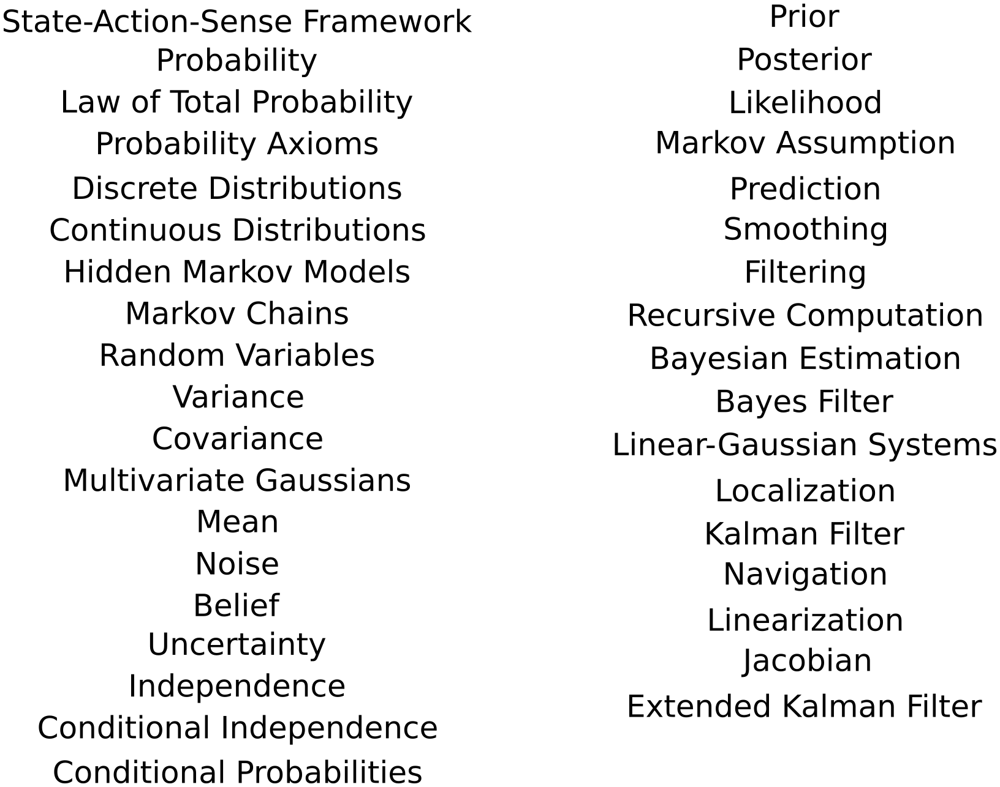

## Today
* Kalman and Beyond
* State Estimation Review
* Day Activity

## For Next Time
* Week 5 Day Activities (Next Monday at 7PM) [Canvas Submission](https://canvas.olin.edu/courses/1002/assignments/18480)
* State Estimation Simulation Assignment (Next Monday at 7PM) [Canvas Submission](https://canvas.olin.edu/courses/1002/assignments/18433)

## Kalman And Beyond
We have had a close look at the _Linear Kalman Filter_ and the _Extended Kalman Filter_ in the last two classes; techniques which extend the Bayes Filter to continuous-valued systems we would like to estimate the state of from series of observations and actions. But these are not the only techniques in town! This section outlines a list of other state estimation techniques that are common in Bayesian Estimation and Robotics, with a starting resource for learning more. You are welcome to use this list as a jumping off point for your upcoming deep dive projects...

**Unscented Kalman Filter**: another technique for dealing with non-linearity in a state, observation, or action framework. [Roger Labbe's Textbook Chapter](https://github.com/rlabbe/Kalman-and-Bayesian-Filters-in-Python/blob/master/10-Unscented-Kalman-Filter.ipynb) or [this tutorial paper](https://groups.seas.harvard.edu/courses/cs281/papers/unscented.pdf) are good places to get started learning this technique.

**Ensemble Kalman Filter**: this is a blend of linear Kalman filtering and sampling based / particle techniques, which allows for very large state-space systems to be estimated from data. [This tutorial paper from UMD](https://www.math.umd.edu/~slud/RITF17/enkf-tutorial.pdf) is a good place to start to learn more about the technique.

**Particle Filter**: this is a sampling-based technique used to convert large continuous systems (which might be nonlinear!) into something relatively easy to perform computation over, using standard Bayesian Estimation formulas. There is a [whole project in CompRobo](https://comprobo25.github.io/in-class/day07) that investigates this technique, and you can read [Roger Labbe's textbook chapter](https://github.com/rlabbe/Kalman-and-Bayesian-Filters-in-Python/blob/master/12-Particle-Filters.ipynb) on the same idea to learn more.

**Monte Carlo Sampling**: In Bayesian Estimation, the process of estimating a state from any number of known/unknown modeling functions is often done using sampling-based techniques (as closed-form analytical techniques is often impossible/intractable). One family of techniques, Markov Chain Monte Carlo samplers, is particularly common. Some specific algorithms you could investigate:  
* **Metropolis-Hastings**: A technique for guiding samples based on a history of prior samples in a space. Here is [an implementation guide in Python](https://medium.com/@keruchen/markov-chain-monte-carlo-and-metropolis-hasting-1dbb9c33f40) you can explore.
* **Hamiltonian**: This is also a guided sampling technique, but uses motion physics to select where to sample next, in an effort to more efficiently explore a state space. This [is a nice tutorial explaining and implementing this sampling technique](https://bayesianbrad.github.io/posts/2019_hmc.html) that also links to other useful learning resources; and this [is a detailed lecture](https://faculty.washington.edu/yenchic/19A_stat535/Lec9_HMC.pdf) on the topic for those who want more math!
* **Reversible-Jump**: This is one of the few sampling techniques that explicitly grapples with the idea that even the dimensionality of the state space may be unknown; this technique allows for samples to be drawn across dimensions. This [overview paper](https://www.colorado.edu/amath/sites/default/files/attached-files/rjmcmc.pdf) provides the math and cites the original papers in this space which provide grounding examples.

**Gaussian Processes**: Leaning in on the Gaussian assumption, a Gaussian process is a way of representing a probability distribution over an (unknown) stochastic process. These have seen increasing adoption in the robotics community, particularly for decision-making or adaptive-sampling systems (spoilers: we'll definitely be talking about these in a few weeks). [This is a simple implementation tutorial](https://scikit-learn.org/stable/modules/gaussian_process.html) showing you all the things that a Gaussian process can do, and this is [an influential paper describing how Gaussian processes can be used in robotics](https://arxiv.org/pdf/1502.02860). 

**Factor Graphs**: Inspired by Kalman Filters, factor graphs are an optimization-based graphical framework that can be used for state estimation. You might commonly find these in navigation and SLAM applications in robotics. [This tutorial paper](https://navi.ion.org/content/71/3/navi.653) provides the derivation, and [this textbook](https://www.cs.cmu.edu/~kaess/pub/Dellaert17fnt.pdf) goes into the nitty-gritty details.


## A Review of State Estimation
We have been focused the last several weeks on understanding Bayesian Estimation to infer the state of a robotic system. Along the way, we have touched on a number of topics:

<p align="center">

</p>

Today, we'll be taking some time to review and reinforce these concepts before we start in on our culminating topic in this module: simultaneous localization and mapping (SLAM). In the rest of this section there are exercises designed to review the course material. See the _Day Activity_ section for specific instructions.

### Exercise: Concept Mapping
Pair up with one or two other students in the class. Using the list of provided terminology, as well as notes from the last seven classes and days activities, generate a concept map that demonstrates the relationships between ideas in the class, and highlights key takeaways / lessons learned. Your concept map can be sweeping of all the material we've covered, or zoom in on a particular concept/set of concepts. Some guiding questions for your concept map could be:
* How do you recognize when a problem could be formulated as a Bayesian estimation problem?
* What is the mapping between a discrete Bayes filter and a continuous Kalman filter?
* What key assumptions have we discussed, and how are they incorporated into our Bayesian estimation formulation?

Your concept map can be in any format - virtual, on the whiteboard, with words, with visuals, mixed media - but does need to be recorded in some way to be submitted. As you are conducting this activity, make note of any areas that you feel strong in, areas that might need more practice, or areas where they are remaining questions. Capture your questions in your concept map with annotations, and consider using these questions as a guide for selecting further practice problems to work through.

### Exercise: Warehouse Wanderer (Rote Practice)
A warehouse robot is navigating the building when suddenly the lights go out. When the lights come back on, the robot needs to re-localize itself in the warehouse using only its own local visual measurements and actions. Our robot has the following sensor model:

| | | | | | | 
|---|---|---|---|---|---| 
| Robot Classifies Aisle As &#8594; | Aisle 1 | Aisle 2 | Aisle 3 | Aisle 4 | Aisle 5 |  
| Actual Aisle &#8595; | | | | | | 
| Aisle 1 | 0.8 | 0.1 | 0.1 | 0.0 | 0.0 |
| Aisle 2 | 0.2 | 0.7 | 0.1 | 0.0 | 0.0 | 
| Aisle 3 | 0.1 | 0.1 | 0.6 | 0.1 | 0.1 |
| Aisle 4 | 0.0 | 0.0 | 0.1 | 0.9 | 0.0 | 
| Aisle 5 | 0.0 | 0.1 | 0.0 | 0.1 | 0.8 |

And when it moves, it either stays in its own aisle, or ends up an in adjacent aisle, picking randomly between turning right or turning left; the robot can't teleport. For our robot, we assume the following motion model: 

| | | | | | | 
|---|---|---|---|---|---| 
| Starts in &#8594; | Aisle 1 | Aisle 2 | Aisle 3 | Aisle 4 | Aisle 5 |  
| Will arrive in &#8595; | | | | | | 
| Aisle 1 | 0.5 | 0.25 | 0.00 | 0.00 | 0.00 |
| Aisle 2 | 0.5 | 0.50 | 0.25 | 0.00 | 0.00 | 
| Aisle 3 | 0.0 | 0.25 | 0.50 | 0.25 | 0.00 |
| Aisle 4 | 0.0 | 0.00 | 0.25 | 0.50 | 0.50 | 
| Aisle 5 | 0.0 | 0.00 | 0.00 | 0.25 | 0.50 |


Our robot thinks that before the lights went off, it was in _Aisle 3_ with a probability of 0.8 and in _Aisle 4_ with a probability of 0.2. At the moment the lights came back on, the robot observed that it was in _Aisle 4_. 

The robot then proceeds to take 10 actions, observing the following sequence: {_Aisle 4_, _Aisle 4_, _Aisle 5_, _Aisle 4_, _Aisle 4_, _Aisle 3_, _Aisle 2_, _Aisle 1_, _Aisle 1_, _Aisle 2_}. 

**As the robot is taking its actions, what does it believe its sequence of aisles to be? After it completes all of its actions, what does it believe its most likely trajectory to be? How devastating is the power outage to your robot's performance?**

To answer these questions, you might consider using the following strategy:
* Identify the state, action, and sense spaces
* Formulate the prior over the state space
* Formulate the _prediction_ matrix (or transition matrix)
* Formulate the _update_ matrix (or measurement matrix)
* Determine whether to use Smoothing or Filtering for a particular question; set up the appropriate recursive formula and bookkeeping


### Exercise: The Wumpus World (Deep Thinking Problem)
[This problem is inspired by the Wumpus World in _Artificial Intelligence: A Modern Approach_. It is not intended that you "solve" the Wumpus World problem, but instead use it as a grounded example to examine the ideas and formulas of state estimation.]

Imagine a robot tasked with exploring a subterranean (cave) complex, which consists of several caverns connected by natural passages. These caves hold several dangers: there is one large Wumpus monster and several bottomless puts. There is one cavern however that holds a scientific discovery that will change _everything_. 

We can frame the exploration task for our robot as a game, where the robot collects +1000 points for finding the scientifically valuable cavern and retrieving the science sample, -1000 points for getting eaten by the Wumpus or falling into a pit, -10 points for using a Wumpus stun gun, and -1 point for every action the robot takes. 

Further, we can define the world with the following parameters:
* Environment: a 5 x 5 grid; the robot always starts in (1,1). The scientific discovery and the Wumpus are placed uniformly randomly in all but the starting square; all other squares may contain bottomless pits with a probability 0.2.
* Actuators: our robot can move _Forward_, _Turn 90 degrees left_, or _Turn 90 degrees right_. Our robot can _Stun_ only once to save itself from a Wumpus; firing the stun gun will stun any Wumpus that is in the direct, unobstructed forward path of the robot. Our robot can _Document_ a scientific discovery and _Climb_ out of the caves to report on the find from (1,1). The robot will be destroyed if it encounters an un-stunned Wumpus or falls into a pit.
* Sensors: our robot can perceive a _Stench_ coming from the Wumpus in any square directly adjacent to the Wumpus; when the robot walks into a wall it will perceive a _Bump_; when the robot is directly adjacent to a pit it will experience a _Breeze_; then the robot is in the room with the scientific discovery it will feel a sense of _Eureka_; when the Wumpus is stunned it emits a _Rumble_ that can be perceived from anywhere in the cave complex.

Our robot is initialized at (1,1) facing directly right, and it senses nothing. The robot tentatively visits (2,1) and senses _Breeze_. It retreats and tentatively visits (1,2), but also senses a _Breeze_. Consider the following:
* What is the probability that any of (1,3), (2,2), and (3,1) contain a pit?
* Which is the best action the robot should select at the next time step?

Populate your own Wumpus world based on the rules described here, and play a few steps of your game assuming the robot acts as a _probabilistic agent_. Consider the following:
* Define the state-action-sense elements of this game. What variables are you tracking through the game? 
* What are the sources of uncertainty in this game? How can uncertainty be reduced?
* Are there "unwinnable" Wumpus worlds that can be created with this rule set? Would it be possible for a robot to know whether it is in an "unwinnable" or "winnable" world?
* If you were programming a robot to do this for real, would you use a purely Bayesian approach to set the robot's actions, or would you use some other technique? Describe your ideal probabilistic-hybrid agent to play this game.


### Exercise: The Runaway Neato (Implementation Problem)
A Neato is on the loose in the MAC, and we need to estimate where it has gone! We will make a very simple assumption that we can represent our world as a 1D system. We will set up a simple simulation of this world, where the robot's pose is controlled by its velocity and process noise, and noisy observations of this pose can be directly observed:

```python
def simulate_realworld_neato(sensor_var, process_var, vel=1.0, step=1, dt=1.):
    """Simulates the movement of a Neato and measurement in the world.
    Input: 
        sensor_var
        process_var
        vel (float): velocity of the bot
        step (int): number of simulation snapshots
        dt (float): time delta between simulation snapshots
    Return:
        xs (array(float)): real positions
        zs (array(float)): observed positions
    """
    x = 0.  # initial position
    sensor_std = math.sqrt(sensor_var)  # compute sensor standard deviation from variance
    process_std = math.sqrt (process_var)  # compute process standard deviation from variance
    xs, zs = [] ,[]
    for i in range(step):
        v = vel + (np.random.randn() * process_std)
        x += v * dt  # simple velocity based update
        xs.append(x)
        zs.append(x + np.random.randn() * sensor_std)  # noise corrupted observation
    return np.array(xs), np.array(zs)

xs, zs = simulate_realworld_neato(0.2, 0.1, vel=1., step=10, dt=0.5)
plt.plot(xs, marker=".", ms=10, label="Real Path")
plt.plot(zs, linestyle="--", marker="*", ms=10, label="Observations")
plt.legend()
plt.show()
```

We will define the state vector of our Neato as $$\textbf{x} = [x, \dot{x}]^T$$, where the first term is position and the second term is velocity. You will now get to make a series of design decisions to define the following:
* The Initial State Covariance ($$P$$)
* The Transition Matrix ($$F$$) 
* The Process Noise ($$Q$$)
* The Measurement Matrix ($$H$$)
* The Measurement Noise ($$R$$)

Once you've set all your definitions, implement a simple Kalman Filter (note: would you elect to use a linear Kalman filter or Extended Kalman filter for this problem? Why or why not?). Remember, you will need to write a _prediction_ function and an _update_ function, then wrap the steps of your Kalman filter into a loop which draws new observations and actions of the Neato over time.

Once you are happy with your implementation, consider the following:
* How does the process covariance change with each iteration of the filter? What would the off-diagonal values indicate?
* What impact does $$R$$ have on the quality of the Neato position estimate? What about $$Q$$? 
* If you were to add a noisy measurement of velocity at each timestep, what would need to be redefined about your model? How different would you expect the filter performance to be?


### Exercise: Robots in the Wild (Professional Skills Problem)
In this exercise, I would like you to pick one of the following (or find your own!) academic papers utilizing an EKF in a robotic system:
* [Extended Kalman Filter Based Mobile Robot Localization in Indoor Fire Environments](https://www.researchgate.net/profile/Jong-Hwan-Kim/publication/289519889_Extended_Kalman_Filter_Based_Mobile_Robot_Localization_in_Indoor_Fire_Environments/links/568e0d7c08aef987e5661fc6/Extended-Kalman-Filter-Based-Mobile-Robot-Localization-in-Indoor-Fire-Environments.pdf)
* [Contact-Aided Invariant Extended Kalman Filtering for Robot State Estimation](https://arxiv.org/pdf/1904.09251)
* [Invariant Extended Kalman Filtering for Underwater Navigation](https://ieeexplore.ieee.org/stamp/stamp.jsp?arnumber=9444664&casa_token=3c130xf8pv0AAAAA:dWwH5dNAfRFGyrEel5hT2CY6vYU4n3C9lhqUUKmmmJmf_OspH0Uv_1EsJejbSQPHdo79InkTUW4)
* [An Extended Kalman Filter for Direct, Real-Time, Phase-Based High Precision Indoor Localization](https://ieeexplore.ieee.org/stamp/stamp.jsp?arnumber=8648434)

Consider the following questions:
* Summarize the state estimation problem posed in the paper you read. Why is this state estimation typically challenging?
* Take a shot at summarizing the components of the EKF that was implemented; you can do this in words or by providing and discussing the exact functions/matrices. 
    * What aspects of the model were linear or nonlinear?
    * Are there any _hidden_ variables in the state to estimate?
    * Do your number of states match the number of observations that are possible? Discuss the dimensionality of the model.
* How did the authors evaluate their EKF implementation? Describe their experimental set-ups and evaluation metrics.
* Do you agree with the conclusions that the authors drew about the efficacy of their state estimation framework? What critiques do you have on their method?


## Day Activity

### Problem 1: Document Your Concept Map(s)
Please document the concept maps you developed in class; note who you worked with, and feel free to further annotate or reflect on your concept map from the activity. 

### Problem 2: Show Your Work
Choose any one of the exercises listed in today's notes to work through in detail, and submit your work. Let us know why you chose that problem, and whether there are any remaining questions or concerns.
