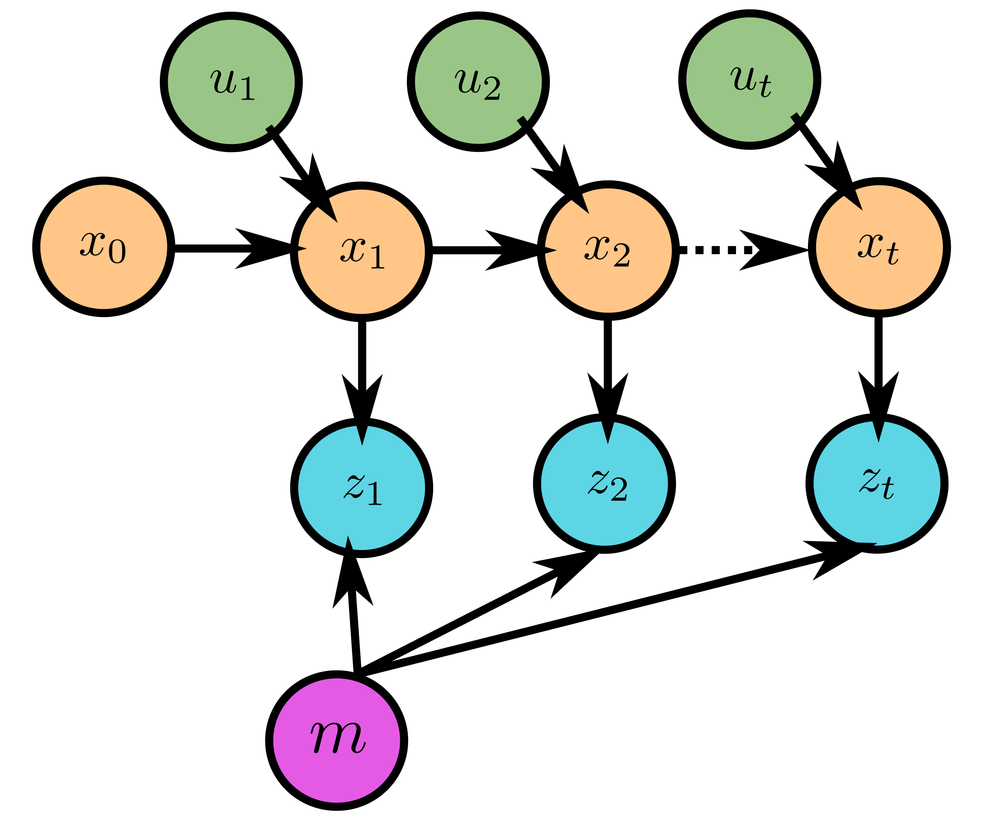
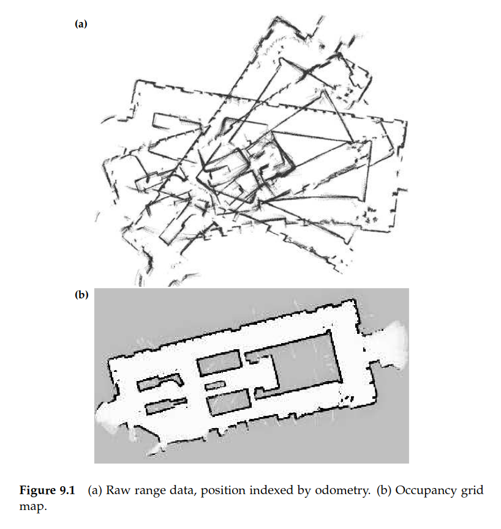
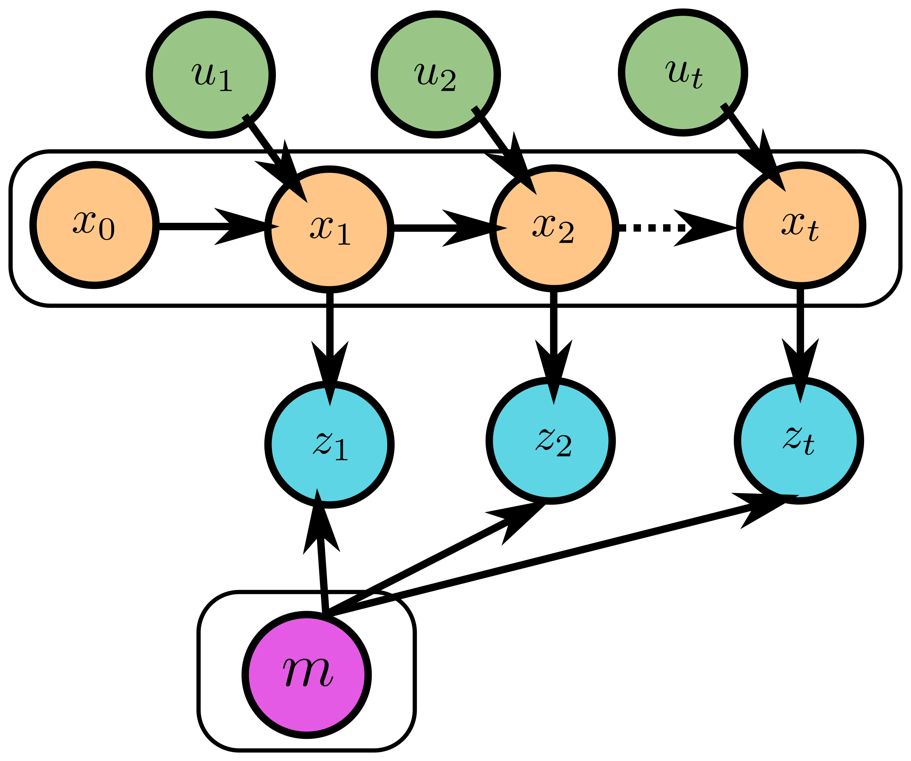

## Today
* Overview of SLAM: Motivation
* Mapping
* Simultaneous Localization and Mapping
* EKF-SLAM Setup
* Deep Dive Project Kick-Off

## For Next Time
* Week 5 Day Activities (Today at 7PM) [Canvas Submission](https://canvas.olin.edu/courses/1002/assignments/18480)
* State Estimation Simulation Assignment (Today at 7PM) [Canvas Submission](https://canvas.olin.edu/courses/1002/assignments/18433)
* [Deep Dive Project Proposals](../projects/deepdive_1.md) (Thursday at 1PM) [Canvas Submission](https://canvas.olin.edu/courses/1002/assignments/17540)

## Simultaneous Localization and Mapping: Motivation
_Simultaneous Localization and Mapping_ or SLAM is perhaps one of the most quintessential family of algorithms used in modern robotics today. SLAM answers the question: _where is the robot within a particular environment?_ The hard part -- we don't necessarily start with any prior information about the particular environment that we want to localize our robot into. Thus, we must _estimate our world state as well as our robot state at the same time_.

Note how this is different from the state estimation (localization) questions we've been answering so far:

| Filtering Techniques | SLAM | 
| --- | --- | 
| Assume we know the starting location of the robot | Starting location within a particular environment is unknown | 
| Aim to reduce cumulative positioning error | Aim to estimate location with high accuracy | 
| Leverages knowledge of the robot's actions and senses | Leverages knowledge of the robot's actions and senses, as well as the estimated structure of the environment itself | 
| Posterior is over robot state | Posterior is over robot and environment state | 

There are several reasons why we might use a SLAM algorithm over simple filtering, including long-term deployment durations and complex task definitions that benefit from a richer state representation. 

The intuition behind SLAM is that localization of a robot can be improved if the nature of its environment is also known. For instance, take a warehouse robot -- at the beginning of every day it could keep track of its location in the warehouse using Kalman filtering or other cumulative localization technique; but it might be more robust if the robot could, from anywhere in the building, know where it is by simply looking around and comparing its observation with a map of the building. SLAM allows a robot to generate such a map, at the same time as localizing itself within that map.  

## Mapping
So far when we've talked about state estimation, we've taken an egotistical approach -- only tracking the state of the robot. In SLAM, we would also like to track the state of the world, explicitly. This is known as _mapping_.

Mapping follows the same idea as localization: from observations, estimate the state. In the case of mapping for robotics, the task may be to take metric observations (such as lidar scans) and use these in composite to estimate the metric structure of an environment.

While this idea is straightforward, the implementation requires some careful thought. Consider:
* **Large Hypothesis Space**: From an estimation standpoint, the hypothesis space (the space of all possible maps), is countably infinite (in other words, gigantic).
* **Chicken and Egg Problem**: Practically speaking, in order to generate a map we need to know where we are, but to know where we are we need a map...this makes "generating a map" a problem that typically can't be done in a vacuum.
* **Noise**: Quality mapping is impacted by noise in perception and actuation, just like in pure localization.
* **Perceptual Ambiguity**: Different environments can _look similar_ (or have perceptual ambiguity), making it hard to correspond a particular observation with a unique part of the map.
* **Cycles**: The robot might traverse a map in an arbitrarily challenging way, potentially never back-tracking or revisiting parts of the map from unexpected directions that can lead to large instantaneous errors. 

To address some of these challenges, the choice of _representation_ for a map can make a big difference. Here are some common ones for storing metric information:
* Landmarks (list of locations of perceptually unique structures)
* 2D Occupancy Grids (discrete spatial representation with grid-values taking on the likelihood of free space or occupied space)
* 3D Voxel Fields (a 3D version of an occupancy grid)
* Octrees (a graphical structure that stores information like that found in a 3D voxel field or 2D occupancy grid)

We can express the mapping estimation problem simply as:

$$\mathcal{P}(m \vert z_{1:t}, x_{1:t})$$

or, as finding the posterior over $$m$$ (the map) given a history of observations $$z_{1:t}$$ and poses $$x_{1:t}$$. This can be represented as a graphical model, expanding on our notion of Markov chains, as follows:

#### An Example: Occupancy Grids (Using Known Poses)
Let's assume, for the sake of simplicity, that we have relatively good odometry measurements from our robot. We also choose to represent our world as a discrete grid, where each cell of the grid records a binary value of whether it is free space or occupied space. 

Estimating the entire map, $$m = \{\mathbf{m}_i\}$$, is intractable (consider a simple 100 x 100 grid; that's 10,000 cells, which can take on one of two values, leading to $$2^{10,000}$$ different map possibilities). So instead, we choose to decompose this problem into a set of independent estimation problems:

$$\mathcal{P}(\mathbf{m}_i \vert z_{1:t}, x_{1:t}) \text{ } \forall \mathbf{m}_i \in m$$

Decomposing this problem into separate independent representations abstracts away possible dependencies between cells in a map, but it makes for an easy way to compute the posterior of any single map:

$$\mathcal{P}(m \vert z_{1:t}, x_{1:t}) = \prod_i \mathcal{P}(\textbf{m}_i \vert z_{1:t}, x_{1:t})$$

A _binary Bayes filter_ can be used to update the state estimate for any one of the cells within the perceptual range of a sensor measurement. 

Figure from Probabilistic Robotics textbook, copied here for illustrative purposes.

## Simultaneous Localization and Mapping: Overview
In our mapping example, we assumed that the actions of our robot didn't really matter since we had access to the robot's true poses. When we don't assume perfect access to poses, then we must frame our mapping problem as a simultaneous localization and mapping problem (we must find our robot poses and estimate the map at the same time). 

In our notation, we are looking to find:

$$\mathcal{P}(m, x_{1:t} \vert z_{1:t}, u_{1:t})$$

As a graphical model (adding onto our idea of Markov chains and mapping), the SLAM problem can be represented as:

where the boxed elements must be inferred, and the unboxed elements are observable/known.

Note, that the statement listed above is the _full SLAM_ problem, but like in our localization work, we're often interested in the _online_ problem of estimating our location and map while the robot is running. A subtle change is then made to the posterior we want to find:

$$\mathcal{P}(m, x_{t} \vert z_{1:t}, u_{1:t}) = \int \int \dots \int \mathcal{P}(m, x_{1:t} \vert z_{1:t}, u_{1:t}) dx_1 dx_2 \dots dx_{t-1}$$

where the pose and map at any moment is the sum of all prior state and map estimates (this is known as marginalization). In practice, we would perform each integration one at a time in an online streaming fashion (like in our filtering based techniques). We can graphically represent the online problem as:

### The Correspondence Problem
Recall in our Bayesian filter the following idea:

$$\mathcal{P}(x_t \vert u_t) = \mathcal{P}(x_t, x_{t-1} \vert u_t)$$

that to find the probability of state given an action, the _previous state_ must be considered. 

In SLAM, we must also consider this same challenge with respect to our environment. Indeed, a SLAM algorithm needs to be able to reason about whether some observed object is related to previously observed objects. This is known as the _correspondence problem_, and we might explicitly consider correspondence variables in our estimation problem:

$$\mathcal{P}(m, x_{1:t}, c_{1:t} \vert z_{1:t}, u_{1:t})$$

and in the online case:

$$
\mathcal{P}(m, x_{t}, c_{t} \vert z_{1:t}, u_{1:t}) = \int \int \dots \int  \sum_{c_1} \sum_{c_2} \dots \sum_{c_t-1} \mathcal{P}(m, x_{1:t}, c_{1:t} \vert z_{1:t}, u_{1:t}) dx_1 dx_2 \dots dx_{t-1}
$$

In practice, there are often too many discrete correspondence variables to deal with. Thus, modern SLAM methods rely on approximations in order to compute the posterior we're interested in.

### Modern Techniques
There are many flavors of SLAM algorithm; in class, we're going to go in-depth in one variant, the EKF-SLAM. But other modern techniques (which might be good deep dive topics!) include:
* GraphSLAM
* FastSLAM
* Graph-Pose SLAM
* ORB-SLAM (and other visual SLAM techniques)

## EKF-SLAM
One of the original variants of a SLAM algorithm is EKF-SLAM, which borrows heavily from EKF for localization framework. Today, we'll walk through the mathematical derivation, and next time we will implement our own version.

### Assumptions
In EKF-SLAM there are three key assumptions:
* Noise is Gaussian (just like in the EKF localization problem)
* Maps are composed of features (i.e., landmarks)
* Observations of the environment provide _positive_ information about the location of a landmark

We will additionally make a simplifying assumption for our derivation today: the correspondences between landmarks will be known. 

### The Posterior and State Vector
We would like to find $$\mathcal{P}(m, x_{t} \vert z_{1:t}, u_{1:t})$$ in real-time (online). Since the correspondences are known, we do not need to represent these directly in our posterior. As the map is a list of landmarks, we can define our state vector as follows:

$$
\mathcal{X}_t = \begin{bmatrix} x_t \\ m \end{bmatrix} = \begin{bmatrix} x & y & \theta & m_{1,x} & m_{1,y} & s_1 & m_{2,x} & m_{2,y} & s_2 & \dots & m_{N,x} & m_{N,y} & s_N \end{bmatrix}^T 
$$

where $$x, y, \theta$$ denote the robot's coordinates and heading, $$m_{i,x}, m_{i, y}$$ represents the coordinates of the $$i$$th landmark for $$i = 1, \dots, N$$ and $$s_i$$ is the landmark's signature.

The initial mean and covariance for our state vector can be expressed:

$$
\mathcal{X}_0 = \begin{bmatrix} 0 & 0 & 0 & \dots & 0 \end{bmatrix}^T
$$

$$
P_0 = \begin{bmatrix} 0 & 0 & 0 & 0 & \dots & 0 \\
                           0 & 0 & 0 & 0 & \dots & 0 \\
                           0 & 0 & 0 & 0 & \dots & 0 \\
                           0 & 0 & 0 & \infty & \dots & 0 \\
                           \vdots & \vdots & \vdots & \vdots & \ddots &\vdots \\
                           0 & 0 & 0 & 0 & \dots & \infty\end{bmatrix} 
$$

which captures the original belief that the robot is initialized at the origin of the world and none of the landmark locations are known. The structure of the covariance matrix also strongly implies that the landmarks are independent from one another.

### Prediction Step
As in the EKF for localization, we use the prediction step to advance the estimate of where our robot is following some action that is taken. Notably, since landmarks are stationary, we are mostly performing a prediction over our robot's pose, which is effectively just our typical EKF:

1. Use the nonlinear transition function to get a new state vector.
2. Compute a transition matrix (Jacobian).
3. Estimate the transformation in state covariance.

The special case here is that in the prediction step, we want to preserve our uncertainty (covariance) over our landmarks (and not reduce this uncertainty to 0 or manipulate it based on our robot's motion -- since how the robot moves should be independent of how the landmarks exist). Thus, we compose our Jacobian out of a block of partial derivatives for robot pose, and an identity matrix for all elements of landmarks. 

### Update Step
In EKF-SLAM, we make an additional observation at each time step -- the signature of a landmark. Imagine a robot given a landmark pinger: this pinger now returns a range, bearing, and ID of the landmarks within the detection limit of the robot. 

During the update step, we want to update our estimate of where the each landmark is (and associated covariance) as well as where our robot is (and associated covariance). To do this, we will simultaneously update our estimates of landmarks and the robot's pose.

1. Given the observation, estimate the location of each landmark in visual range assuming that the robot's estimated pose from the prediction step is true.
2. Compute the residual between the predicted location of the robot and each landmark with the observation (used to compute the robot's pose and the landmark's pose). 
3. Construct a measurement matrix (Jacobian) which transforms the observation vector back into the full state space.
4. Compute the Innovation in covariance.
5. Compute the Kalman gain.
6. Update the state vector.
7. Update the state covariance.

In practice, at a single timestep multiple landmarks may be observed. The update step will iterate through each observation to compute a new innovation, gain, state vector, and state covariance. The output of the update step is the final integration of all of the observations.

### Example Problem: Steering Robot with a Landmark Detector
Let's look at a specific example for the case of a 2D steering robot, with position $$x, y, \theta$$ (cartesian position and heading) and control inputs $$v, \omega$$ (linear and angular velocity).

We can start with inspecting a simple one-step update:

$$
\mathcal{X}_t = \mathcal{X}_{t-1} + \begin{bmatrix} -\frac{v_t}{\omega_t}\sin\theta + \frac{v_t}{\omega_t}\sin(\theta+\omega_t \Delta t) \\ \frac{v_t}{\omega_t}\cos\theta - \frac{v_t}{\omega_t}\cos(\theta+\omega_t \Delta t) \\ \omega_t \Delta t \\ 0 \\ 0 \\ \vdots \\ 0 \end{bmatrix}
$$

where state vector $$\mathcal{X}_t$$ contains $$3N + 3$$ elements (3 elements representing the robot pose, and $$3N$$ elements representing each landmark pose and signature, with $$N$$ representing the number of landmarks).

We can define a more compact representation:

$$
\mathcal{X}_t = \mathcal{X}_{t-1} + F^T\begin{bmatrix}-\frac{v_t}{\omega_t}\sin\theta + \frac{v_t}{\omega_t}\sin(\theta+\omega_t \Delta t) \\ \frac{v_t}{\omega_t}\cos\theta - \frac{v_t}{\omega_t}\cos(\theta+\omega_t \Delta t) \\ \omega_t \Delta t \end{bmatrix}
$$

where

$$
F = \begin{bmatrix} 1 & 0 & 0 & & 0 & \dots & 0 \\
                    0 & 1 & 0 & & 0 & \dots & 0 \\
                    0 & 0 & 1 & & 0 & \dots & 0 \end{bmatrix}
$$

such that $$F$$ is composed of 3 x 3 identity matrix (over robot state) and $$3N$$ columns of 0s.

In order to compute our covariance, we need to linearize our dynamical system. If we let: 

$$
g(\mathcal{X}_{t-1}, u_t) = \mathcal{X}_{t-1} + F^T\begin{bmatrix}-\frac{v_t}{\omega_t}\sin\theta + \frac{v_t}{\omega_t}\sin(\theta+\omega_t \Delta t) \\ \frac{v_t}{\omega_t}\cos\theta - \frac{v_t}{\omega_t}\cos(\theta+\omega_t \Delta t) \\ \omega_t \Delta t \end{bmatrix}
$$

then we can linearize based on a single Taylor Series Expansion:

$$
g(\mathcal{X}_{t-1}, u_t) \approx g(\bar{\mathcal{X}_{t-1}}, u_t) + G_t(\mathcal{X}_{t-1} - \bar{\mathcal{X}_{t-1}})
$$

where $$\bar{\mathcal{X}_{t-1}}$$ represents the mean estimate of the state vector. Because of the additive form of our transition matrix, we can decompose our Jacobian as follows:

$$
G_t = I + F^T g_t F
$$

where

$$
g_t = \begin{bmatrix} 0 & 0 & -\frac{v_t}{\omega_t}\cos(\theta_{t-1}) + \frac{v_t}{\omega_t}\cos(\theta_{t-1} + \omega_t \Delta t) \\
0 & 0 & -\frac{v_t}{\omega_t}\sin(\theta_{t-1}) + \frac{v_t}{\omega_t}\sin(\theta_{t-1} + \omega_t \Delta t) \\ 0 & 0 & 0 \end{bmatrix}
$$

**Thus, at the end of the prediction step we would have:**

$$
\hat{\mathcal{X}_t} = \mathcal{X}_{t-1} + F^T \begin{bmatrix}-\frac{v_t}{\omega_t}\sin\theta + \frac{v_t}{\omega_t}\sin(\theta+\omega_t \Delta t) \\ \frac{v_t}{\omega_t}\cos\theta - \frac{v_t}{\omega_t}\cos(\theta+\omega_t \Delta t) \\ \omega_t \Delta t \end{bmatrix} 
$$

$$
\hat{P_t} = G_t P_{t-1} G_t^T + F^T Q_t F
$$

---

Now, let's donsider our update step. Our robot is equipped with a range and bearing sensor. Any observation can be modeled as:

$$
z_t^i = \begin{bmatrix} \sqrt{(m_{j,x} - x)^2 + (m_{j,y} - y)^2} \\
\text{atan2}(m_{j,y} - y, m_{j,x} - x) - \theta \\
m_{j,s} \end{bmatrix} + R_t
$$

where $$i$$ is the index of an individual landmark, $$j = c_t^i$$ is the index of the observed landmark at a particular time, and the first term in the matrix represents a range, the second term represents a bearing, and the final term represents a landmark signature. $$R_t$$ is a 0-mean multivariate gaussian which corrupts the observations with a small amount of noise.

Given some particular landmark, we can linearize the measurement function as $$h(\mathcal{X}_t,j) \approx h(\hat{\mathcal{X}}_t,j) + H_t^i(\mathcal{X}_t - \hat{\mathcal{X}}_t)$$

where

$$
q_t = (m_{j,x} - x_t)^2 + (m_{j,y} - y_t)^2 
$$

$$
h_t^i = \begin{bmatrix}\frac{\partial h_1}{\partial x} & \frac{\partial h_1}{\partial y} & \frac{\partial h_1}{\partial \theta} & \frac{\partial h_1}{\partial m_{j,x}} & \frac{\partial h_1}{\partial m_{j,y}} & \frac{\partial h_1}{\partial m_{j,s}} \\ \frac{\partial h_2}{\partial x} & \frac{\partial h_2}{\partial y} & \frac{\partial h_2}{\partial \theta} & \frac{\partial h_2}{\partial m_{j,x}} & \frac{\partial h_2}{\partial m_{j,y}} & \frac{\partial h_2}{\partial m_{j,s}} \\ \frac{\partial h_3}{\partial x} & \frac{\partial h_3}{\partial y} & \frac{\partial h_3}{\partial \theta} & \frac{\partial h_3}{\partial m_{j,x}} & \frac{\partial h_3}{\partial m_{j,y}} & \frac{\partial h_3}{\partial m_{j,s}} \end{bmatrix} = 
\begin{bmatrix} \frac{x_t - m_{j,x}}{\sqrt{q_t}} & \frac{y_t - m_{j,y}}{\sqrt{q_t}} & 0 & \frac{m_{j,x} - x_t}{\sqrt{q_t}} & \frac{m_{j,y} - y_t}{\sqrt{q_t}} & 0 \\ \frac{m_{j,y} - y_t}{q_t} & \frac{x_t - m_{j,x}}{q_t} & -1 & \frac{y_t - m_{j,y}}{q_t} & \frac{m_{j,x} - x_t}{q_t} & 0 \\ 0 & 0 & 0 & 0 & 0 & 1\end{bmatrix}
$$

and 

$$
H_t^i = h_t^iF_j
$$

with 

$$
F_j = \begin{bmatrix}
1 & 0 & 0 && 0 & \dots & 0 & & 0 & 0 & 0 && 0 & \dots & 0 \\
0 & 1 & 0 && 0 & \dots & 0 & & 0 & 0 & 0 && 0 & \dots & 0 \\
0 & 0 & 1 && 0 & \dots & 0 & & 0 & 0 & 0 && 0 & \dots & 0 \\
0 & 0 & 0 && 0 & \dots & 0 & & 1 & 0 & 0 && 0 & \dots & 0 \\
0 & 0 & 0 && 0 & \dots & 0 & & 0 & 1 & 0 && 0 & \dots & 0 \\
0 & 0 & 0 && 0 & \dots & 0 & & 0 & 0 & 1 && 0 & \dots & 0 \\
\end{bmatrix}
$$

where the columns of 0s are $$3j -3$$ and $$3N - 3j$$ elements wide, respectively (again, capturing the fact that landmarks provide no information about other landmarks).

This allows us to compute a residual and innovation (and thus Kalman gain) with respect to every landmark observation:

$$
S_t^i = H_t^i \hat{P}_t [H_t^i]^T + R_t
$$

$$
K_t^i = \hat{P}_t [H_t^i]^T [S_t^i]^{-1}
$$

**This is done, iterating through every observation with intermediate update steps (in the initial step the prediction estimate is used):** 

$$
\tilde{\mathcal{X}_t} = \tilde{\mathcal{X}_t} + K_t^i(z_t^i - h(\tilde{\mathcal{X}}_t, j))
$$

$$
\tilde{P_t} = (I - K_t^iH_t^i)\tilde{P}_t
$$

**until the final observation is incorporated, and $$\mathcal{X}_t = \tilde{\mathcal{X}_t}$$ and $$P_t = \tilde{P_t}$$.**

---

Next class we will take a closer look at this example and implement it for ourselves to see how introducing landmarks to the state changes our robot localization estimate and manifests in an estimated map of the world.

## Going Further
If you'd like to get more depth in Mapping or SLAM as a whole, the following are good resources for learning more:
* Part III of _Probabilistic Robotics_ (covers occupancy grid mapping, SLAM, GraphSLAM, FastSLAM)
* Cyrill Stachniss' [Online Course and Lecture Series](https://www.youtube.com/playlist?list=PLgnQpQtFTOGQrZ4O5QzbIHgl3b1JHimN_) 

## Deep Dive Project Kick-Off
Today we are kicking off the deep dive projects for the State Estimation unit. This is an opportunity for you to dig deep into a topic of your own interest and share it with the class. Details about the project can be found on the [project description page](../projects/deepdive_1.md). We'll use the remainder of our time in class today to brainstorm topics and start developing project proposals, which will be due by next class for review.