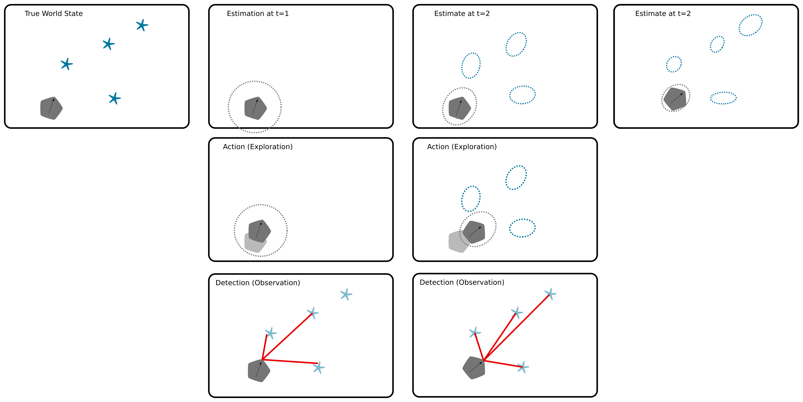

## Today
* Alumni Q&A
* EKF-SLAM Details (Continued)
* EKF-SLAM Implementation
* Deep Dive: Proposal Review and Work-time

## For Next Time
* Keep working on your [Deep Dive Projects](../projects/deepdive_1.md) 

## Alumni Q&A
Eric Miller '19 is stopping by the class to discuss his latest (just out of stealth!) venture, [AutoPallet Robotics](https://autopallet.bot/). This is a time for students to hear about how uncertainty quantification and reasoning is applied to a real world system, and learn about one alumn's post-graduation career trajectory.

## EKF-SLAM Details (Continued)
Last time, we started to get into the details of deriving the EKF-SLAM algorithm. We'll finish this discussion, and then have some time to experiment with an implemented version of the algorithm to gain further intuition for how the system works.

Recall that the gist of EKF-SLAM is that we will iteratively estimate the robot's location and the location of landmarks simultaneously. We can represent the landmarks as additional states in our transition and measurement matrices which define the transformations between states and observations, respectively. The output will look something similar to what this cartoon depicts:

### Assumptions
In EKF-SLAM there are three key assumptions:
* Noise is Gaussian (just like in the EKF localization problem)
* Maps are composed of features (i.e., landmarks)
* Observations of the environment provide _positive_ information about the location of a landmark

We will additionally make a simplifying assumption for our derivation today: the correspondences between landmarks will be known. 

### The Posterior and State Vector
We would like to find $$\mathcal{P}(m, x_{t} \vert z_{1:t}, u_{1:t})$$ in real-time (online). Since the correspondences are known, we do not need to represent these directly in our posterior. As the map is a list of landmarks, we can define our state vector as follows:

$$
\mathcal{X}_t = \begin{bmatrix} x_t \\ m \end{bmatrix} = \begin{bmatrix} x & y & \theta & m_{1,x} & m_{1,y} & s_1 & m_{2,x} & m_{2,y} & s_2 & \dots & m_{N,x} & m_{N,y} & s_N \end{bmatrix}^T 
$$

where $$x, y, \theta$$ denote the robot's coordinates and heading, $$m_{i,x}, m_{i, y}$$ represents the coordinates of the $$i$$th landmark for $$i = 1, \dots, N$$ and $$s_i$$ is the landmark's signature.

The initial mean and covariance for our state vector can be expressed:

$$
\mathcal{X}_0 = \begin{bmatrix} 0 & 0 & 0 & \dots & 0 \end{bmatrix}^T
$$

$$
P_0 = \begin{bmatrix} 0 & 0 & 0 & 0 & \dots & 0 \\
                           0 & 0 & 0 & 0 & \dots & 0 \\
                           0 & 0 & 0 & 0 & \dots & 0 \\
                           0 & 0 & 0 & \infty & \dots & 0 \\
                           \vdots & \vdots & \vdots & \vdots & \ddots &\vdots \\
                           0 & 0 & 0 & 0 & \dots & \infty\end{bmatrix} 
$$

which captures the original belief that the robot is initialized at the origin of the world and none of the landmark locations are known. The structure of the covariance matrix also strongly implies that the landmarks are independent from one another.

### Prediction Step
As in the EKF for localization, we use the prediction step to advance the estimate of where our robot is following some action that is taken. Notably, since landmarks are stationary, we are mostly performing a prediction over our robot's pose, which is effectively just our typical EKF:

1. Use the nonlinear transition function to get a new state vector.
2. Compute a transition matrix (Jacobian).
3. Estimate the transformation in state covariance.

The special case here is that in the prediction step, we want to preserve our uncertainty (covariance) over our landmarks (and not reduce this uncertainty to 0 or manipulate it based on our robot's motion -- since how the robot moves should be independent of how the landmarks exist). Thus, we compose our Jacobian out of a block of partial derivatives for robot pose, and an identity matrix for all elements of landmarks. 

### Update Step
In EKF-SLAM, we make an additional observation at each time step -- the signature of a landmark. Imagine a robot given a landmark pinger: this pinger now returns a range, bearing, and ID of the landmarks within the detection limit of the robot. 

During the update step, we want to update our estimate of where the each landmark is (and associated covariance) as well as where our robot is (and associated covariance). To do this, we will simultaneously update our estimates of landmarks and the robot's pose.

1. Given the observation, estimate the location of each landmark in visual range assuming that the robot's estimated pose from the prediction step is true.
2. Compute the residual between the predicted location of the robot and each landmark with the observation (used to compute the robot's pose and the landmark's pose). 
3. Construct a measurement matrix (Jacobian) which transforms the observation vector back into the full state space.
4. Compute the Innovation in covariance.
5. Compute the Kalman gain.
6. Update the state vector.
7. Update the state covariance.

In practice, at a single timestep multiple landmarks may be observed. The update step will iterate through each observation to compute a new innovation, gain, state vector, and state covariance. The output of the update step is the final integration of all of the observations.

### Example Problem: Steering Robot with a Landmark Detector
Let's look at a specific example for the case of a 2D steering robot, with position $$x, y, \theta$$ (cartesian position and heading) and control inputs $$v, \omega$$ (linear and angular velocity).

We can start with inspecting a simple one-step update:

$$
\mathcal{X}_t = \mathcal{X}_{t-1} + \begin{bmatrix} -\frac{v_t}{\omega_t}\sin\theta + \frac{v_t}{\omega_t}\sin(\theta+\omega_t \Delta t) \\ \frac{v_t}{\omega_t}\cos\theta - \frac{v_t}{\omega_t}\cos(\theta+\omega_t \Delta t) \\ \omega_t \Delta t \\ 0 \\ 0 \\ \vdots \\ 0 \end{bmatrix}
$$

where state vector $$\mathcal{X}_t$$ contains $$3N + 3$$ elements (3 elements representing the robot pose, and $$3N$$ elements representing each landmark pose and signature, with $$N$$ representing the number of landmarks).

We can define a more compact representation:

$$
\mathcal{X}_t = \mathcal{X}_{t-1} + F^T\begin{bmatrix}-\frac{v_t}{\omega_t}\sin\theta + \frac{v_t}{\omega_t}\sin(\theta+\omega_t \Delta t) \\ \frac{v_t}{\omega_t}\cos\theta - \frac{v_t}{\omega_t}\cos(\theta+\omega_t \Delta t) \\ \omega_t \Delta t \end{bmatrix}
$$

where

$$
F = \begin{bmatrix} 1 & 0 & 0 & & 0 & \dots & 0 \\
                    0 & 1 & 0 & & 0 & \dots & 0 \\
                    0 & 0 & 1 & & 0 & \dots & 0 \end{bmatrix}
$$

such that $$F$$ is composed of 3 x 3 identity matrix (over robot state) and $$3N$$ columns of 0s.

In order to compute our covariance, we need to linearize our dynamical system. If we let: 

$$
g(\mathcal{X}_{t-1}, u_t) = \mathcal{X}_{t-1} + F^T\begin{bmatrix}-\frac{v_t}{\omega_t}\sin\theta + \frac{v_t}{\omega_t}\sin(\theta+\omega_t \Delta t) \\ \frac{v_t}{\omega_t}\cos\theta - \frac{v_t}{\omega_t}\cos(\theta+\omega_t \Delta t) \\ \omega_t \Delta t \end{bmatrix}
$$

then we can linearize based on a single Taylor Series Expansion:

$$
g(\mathcal{X}_{t-1}, u_t) \approx g(\bar{\mathcal{X}_{t-1}}, u_t) + G_t(\mathcal{X}_{t-1} - \bar{\mathcal{X}_{t-1}})
$$

where $$\bar{\mathcal{X}_{t-1}}$$ represents the mean estimate of the state vector. Because of the additive form of our transition matrix, we can decompose our Jacobian as follows:

$$
G_t = I + F^T g_t F
$$

where

$$
g_t = \begin{bmatrix} 0 & 0 & -\frac{v_t}{\omega_t}\cos(\theta_{t-1}) + \frac{v_t}{\omega_t}\cos(\theta_{t-1} + \omega_t \Delta t) \\
0 & 0 & -\frac{v_t}{\omega_t}\sin(\theta_{t-1}) + \frac{v_t}{\omega_t}\sin(\theta_{t-1} + \omega_t \Delta t) \\ 0 & 0 & 0 \end{bmatrix}
$$

**Thus, at the end of the prediction step we would have:**

$$
\hat{\mathcal{X}_t} = \mathcal{X}_{t-1} + F^T \begin{bmatrix}-\frac{v_t}{\omega_t}\sin\theta + \frac{v_t}{\omega_t}\sin(\theta+\omega_t \Delta t) \\ \frac{v_t}{\omega_t}\cos\theta - \frac{v_t}{\omega_t}\cos(\theta+\omega_t \Delta t) \\ \omega_t \Delta t \end{bmatrix} 
$$

$$
\hat{P_t} = G_t P_{t-1} G_t^T + F^T Q_t F
$$

---

Now, let's donsider our update step. Our robot is equipped with a range and bearing sensor. Any observation can be modeled as:

$$
z_t^i = \begin{bmatrix} \sqrt{(m_{j,x} - x)^2 + (m_{j,y} - y)^2} \\
\text{atan2}(m_{j,y} - y, m_{j,x} - x) - \theta \\
m_{j,s} \end{bmatrix} + R_t
$$

where $$i$$ is the index of an individual landmark, $$j = c_t^i$$ is the index of the observed landmark at a particular time, and the first term in the matrix represents a range, the second term represents a bearing, and the final term represents a landmark signature. $$R_t$$ is a 0-mean multivariate gaussian which corrupts the observations with a small amount of noise.

Given some particular landmark, we can linearize the measurement function as $$h(\mathcal{X}_t,j) \approx h(\hat{\mathcal{X}}_t,j) + H_t^i(\mathcal{X}_t - \hat{\mathcal{X}}_t)$$

where

$$
q_t = (m_{j,x} - x_t)^2 + (m_{j,y} - y_t)^2 
$$

$$
h_t^i = \begin{bmatrix}\frac{\partial h_1}{\partial x} & \frac{\partial h_1}{\partial y} & \frac{\partial h_1}{\partial \theta} & \frac{\partial h_1}{\partial m_{j,x}} & \frac{\partial h_1}{\partial m_{j,y}} & \frac{\partial h_1}{\partial m_{j,s}} \\ \frac{\partial h_2}{\partial x} & \frac{\partial h_2}{\partial y} & \frac{\partial h_2}{\partial \theta} & \frac{\partial h_2}{\partial m_{j,x}} & \frac{\partial h_2}{\partial m_{j,y}} & \frac{\partial h_2}{\partial m_{j,s}} \\ \frac{\partial h_3}{\partial x} & \frac{\partial h_3}{\partial y} & \frac{\partial h_3}{\partial \theta} & \frac{\partial h_3}{\partial m_{j,x}} & \frac{\partial h_3}{\partial m_{j,y}} & \frac{\partial h_3}{\partial m_{j,s}} \end{bmatrix} = 
\begin{bmatrix} \frac{x_t - m_{j,x}}{\sqrt{q_t}} & \frac{y_t - m_{j,y}}{\sqrt{q_t}} & 0 & \frac{m_{j,x} - x_t}{\sqrt{q_t}} & \frac{m_{j,y} - y_t}{\sqrt{q_t}} & 0 \\ \frac{m_{j,y} - y_t}{q_t} & \frac{x_t - m_{j,x}}{q_t} & -1 & \frac{y_t - m_{j,y}}{q_t} & \frac{m_{j,x} - x_t}{q_t} & 0 \\ 0 & 0 & 0 & 0 & 0 & 1\end{bmatrix}
$$

and 

$$
H_t^i = h_t^iF_j
$$

with 

$$
F_j = \begin{bmatrix}
1 & 0 & 0 && 0 & \dots & 0 & & 0 & 0 & 0 && 0 & \dots & 0 \\
0 & 1 & 0 && 0 & \dots & 0 & & 0 & 0 & 0 && 0 & \dots & 0 \\
0 & 0 & 1 && 0 & \dots & 0 & & 0 & 0 & 0 && 0 & \dots & 0 \\
0 & 0 & 0 && 0 & \dots & 0 & & 1 & 0 & 0 && 0 & \dots & 0 \\
0 & 0 & 0 && 0 & \dots & 0 & & 0 & 1 & 0 && 0 & \dots & 0 \\
0 & 0 & 0 && 0 & \dots & 0 & & 0 & 0 & 1 && 0 & \dots & 0 \\
\end{bmatrix}
$$

where the columns of 0s are $$3j -3$$ and $$3N - 3j$$ elements wide, respectively (again, capturing the fact that landmarks provide no information about other landmarks).

This allows us to compute a residual and innovation (and thus Kalman gain) with respect to every landmark observation:

$$
S_t^i = H_t^i \hat{P}_t [H_t^i]^T + R_t
$$

$$
K_t^i = \hat{P}_t [H_t^i]^T [S_t^i]^{-1}
$$

**This is done, iterating through every observation with intermediate update steps (in the initial step the prediction estimate is used):** 

$$
\tilde{\mathcal{X}_t} = \tilde{\mathcal{X}_t} + K_t^i(z_t^i - h(\tilde{\mathcal{X}}_t, j))
$$

$$
\tilde{P_t} = (I - K_t^iH_t^i)\tilde{P}_t
$$

**until the final observation is incorporated, and $$\mathcal{X}_t = \tilde{\mathcal{X}_t}$$ and $$P_t = \tilde{P_t}$$.**

### Implementation Example
To gain further intuition about the EKF-SLAM algorithm, a prepared implementation in CoLab has been developed. Here, you'll be able to change/define your own functions, experiment with different parameters of the EKF-SLAM algorithm, and visualize different components of the system. 

Access [the notebook here](https://colab.research.google.com/drive/1po4ffs9wcWQsqrzj_GKn4itsofpKM6Sd?usp=sharing). You may want to copy the notebook onto your own Google Account in order to run and edit the file smoothly.

When inspecting the code, consider the following:
* Track the dimensionality of all of the components of the EKF filter. 
    * How are landmarks added or subtracted from the state vector?
* How is the correspondence problem solved? (Further, what is Mahalanobis distance?)
    * How sensitive is the filter to the correspondence problem? (you might want to play with the correspondence parameters for this!)
* How does the covariance change in time? (you might want to generate some plots for this!)
* How does changing Q, R, and the initial covariance P impact the performance of the filter?
* What would you change about this code to implement the example we've been working through in class?

## Going Further
If you'd like to get more depth in Mapping or SLAM as a whole, the following are good resources for learning more:
* Part III of _Probabilistic Robotics_ (covers occupancy grid mapping, SLAM, GraphSLAM, FastSLAM)
* Cyrill Stachniss' [Online Course and Lecture Series](https://www.youtube.com/playlist?list=PLgnQpQtFTOGQrZ4O5QzbIHgl3b1JHimN_) 

## Deep Dive Project Proposal Review and Work Time
In the remainder of class, the teaching team will be around to check-in with folks on their project proposal, and there will be time to work on deep dives, catch-up on other ProbRobo work, or continue experimenting with the EKF-SLAM implementation.