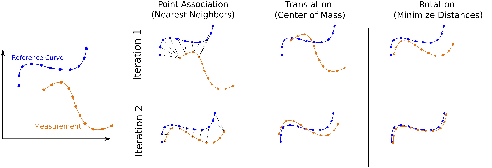
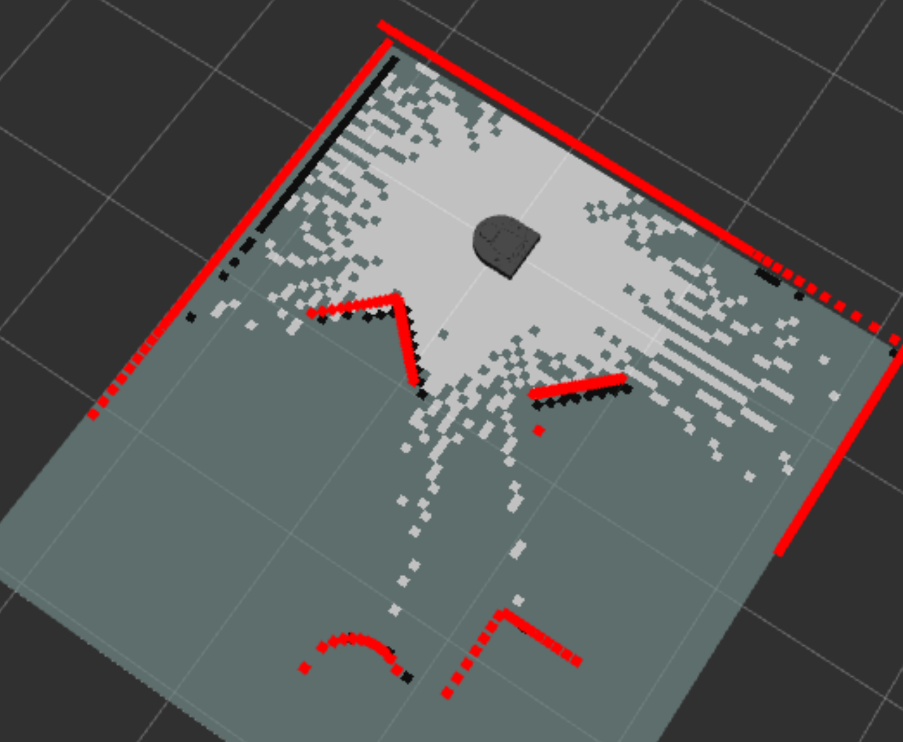
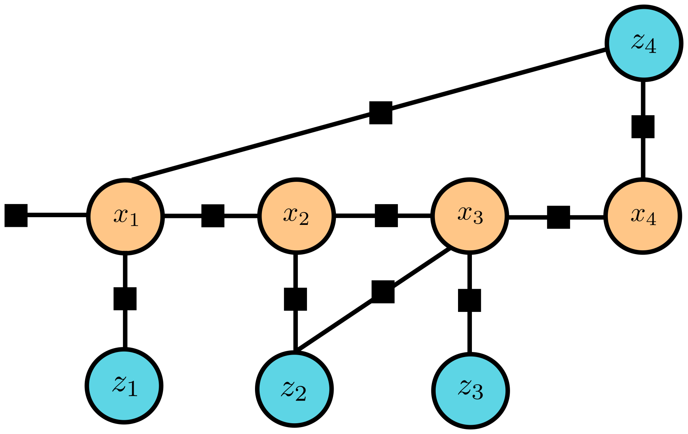

## Today
* Revisiting Key Topics through Rapid Teach-In
    * The Correspondence Problem
    * Map Representations
    * Online and Offline Formulations
* Deep Dive: Worktime and Check-In

## For Next Time
* Keep working on your [Deep Dive Projects](../projects/deepdive_1.md). 

## The Correspondence Problem, Revisited
One of the key practicalities of a SLAM algorithm is solving the correspondence problem -- aligning observations with elements in a map. 

### In EKF-SLAM
In EKF-SLAM, we have assumed a relatively simple world, with a sparse number of landmarks and detections. To solve the correspondence problem, we can use our estimated world pose and noisy observations to assign an observation to the closest known landmark. In the implementation example we looked at, we used the _Mahalanobis Distance_ as a measure of "closeness" for this problem:

$$
d_M(m_z, m_i) = \sqrt{(m_z - m_i)^T S^{-1}(m_z - m_i)}
$$

where $$m_z$$ is an observed landmark, $$m_i$$ is a candidate landmark from the state, and $$S$$ is the covariance matrix between the two (in practice, this is the innovation between the points). The use of Mahalanobis distance allows for the _uncertainty_ over landmark poses in the state and measurement noise in the observation to be considered when performing the correspondence problem.    

### For Dense Observations and State Representations
Iterating through all possible matches is well and good when there are very few of them, but what if we have a much more rich state and observation space? For instance, a common scenario is that we have an occupancy grid that represents our environment, and we would like to match a laser scan to some local area of that occupancy grid. Naively approaching this problem (enumerating over all possible projections of a laser scan onto a world map) would be a computational nightmare. 

A popular algorithm for solving the "dense" version of the correspondence problem is called _Iterative Closest Point_:
* Structure in a map and the dense observation are represented as point clouds
* Iteratively, until convergence:
    * For each map point, the "closest" observation point is found. Nearest neighbor search (using, for instance, Euclidean distance) might be used to associate the points together.
        * Note: the matching is not necessarily 1-for-1!
    * Based on the set of matching points, compute the transformation (translation then rotation) that aligns the observation points to the map points.

[This 5-minute explainer](https://www.youtube.com/watch?v=QWDM4cFdKrE) assists with visualizing this technique.

## Map Representations, Revisited
In EKF-SLAM, we represent our "map" of the world as a list of landmark states. This is a compact way of representing structure in an environment, which is computationally convenient. However, sometimes we might want to use our map to do more than localize -- maybe we want to explore a space and ensure we've seen everything, or we need to find a particular object in a particular room. For more complex tasks or more dense sensing, we might want to pick a different representation for our map.

### Occupancy Grids and Voxel Fields
One common representation for a metric map is an occupancy grid (or, in 3D space, a voxel field). An occupancy grid discretizes a map into fixed-area squares and assigns a value indicating whether that grid cell is occupied (there is an object there) or free space. Rather than naively assign occupied/free assignments based on single observations, a _Bayesian binary filter_ is run for each cell, allowing observations to accumulate to improve certainty. Occupancy grids are among the most common map representations; the `slam_toolbox` in `ROS2` that implements modern SLAM algorithms for use on hardware systems makes use of occupancy grids in the implementation.

The simplest form of algorithm for occupancy grid mapping takes the form:
* Iterate over all cells of the map, and for each cell:
    * Check whether the cell is within the perceptual range of the particular robot observation
    * If a cell is relevant, update the value of the cell (the _log odds_ measure is common) using an _inverse sensor model_
    * If a cell is not relevant, it retains its prior value

In this algorithm, there are two new ideas to us: the _inverse sensor model_ and the _log odds_ form of probability:
* The inverse sensor model implements $$\mathcal{P}(m_i \vert x_t, z_t)$$. Let's take for example a range finder: in the inverse sensor model, the range and heading for a particular observation will allow us to assign all cells from the robot to the metric location of the measurement a "free space" value and the cells associated with the range and heading an "occupied space" value.
* The log odds form of a probability is often used to improve numerical stability, and takes the form for any probability $$p$$: $$\log\frac{p}{1-p}$$. If this value is 0, then there are 50-50 "odds" of something, if it is negative then it is less likely to occur, and positive it is more likely.

[Chapter 9 of _Probabilistic Robotics_](https://share.libbyapp.com/title/5578912#library-minuteman-olin) discusses more details about occupancy grid mapping, and variations on the standard format.

### Factor Graphs
Occupancy grids serve as a useful representation for dense measurements, but themselves are clunky to deal with. A popular alternative for the _computational_ representation of a map is a _factor graph_, which tracks the history of states and observations (the factors) of a robot, drawing correspondence connections that change the topology of the graph and have implications for the estimate of robot trajectory and corresponding map. Many _offline_ SLAM algorithms make use of factor graphs to optimize at the end of a robot deployment, as updating a graphical structure _online_ requires extensive compute resources.

Factor graphs are particularly good at solving the _loop closure_ problem in SLAM -- how does a robot deal with accumulated noise when it revisits a place that it has been? In filtering based online methods, the latest observation will be used to correct the vehicle and that local area of the map, but all prior estimates may be left untouched, creating a distorted field. In a factor graph, loops closures can be modeled with factors, which ultimately inform an optimization of the entire graphical structure.

Perhaps one of the most well-known implementations of factor graphs for SLAM is the [GTSAM library](https://repository.gatech.edu/server/api/core/bitstreams/b3606eb4-ce55-4c16-8495-767bd46f0351/content), which has been widely adopted and modified since creation. GTSAM has a [Python API](https://github.com/gtbook/gtsam-examples/blob/main/RangeISAMExample_plaza2.ipynb) and has been incorporated into the [Robotics Book by Frank Daellart](https://www.roboticsbook.org/S64_driving_perception.html). [This 5-minute explainer](https://www.youtube.com/watch?v=uuiaqGLFYa4&list=PLgnQpQtFTOGSO8HC48K9sPuNliY1qxzV9&index=36) provides further high-level detail.

While the map is represented abstractly as a factor graph, for human interpretation it is not uncommon to use the factor graph observation factors and updated states to populate an occupancy grid.

## Online vs Offline, Revisited
SLAM is fundamentally an algorithm for estimating the joint posterior over a robot's path and the structure of the environment. As SLAM is built from a Bayesian framework, either _filtering_ or _smoothing_ can be applied to refine the posterior. Whether filtering or smoothing is used depends on whether the algorithm is being run _online_ (while the robot is in motion, synchronously with the robot's actions and observations) or _offline_ (as a batch process that runs after the robot executes some trajectory and records observations).

### Online Methods: Filtering
The benefit of an online method is that a robot given a complicated task in an initial unknown environment can develop a _belief_ about its state and the world state that it can leverage, in practical time, to execute some other mission. In an online method, filtering-based SLAM algorithms would be used. 

While useful, online methods are typically limited in the following ways:
* Only the latest state of the robot is estimated; corrections to previous beliefs are not applied if new information is learned that impacts the interpretation of the history.
* Loop closures can diverge or significantly distort a map, making future localization in the map challenging.
* To run in real-time, trade-offs with map resolution and observation fidelity may need to be made, and it might not be obvious how to tune these parameters.

### Offline Methods: Smoothing
An offline method is commonly considered a "gold standard" for re-creating a robot's trajectory and generating a high quality map, largely because the benefit of hindsight (smoothing) can be applied in this setting. This is particularly useful to resolve the loop closure problem and create coherent maps when many cycles exist in a trajectory.

While powerful, offline methods are only useful in situations in which the robot can be allowed to execute dedicated "mapping" missions. An offline SLAM technique might be paired with an online localization (or SLAM) technique which is seeded by the map generated by the offline SLAM algorithm when the robot is actually tasked with something to do in the environment. 

## Going Further
If you'd like to get more depth in Mapping or SLAM as a whole, the following are good resources for learning more:
* Part III of _Probabilistic Robotics_ (covers occupancy grid mapping, SLAM, GraphSLAM, FastSLAM)
* Cyrill Stachniss' [Online Course and Lecture Series](https://www.youtube.com/playlist?list=PLgnQpQtFTOGQrZ4O5QzbIHgl3b1JHimN_) 

## Deep Dive Project Worktime
The remainder of class is designed to be time to work on your deep dive projects. The teaching team will also be around to do some brief check-ins with you.