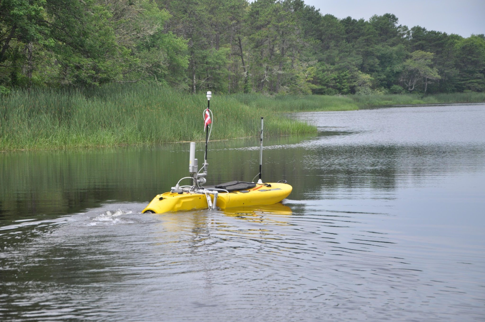
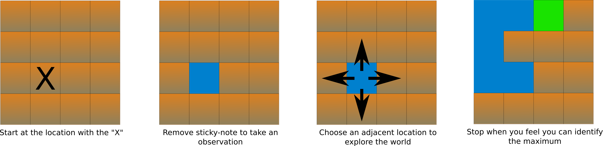

## Today
* Kick-Off to the Planning Under Uncertainty Unit
* The definition of a Decision Process
* Markov Decision Processes

## For Next Time
* Revise the [YOGA Assignment](https://canvas.olin.edu/courses/1002/assignments/17538) to help focus the rest of the semester (Due this Friday at 7PM).
* Work on the [Week 10 Day Assignments](https://canvas.olin.edu/courses/1002/assignments/18646) (Due March 30th at 7PM).

## Planning Under Uncertainty
In the last unit we were considering how a robot can reason about its state within an environment (alongside aspects of that environment). This unit, we are going to further operationalize this ability -- if the robot can estimate itself and the world, it can leverage that knowledge to perform more complex or strategic tasks.

Take for instance the localization task: we saw first-hand how useful it was for the robot to see landmarks at moments when the robot's uncertainty was growing. In our work then, the robot encountering a landmark was opportunistic based on an open-loop trajectory we gave the system. But what if the robot could decide to strategically revisit or seek out a landmark based on its own uncertainty in a closed-loop system? This is one of the key pillars of planning under uncertainty. 

### Definition and Types of Uncertainty
Planning under uncertainty is the art of making decisions with imperfect information about an environment or task.

Formally, there are two types of uncertainty that can arise within a robotic system:
* **Aleatoric Uncertainty** -- arises when the thing we want to study is itself random or chaotic; e.g., fluid turbulence.
* **Epistemic Uncertainty** -- arises when there is something we don't completely know; e.g., imperfect model or hidden states.

When we talk about "planning under uncertainty" in this unit, we are mostly going to consider how we deal with _epistemic uncertainty_, which is a type of uncertainty that _can be estimated and even reduced from collecting observations_. 

### A Conceptual Activity
You are a robotic scientist dropped into an estuary tasked with finding the source leaking methane-rich materials into the environment. Your task definition:
1. You are equipped with a _point sensor_ for methane concentration.
2. The _global maximum_ of methane corresponds with the wastewater source in this estuary.
3. We are allowed to collect a single physical water sample for _ex situ_ analysis in a laboratory; we would like that to be representative of the wastewater source. 
4. Using only your _point sensor_, find the methane maximum and collect a sample there.

Using the maps in front of you, you can simulate this scenario using the following rules:
* Start at the location marked with an "X"
* Take an observation with your point sensor by removing a sticky note
* Choose any adjacent location to go in order to traverse the world and explore
* Stop when you feel that you can identify the maximum of the world
* Actions are worth the following points:
    * Moving and Observing: -1
    * Backtracking: -2
    * Correct Guess: +50
    * Incorrect Guess: -10
* You can assume that the world is _smooth_ and that higher-value regions are less purple.

**Exercise**: Play through this simulated scenario with a partner. Take note of the strategy that you adopt. 
* What _heuristics_ did you use to choose where to sample next?
* How did you leverage your observations and prior knowledge?
* When did you know that you knew enough to be confident where the maximum was?
* How was this similar or different from what other groups chose to do?

## The Definition of a Decision Process
In robotic systems, we are typically in a scenario where we are working through a _sequential decision-making problem_: alternating between evaluating new information, planning a new move, and executing that move. 

In these types of tasks, we are balancing performing a task with _gathering information_ (in a formal sense) to execute this task. We can gather information in two distinct areas:
* **Action Effects**: the nature of a robot and its environment is that even when a state is perfectly observable, the possible outcome of an action may still be non-deterministic. This is often why operating in open-loop is insufficient for many tasks (even simple tasks). By taking actions and recording outcomes it may be possible to model the action-effect mapping; alternatively, by considering action-effect non-determinism, more robust control actions can be taken to ensure task completion.
* **Perception**: in the vast majority of interesting robotics problems, sensor can only yield _partial_ information about an environment, and the rest must be inferred. Information gathering can improve inference models that "fill in the blank" between what can be observed and what cannot.

A decision-making process grapples with different forms of uncertainty and considers how to embed information gathering actions amongst task performing actions. To do this, decision-making systems not only use the robot's current uncertainty to select actions, but it also utilizes a sense of _anticipated uncertainty_ to differentiate the utility of different actions or action sequences over some planning horizon.

### The Composition of a Decision-Making Algorithm
In practice, a decision-making algorithm on a robot is implemented as a _compositional_ framework, with different elements:
* **World Model** -- the representation of the robot's and world's state, informed by observations. This is also sometimes called the "belief" of the robot, and provides an interface for computing world/state uncertainty.
* **Task Heuristic** -- the representation of the task the robot needs to execute. This is often written as a cost or reward function, over which the robot's actions are optimized.
* **Action Selection / Optimizer** -- given the task heuristic and world model, the action selector is what simulates and evaluated the robot taking various actions, the state responding based on those actions, and reward being accumulated (or cost being incurred). This optimizer can be formatted as a search algorithm or as a classical closed-form optimizer. 

We will be discussing the elements of a decision-making algorithm in-depth this unit, and writing our own implementations.

**Exercise:** Consider what you've learned about a decision-making system. How do the different aspects of decision-making align with our state-sense-act framework for a robot? How can uncertainty be embedded into this framework?

## Markov Decision Processes
Let's consider a scenario in which the world is fully observable, but our action-effects are non-deterministic (uncertain). How do we ensure that the robot still performs a task in a well-defined way? 

We're going to use a paradigm called _Markov Decision Processes_ (or MDPs). This specific decision-making process assumes that the state of the robot/environment are fully observable, but that the action-effect dynamics may be stochastic. A MDP is defined as a tuple composed of the following elements:

$$
\{\mathcal{S}: \text{States}, \mathcal{A}: \text{Actions}, T: \text{Transition function}, R: \text{Reward function}\}
$$

Formally, in a MDP the perception model, $$\mathcal{P}(z_t \vert x_t)$$ is deterministic; the action model $$\mathcal{P}(x_{t+1} \vert u_t, x_t)$$ is non-deterministic.

Since the action-effect model is stochastic, it is _insufficient_ to plan out a single course of action for a robot (if we want any guarantee about the overall performance of the robot). Thus, we need to develop a _control policy_ that will be robust to the stochasticity of the action-effects. We will discuss the practicalities of doing this next class!

## Today's So What
Robots are increasingly deployed around us, and must grapple with the same realities we do. Thus, they must be able to represent uncertainty and use it strategically. 

**Robustness** We need to know that they are safe and robust to be around, and reliable in their assigned tasks. Formal paradigms that describe tasks and environments provide a meaningful basis for evaluating the quality of a robotic system.

**Autonomy and Intelligence** For robots to be useful tools, they need to act without our supervision in challenging, high-stakes scenarios. Autonomy and "intelligent" behavior is predicated on the ability to strategically plan, which requires dealing with uncertainty.

**Advancing Human Capability** The same frameworks that can support a robot can support people too. Decision-making is hard! Balancing human intuition and analytical optimization can lead to better outcomes than either alone.

## Going Further
To learn more about planning under uncertainty, you might find the following resources useful:
* Chapter 14 of _Probabilistic Robotics_
* [These slides](https://docs.google.com/presentation/d/1wyX5DYXP6ONv1_5_VUT-v2ShacLwM7lBW9gYbZJW8JI/edit?usp=sharing) which outline some of the discussion from today's lecture and previews future discussions.

## Day Activity
Today's day activity is designed to reinforce the idea of a decision-process and map the formalism to our framework for robotic systems.

### Problem 1: Recap of Today's Notes
Go back through today's written notes on this page and work through each of the exercises / be sure to document your answers to the exercises discussed in class (there should be a total of 2 exercises in today's notes).

### Problem 2: Vocabulary Review
There was a lot of new vocabulary introduced in today's lecture. Let's have a look at some key terms; using the course resources and these notes, please provide your own defnitions of the following terms (with respect to robotic systems):
* Uncertainty
* Decision-Making
* Information
* Heuristic
* Partial Observability
* Policy

### Problem 3: Using the MDP Formalism
Let's practice defining a MDP (e.g., populating the tuple for a MDP) from a problem description. Here, an example is provided first, and then an example is provided for you to consider.

**Example:**
Imagine a wheeled-robot plopped into an office building, tasked with finding a particular known location. The robot does not know its initial location but does have a map of the environment in which it can try to localize itself and in which the goal location is marked. The floor of the office environment is essentially symmetric save for the far ends of the corridors. The robot incurs a time-based penalty based on how long it takes to get to the goal location.

Let the MDP be represented as the tuple: $$\{\mathcal{S}, \mathcal{A}, T, R\}$$ where:

$$
\mathcal{S}: x_t = \{x_x \in [\mathcal{X}_{min}, \mathcal{X}_{max}], x_y \in [\mathcal{Y}_{min}, \mathcal{Y}_{max}], x_\theta \in [-180, 180)\}
$$
where the robot's location is a 3-tuple with x and y values within a bounded map and the robot's heading between -180 and 180 degrees.

$$
\mathcal{A}: u_t \in \mathbb{U}
$$
where the robot can select an action primitive from a set of well-defined primitives, e.g., forward, backward, right, left (which are executed as velocity commands to a controller when selected).

$$
T: \mathcal{S} \times \mathcal{A} \rightarrow \mathcal{P}(x_{t+1} \vert x_t, u_t)
$$
where the transition model is the probability of a state evolution based on the previous state and selected action.

$$
R: \mathcal{S} \times \mathcal{A} \rightarrow \sum^T_{t=0} \alpha, \alpha \in (-\infty, 0) 
$$
where the reward at any time is a negative accumulated score over all time passed.

**Problem:**
Imagine a 6-DOF arm manipulator attached to a table on which different objects and bins can be placed. The robot has access to an overhead camera which provides a perfect map of the world at any moment of time, and it can see where objects and bins are located. The arm is tasked with placing an apple into a blue bin, both of which are located on the table. The arm is composed of a revolute joint at the base, a revolute shoulder, two revolute elbows, a revolute wrist, and an end-effector which can open and close. The robot has positioning and gripping stochasticity. The robot will accumulate a reward of 100 points when it places an apple in the blue bin. 