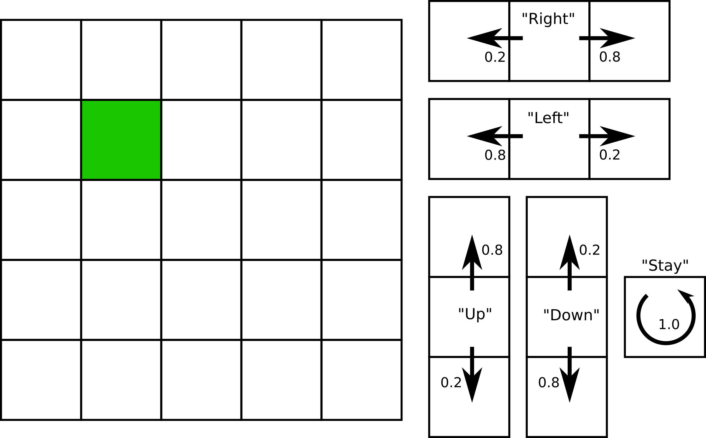
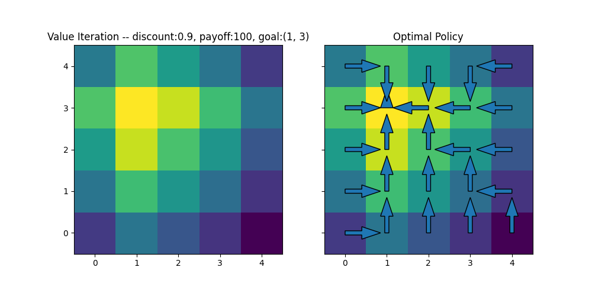
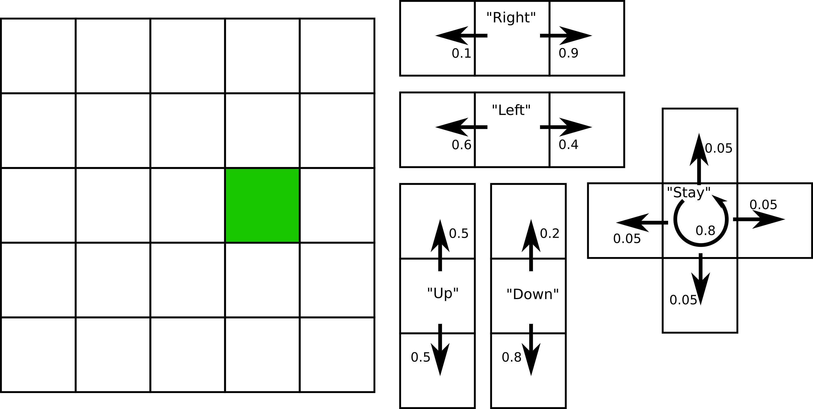

## Today
* MDPs (continued)
* Value Iteration

## For Next Time
* Revise the [YOGA Assignment](https://canvas.olin.edu/courses/1002/assignments/17538) to help focus the rest of the semester (Due tomorrow at 7PM).
* Work on the [Week 10 Day Assignments](https://canvas.olin.edu/courses/1002/assignments/18646) (Due March 30th at 7PM).

## MDPs (continued)
Last time we introduced the paradigm of a Markov Decision Process (MDP), which is defined by a 4-tuple: $$\{\mathcal{S}, \mathcal{A}, T, R\}$$. A MDP grapples with action-effect stochasticity in a robotic system, where we will assume that the state space is fully observable at any time. 

As a part of this definition, we define a reward function (or equivalently, a cost function), which embeds the robot task. Ultimately, we would like to select a series of actions that collect the most reward (or incur the least cost), _even when action-effect stochasticity is considered_. 

Today, we'll learn a foundational algorithm for solving MDPs (i.e., finding a control policy) called _value iteration_. This is just one in a whole family of algorithms we will explore in this unit.

## Value Iteration
Value iteration is a method for maximizing the "payoff" of a control policy that a robot executes according to some goal and cost (the reward function). 

### Rewarding a Robot
In value iteration, the reward function is extremely important as it is the "value" that will be accumulated over a simulated chain of actions in order to ultimately select the best policy. As such, it is important that the reward function define the _goals_ of the robot, and the _costs_ to achieving those goals. For instance:

* A _goal_ for a robot could be to reach a certain destination or successfully maintain a certain configuration (e.g., balancing on one wheel). When reached, the robot is given a positive _payout_.
* A _cost_ for a robot could be the energy it expends performing certain tasks, or the time it takes to achieve a goal. When incurred, the robot is given a negative signal. 

The reward function can thus be compositional, e.g., 

$$
R(x_t, u_t) =  \begin{cases}
      +100 & \text{if action achieves the goal state}\\
      -10 & \text{if action expends over 10\% of energy budget}\\
      -1 & \text{otherwise}
    \end{cases}       
$$

Using a compositional reward function saves us a bit of bookkeeping hassle between costs and payouts; but it also directly encodes a key philosophy in planning under uncertainty: **there is always a trade-off between achieving a goal and accumulating cost.**

### Definition of a Control Policy (and Considerations)
A control policy we will denote as:

$$
\pi: x_t \rightarrow u_t
$$

where a policy is a function that maps states of the robot/environment into control actions. Though this statement is very generic, in practice, there are many computational considerations that must be designed: will this policy be deterministic or non-deterministic? Will it be fast/reactive or nonmyopic? 

The aim for any policy is to maximize the _expected reward_ (or cumulative payoff) that can be earned from any state of the system:

$$
R_T^\pi(x_t) = \mathbb{E}\Biggl[\sum_{\tau=1}^T\gamma^\tau r_{t+\tau} \vert u_{t+\tau} = \pi(x_{1:t+\tau-1}, u_{1:t+\tau-1})\Biggr]
$$

Keenly associated with the practicalities of a policy is the _planning horizon_ set by $$T$$ and the _discount factor_ set by $$\gamma$$, which together capture the value placed on future actions. Consider a few different types of planning horizon:

**Greedy (One-Step)**: this is a very short planning horizon where $$T=1$$ (and discount factor is moot); essentially it only values immediate rewards. 

**Finite (Multi-Step)**: this is a variable length horizon where $$T>1$$ and $$\gamma=1$$. Reward is summed over the length of all possible trajectories that could be sprouted from a single position in space. 

**Infinite (Discounted)**: this is ostensibly a horizon that assumes infinite planning time (and so infinitely accumulated reward); to make this practically useful, future rewards are discounted (allowing planners that use an infinite horizon to still discriminate between "good" and "bad" plans) such that $$\gamma < 1$$. 


### Optimal Control Policies for MDPs
An optimal control policy will effectively balance payoffs with costs for a given task and environment to ultimately maximize reward. What constitutes "optimal" is the crux of the value iteration discussion. We will deduce the definition for an optimal policy by inspecting the logic associated with different planning horizons.

Let's first consider a greedy (one-step) optimal policy:

$$
\pi_1(x) = \arg\max_u r(x,u)
$$

Quite simply, the best action to take is the one that will maximize the immediate reward that can be collected. We can define the _value_ of this policy as:

$$
V_1(x) = \gamma \max_u r(x,u)
$$

That is, the value is the expected immediate discounted reward.

Now, we consider what it would mean to have a two-step planning horizon. In this scenario, the optimal policy should maximize the sum of both of these steps:

$$
\pi_2(x) = \arg\max_u \Bigl[r(x,u) + \int V_1(x') \mathcal{P}(x' \vert u,x) dx'\Bigr]
$$

where the value of this policy is:

$$
V_2(x) = \gamma \max_u \Bigl[r(x,u) + \int V_1(x') \mathcal{P}(x' \vert u,x) dx'\Bigr]
$$

On inspection, we see that this is a recursive calculation: the two-step value is the immediate payoff of taking an action summed with the value of all possible next actions. With this form, we can consider the finite horizon case:

$$
\pi_T(x) = \arg\max_u \Bigl[r(x,u) + \int V_{T-1}(x') \mathcal{P}(x' \vert u,x) dx'\Bigr]
$$

where the value of this policy is:

$$
V_T(x) = \gamma \max_u \Bigl[r(x,u) + \int V_{T-1}(x') \mathcal{P}(x' \vert u,x) dx'\Bigr]
$$

And for the infinite case:

$$
\pi_\infty(x) = \arg\max_u \Bigl[r(x,u) + \int V_\infty(x') \mathcal{P}(x' \vert u,x) dx'\Bigr]
$$

where the value of this policy is:

$$
V_\infty(x) = \gamma \max_u \Bigl[r(x,u) + \int V_\infty(x') \mathcal{P}(x' \vert u,x) dx'\Bigr]
$$

This recursive computation of the value function and policy is known as the _Bellman equation_ (or equivalently, the _Bellman backup equation_). The intuition here is that for any given reward distribution, we can recursively "work backwards" from payoffs over a state and action space to assign a lifetime expected value of being in any one particular state and taking actions from there. The optimal policy will be the series of actions from any state that maximizes cumulative rewards.


### Practical Algorithms
Fundamentally, value iteration is used to generate a _reward landscape_ in an otherwise sparse world, over which an optimal policy can then be computed. Value iteration is computed recursively until convergence (e.g., values no longer appear to update in the map):

$$
\hat{V}(x) \leftarrow \gamma \max_u \Bigl[r(x,u) + \int \hat{V}(x')\mathcal{P}(x' \vert u,x) dx'\Bigr]
$$

and then the optimal policy is selected:

$$
\pi(x) = \arg\max_u \Bigl[r(x,u) + \int \hat{V}(x')\mathcal{P}(x' \vert u,x) dx'\Bigr]
$$

In plain pseudocode, value iteration follows:
```
func value_iteration()
    for all x:
        Vhat(x) = 0  # initialize
    until convergence:
        for all x:
            Vhat(x) = gamma * max(u, [r(x,u) + sum(Vhat(x')* prob(x'|x,u) for all x')]) 
    return Vhat
```

And subsequent policy selection:
```
func optimal_policy()
    return argmax(u, [r(x,u) + sum(Vhat(x')* prob(x'|x,u) for all x')])
```

### Implementation Example
The following section builds a small toy example of a grid world in which a single square contains all possible payoff, and all actions otherwise accumulate a small negative cost. The actions in this world are stochastic according to a transition function that assumed 100% action success if the robot is commanded to stay in place, and otherwise places 80% chance on the state advancing exactly as would be predicted by the commanded action and a 20% chance that the exact opposite state will be achieved instead (so, if commanded to the left, there is a 20% chance that the robot will actually go right). The discount factor we'll set is 0.9.

<p align="center">

</p>

To begin, let's create a way of computing the reward for this environment.

```python
class Reward(object):
    '''Creates a reward computing object for a gridworld.'''
    def __init__(self, goal, payoff, cost):
        self.goal = goal  # the location of the payoff
        self.payoff = payoff  # the payoff amount
        self.cost = cost  # action costs

    def compute_reward(self, state, action, next_state):
        '''Compute the immediate reward that is accumulated based on the current state, action taken, and resulting state.'''
        if (state == self.goal and action == "stay"):
            return self.payoff
        elif next_state == self.goal and action == "right" and state == (self.goal[0]-1, self.goal[1]):
            return self.payoff
        elif next_state == self.goal and action == "left" and state == (self.goal[0]+1, self.goal[1]):
            return self.payoff
        elif next_state == self.goal and action == "up" and state == (self.goal[0], self.goal[1]-1):
            return self.payoff
        elif next_state == self.goal and action == "down" and state == (self.goal[0], self.goal[1]+1):
            return self.payoff
        else:
            return self.cost
```

And let's also go ahead and create a way of computing the transition function probability under different conditions as well:

```python
class Transition(object):
    '''Create a transition function object for a gridworld.'''
    def __init__(self):
        pass

    def compute_transition(self, state, action, next_state):
        '''For a given state and action, compute the probability of the next state.'''
        if action == "stay" and state == next_state:
            return 1.0
        elif action == "right":
            if next_state[0] == state[0] + 1 and next_state[1] == state[1]:
                return 0.8
            elif next_state[0] == state[0] - 1 and next_state[1] == state[1]:
                return 0.2
            else:
                return 0.0
        elif action == "left":
            if next_state[0] == state[0] - 1 and next_state[1] == state[1]:
                return 0.8
            elif next_state[0] == state[0] + 1 and next_state[1] == state[1]:
                return 0.2
            else:
                return 0.0
        elif action == "up":
            if next_state[1] == state[1] + 1 and next_state[0] == state[0]:
                return 0.8
            elif next_state[1] == state[1] - 1 and next_state[0] == state[0]:
                return 0.2
            else:
                return 0.0
        elif action == "down":
            if next_state[1] == state[1]-1 and next_state[0] == state[0]:
                return 0.8
            elif next_state[1] == state[1] + 1 and next_state[0] == state[0]:
                return 0.2
            else:
                return 0.0
        else:
            return 0.0
```
Finally, let's create a class that provides an interface to our gridworld directly:

```python
class GridWorld(object):
    def __init__(self, xdim, ydim, reward, transition):
        self.xdim = xdim  # number of columns in the world
        self.ydim = ydim  # number of rows in the world
        self.reward = reward  # reward function
        self.transition = transition  # transition function

        self._make_grid()  # populate the world
    
    def _make_grid(self):
        """Create the states for the grid world"""
        self.grid = dict()
        grid = []
        for i in range(xdim):
            for j in range(ydim):
                grid.append((i, j))
        for i, coord in enumerate(grid):
            self.grid[i] = coord

    def compute_action_probability(self, state, action, next_state):
        """Convenience function for computing transition probability."""
        return self.transition.compute_transition(state, action, next_state)
    
    def compute_reward(self, state, action, next_state):
        """Convenience function for computing immediate reward."""
        return self.reward.compute_reward(state, action, next_state)
```
Now, let's create the functions that will allow us to initialize our value function over a given GridWorld, and then perform infinite horizon value iteration:

```python
def initialize_value(grid_world):
    """Given a grid world, initialize the value function."""
    Vhat = np.zeros(len(grid_world.grid))
    return Vhat

def value_iteration(grid_world, actions, discount, epsilon):
    """Perform value iteration.
    Inputs:
        grid_world: a GridWorld class
        actions: a list of possible actions a robot can take
        discount: the discount factor to apply to rewards
        episilon: the convergence threshold
    Outputs:
        Vhat: the converged value function over all world states
    """
    Vhat = initialize_value(grid_world)
    while True:
        delta = 0
        for state in grid_world.grid.keys():
            v = Vhat[state]  # store the current value for checking convergence
            Vhat[state] = max(sum(grid_world.compute_action_probability(grid_world.grid[state], action, grid_world.grid[next_state]) * 
                                (grid_world.compute_reward(grid_world.grid[state], action, grid_world.grid[next_state]) + discount * Vhat[next_state]) 
                                for next_state in grid_world.grid.keys()) for action in actions)
            delta = max(delta, abs(v - Vhat[state]))
        if delta < epsilon:
            break
    return Vhat
```

And finally, given a converged value distribution, we will want a way to select the optimal policy from any state:

```python
def policy_selection(grid_world, Vhat, discount):
    """Compute the optimal policy.
    Inputs:
        grid_world: A GridWorld class
        Vhat: a converged value distribution from value iteration
        discount: the discount factor applied to rewards
    Outputs:
        policy: a lookup table (dictionary) of best actions for every state in grid_world
    """
    policy = {}
    for state in grid_world.grid.keys():
        policy[state] = max(actions, key=lambda a: sum(grid_world.compute_action_probability(grid_world.grid[state], a, grid_world.grid[next_state]) * 
                                                       (grid_world.compute_reward(grid_world.grid[state], a, grid_world.grid[next_state]) + discount * Vhat[next_state])
                                                       for next_state in grid_world.grid.keys()))
    return policy
```

Let's go ahead and populate a world based on the problem set up, and see what value iteration and policy selection yield:

```python
if __name__ == "__main__":
    # Problem Set-Up
    actions = ["stay","right","left","up","down"]
    xdim = 5
    ydim = 5
    discount = 0.9
    convergence_threshold = 0.0001
    payoff = 100
    payoff_loc = (1,3)
    cost = -1
    reward = Reward(payoff_loc, payoff=payoff, cost=cost)
    transition = Transition()
    world = GridWorld(xdim, ydim, reward, transition)

    # Value Iteration and Optimal Policy Computation
    Vhat = value_iteration(world, actions, discount, convergence_threshold)
    policy = policy_selection(world, Vhat, discount)

    # Plotting
    fig, ax = plt.subplots(1, 2, sharex=True, sharey=True, figsize=(10,5))
    plot_actions = {"stay":(0,0), "right":(0.4,0), "left":(-0.4,0), "up":(0,0.4), "down":(0,-0.4)}
    ax[0].imshow(Vhat.reshape(xdim, ydim).T, origin="lower")
    ax[0].set_title(f"Value Iteration -- discount:{discount}, payoff:{payoff}, goal:{payoff_loc}")

    ax[1].imshow(Vhat.reshape(xdim, ydim).T, origin="lower")
    for key, value in policy.items():
        xval = world.grid[key][0]+plot_actions[value][0]
        yval = world.grid[key][1]+plot_actions[value][1]
        ax[1].arrow(world.grid[key][0], world.grid[key][1], plot_actions[value][0], plot_actions[value][1], width=0.1)
    ax[1].set_title("Optimal Policy")
    plt.show()
```

<p align="center">

</p>


## Today's So What
While fully-observable systems are not necessarily common in natural environments, MDPs and value iteration can well-describe constrained and controlled environments (e.g., warehouses, manufacturing lines, etc.) and can be used to great effect in these environments when robots don't always perform perfectly. 

Importantly, value iteration is a way of taking what is otherwise a _sparse_ reward structure, and creating a reward distribution that can enable a robot to take strategic actions (even when it is functionally very far away from a goal). This idea -- of taking a sparse signal and transforming it into a more continuous signal -- is going to be a theme as we move into harder domains for planning: namely when we also add partial observability into the mix.


## Going Further
To learn more about solvers for MDPs, I recommend reading Chapter 14 of _Probabilistic Robotics_.


## Day Activity
Today's day activity is designed to practice applying value iteration to an MDP.

### Problem 1: Recap of Today's Notes
<!-- Go back through today's written notes on this page and work through each of the exercises / be sure to document your answers to the exercises discussed in class (there should be a total of [TODO] exercises in today's notes). -->
We learned a lot of new vocabulary today; develop a concept map for MDPs and value iteration, defining and connecting the following terms (please feel free to add additional terms!):
* (Optimal) Control Policy
* Payoff
* Cost
* (Expected) Reward
* Planning Horizon
* Greedy Planners
* Discount Factor
* Value Function
* Convergence
* Bellman Equation

### Problem 2: Practicing Value Iteration
Consider the following grid-world:

<p align="center">

</p>

**Part 1: MDP Definition** Write out the MDP (4-tuple) that describes this grid-world scenario. You may select the initial payoff and cost amounts. Please also set an initial discount factor (you can choose!).

**Part 2: Value Iteration** For the given grid-world, use value iteration to find the optimal policy with your starting discount factor. You can solve this by hand, or if you'd like, write a short script to solve the problem. If you would like to start with an initial code implementation, you might find today's notes a helpful place to start! What do you notice about the value distribution over the state space?

**Part 3: Compute the Optimal Policy** For the value distribution you just found, find the optimal policy from each state. What do you notice about the optimal policy and the relationship to the value distribution?

**Part 4: Changing the Discount Factor** How does changing the discount factor in value iteration change the results or computation of the optimal policy?

**Part 5: Changing the Reward Function** How does changing the reward function (increasing/decreasing payoff; increasing/decreasing cost) in value iteration change the results or computation of the optimal policy?

**Part 6: Changing the Stochasticity** How does changing the transition function probability in value iteration change the results or computation of the optimal policy?

**Part 7: Consider Partially-Observable States** Speculate for a moment: how do you think this algorithm would change if the state of the system _were not_ fully observable? What would break? How might you think about fixing it? (Note: it is totally OK to spitball ideas here!)
