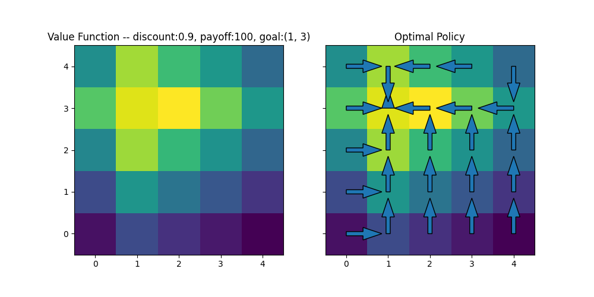

## Today
* Policy Iteration
* Partially-Observable Markov Decision Processes


## For Next Time
* Work on the [Week 10 Day Assignments](https://canvas.olin.edu/courses/1002/assignments/18646) (Due tonight at 7PM).
* Work on the [Week 11 Day Assignments](https://canvas.olin.edu/courses/1002/assignments/18648) (Due Monday 6th at 7PM).


## Policy Iteration
Last time, we discussed _value iteration_: a recursive method for computing a value-gradient over an otherwise sparse reward space under action-effect uncertainty. There are a lot of great things about value iteration -- it is relatively intuitive to understand, it provides the optimal policy from any state, and the optimal policy that it provides is guaranteed to be truly optimal.\

But like any algorithm, there are some downsides to value iteration. One major downside is purely computational: there are many loops we run at every iteration of value iteration, and we introduce a nonlinearity in the form of the "max" function. Another downside is that any arbitrary iteration yields what could be a sub-optimal value function (which would then lead to a sub-optimal policy); value iteration is very sensitive to convergence criteria which can ultimately impact the quality of the policy. And finally, value iteration requires perfect access to information like the reward function or state observation, which we might not have in every scenario.

It would be very exciting to more efficiently compute the optimal policy, and have a strategy that might be robust to introducing more uncertainty or compute constraints. Enter: _policy iteration_.

### Searching for the Best Policy
The intuition behind policy iteration is simple: starting from some initial guess of the best policy, search the space of possible policies by traversing an _approximate_ gradient of reward. 

Why is searching over policies attractive? In general, within an MDP, the space of all policies is _finite_: if there are $$N$$ states, and $$M$$ actions that can be taken from each state, then the space of policies is $$M^N$$. Note: that's still rather large...but we have our reward function to help _guide us through searching this space_ which in practice means that we will not need to investigate every single policy in order to find a good one. Contrast this with value iteration, which does require us to consider every action at every state at every iteration of the algorithm. 

### Approximating the Value Function
To leverage the fact that we have a reward function to help guide our policy search, we can think about _approximating_ the value function for any given policy as:

$$
V_\pi(x) = \sum_{x' \in S}\mathcal{P}(x' \vert x, \pi(x))[r(x, \pi(x), x') + \gamma V_\pi(x')]
$$

where the approximate value of a policy from a state is simply the expected reward of following the policy from that state.

In policy iteration, we can use this approximated value function (which you might see equivalently called the "policy evaluation") to essentially score how "good" a suggested policy is. By making small changes to the policy, we can use the signal from the policy evaluation function to determine what changes are effective at accumulating more lifetime reward.

### Practical Algorithm
The basic steps of policy iteration are:

1. Establish a baseline policy and initial value function.
2. Evaluate the policy.
3. Refine the policy by evaluating other actions.

The refinement step is important! And we can think of it equivalently to finding the optimal policy in the last step of value iteration:

$$
\pi(x) = \arg \max_u \sum_{x' \in S}\mathcal{P}(x' \vert x, u) [r(x, u, x') + \gamma V_\pi(x')]
$$

Notice that in the policy refinement step, we have replaced the policy-defined action as any value action in the action space, but we continue to use the approximated value function.

Written in a pseudocode format, policy evaluation follows this format:
```
func policy_evaluation(policy)
    for all x:
        Vhat(x) = sum(prob(x'|x,policy(x))[r(x,policy(x),x') + gamma * Vhat(x')] for all x')
    return Vhat(x)
```

And subsequent policy iteration:
```
func policy_iteration()
    pi(x) = u_init  # set the baseline policy
    until convergence:
        Vhat(x) = policy_evaluation(pi(x))  # evaluate the policy
        pi(x) = max(u, [sum(prob(x'|x,u)[r(x,u,x') + gamma * Vhat(x')] for all x')])
    return pi(x)
```

### Implementation Example
We will continue building from Gridworld we started last class:

<p align="center">

</p>

There are a few new functions we need to write to perform policy iteration. Let's start with initialization, where we will set all initial policies completely randomly:

```python
def initialize_policy(grid_world, actions):
    """Given a grid world and set of actions, initialize the policy."""
    pihat = dict()
    for key in grid_world.grid.keys():
        pihat[key] = np.random.choice(actions)
    return pihat
```

Now, we can write the policy iteration loop, which will be used to approximate the value function and the policy at every step:

```python
def policy_iteration(grid_world, actions, discount):
    """Performs policy iteration for a given Gridworld."""
    Vhat = initialize_value(grid_world)
    pihat = initialize_policy(grid_world, actions)

    while True:
        p = copy.deepcopy(pihat)  # current policy; will compare after refinement
        for state in grid_world.grid.keys():  # update the value function
            Vhat[state] = sum(grid_world.compute_action_probability(grid_world.grid[state], pihat[state], grid_world.grid[next_state]) * 
                              (grid_world.compute_reward(grid_world.grid[state], pihat[state], grid_world.grid[next_state]) + discount * Vhat[next_state]) 
                              for next_state in grid_world.grid.keys())
        for state in grid_world.grid.keys():  # refine the policy
            pihat[state] = max(actions, key=lambda a: sum(grid_world.compute_action_probability(grid_world.grid[state], a, grid_world.grid[next_state]) * 
                                                       (grid_world.compute_reward(grid_world.grid[state], a, grid_world.grid[next_state]) + discount * Vhat[next_state])
                                                       for next_state in grid_world.grid.keys()))
            
        if p == pihat:  # policy has converged
            break

    return Vhat, pihat
```

Calling these functions will be straightforward, only requiring the line:

```python
Vhat, policy = policy_iteration(world, actions, discount)
```

to be placed in the `if __name__ == "__main__"` section of the code. All other previously provided utilities can be used without adjustment.

<p align="center">

</p>


## Partially-Observable MDPs
So we've been spending time in MDP land, which assumes action-effect uncertainty, but that state is perfectly observable at every time. What happens when we have action-effect uncertainty _and_ uncertainty about our state? 

We will need a few new mechanisms to expand upon our typical MDP formalism:

* A _belief_, which holds a probability distribution over all states (since states cannot be known and only estimated/inferred)
* An _observation model_, which characterizes our observation uncertainty


### POMDP Formalism
Expanding the MDP formalism to include _perception uncertainty_ is known as a "partially observable Markov decision process" or POMDP. It is characterized by an 8-tuple:

$$
\text{POMDP: } \{\mathcal{S}, \mathcal{A}, T, R, \mathcal{Z}, O, b_0, \gamma\}
$$

where:

$$
\mathcal{S} \text{ are the states of the robot/environment}
$$ 

$$
\mathcal{A} \text{ are the actions available to the robot}
$$ 

$$
T: \mathcal{S} \times \mathcal{A} \rightarrow \mathcal{P}(x_{t+1} \vert x_t, u_t) \text{ is the transition function}
$$ 

$$
R: \mathcal{S} \times \mathcal{A} \rightarrow \sum^T_{t=0} \alpha, \alpha \in \mathbb{R} \text{ is the reward function}
$$

$$
\mathcal{Z} \text{ is the space from which an observation can be drawn}
$$

$$
O: \mathcal{S} \rightarrow \mathcal{P}(z_t \vert x_t) \text{ is the observation function}
$$

$$
b_0 \in \mathcal{P}(S_o) \text{ is the initial belief}
$$

$$
\gamma: \text{ is the discount factor}
$$


### POMDPS as Belief-State MDPs
Ok, so we have this POMDP...what does this mean for finding good policies for robotics problems? Let's consider value iteration (this same logic can extend to policy iteration too!). Now, rather than states, we have _beliefs over states_ and so we can re-write the value function with $$b$$ standing for belief as:

$$
V(b) = \gamma \max_u \Bigl[r(b,u) + \int V(b')\mathcal{P}(b' \vert u,b) db'\Bigr]
$$

with corresponding best policy:

$$
\pi(b) = \arg \max_u \Bigl[r(b,u) + \int V(b')\mathcal{P}(b' \vert u,b) db'\Bigr]
$$

As an important point, computing the probability of a future belief from a current belief and action includes both the action-effect uncertainty and the observation uncertainty:

$$
\mathcal{P}(b' \vert u,b) = \int \mathcal{P}(b' \vert u,b,z)\mathcal{P}(z \vert u, b) dz
$$

where a Bayes Filter (yes! It makes a triumphant return!) is used to estimate the first term $$\mathcal{P}(b' \vert u,b,z)$$.

Under one condition (i.e., when the states, actions, observations, and planning horizon are all finite) it is possible to solve a POMDP directly using our value iteration and policy iteration methods. But gosh, this is _rare_ in the real world; in practice we would say that _solving a POMDP directly is intractable and must be approximated_. Let's further consider why this is true:

A belief is a probability distribution here -- and so the value of any state is also a probability distribution (and so on, to the policies as well). This means that even if the state space is finite and discrete, the belief space becomes _continuous_ -- and so we cannot trivially "iterate over beliefs" as we might for states. (Note: we can continue this logic for continuous state spaces, and now we have an infinitely-dimensional belief space, and that's...well that's a hard problem in the formal sense.)


### Approximately Solving a POMDP
So we just claimed that POMDPs are intractable to solve directly. But most real robotics problems are defined by POMDPs. So what does it mean to _approximately solve_ a POMDP?

Let's callback to our policy iteration approach. There, we used an approximate method to estimate the value function -- it was faster, limited our search significantly, and converged to the right answer. That is what we're seeking to do with approximate POMDP solvers: finding clever ways to approximate a reward function or policy value in order for our robot to succeed at a given task, even under uncertainty. 

We will be spending the rest of this unit investigating the form of an approximate POMDP solver, and implementing one without our simulation environment. Our compositional framework will be broken down into a few key parts:
* A belief model
* An information-theoretic heuristic to aid search
* A selective search policy


## Today's So What
Today we saw the power of an approximate solver for an MDP called policy iteration. And we also spent some time with a new formalism for a class of robotics problems in which perception uncertainty is present, POMDPs. We are now approaching a point where we can start building the "brain" of a modern autonomous robot! We will expand on the notion of approximate solvers to allow a robot to perform a task, even when the world is uncertain, under relatively lightweight assumptions that empirically pan out in practice. 

## Going Further
Since policy iteration is the first step to modern reinforcement learning systems, there are many online resources you may find useful:

* [This primer as part of an RL series](https://gibberblot.github.io/rl-notes/single-agent/policy-iteration.html)
* [This MIT lecture](https://ocw.mit.edu/courses/16-410-principles-of-autonomy-and-decision-making-fall-2010/75e2c8c2cf31b874c239ba2e8126fb35_MIT16_410F10_lec23.pdf)

On POMDPs, Chapter 15 in _Probabilistic Robotics_ is a thorough source, especially if you are interested in the process for directly computing a finite-POMDP.


## Day Activity
Today's Day Activity aims to build further intuition about policy iteration, and practice using the POMDP formalism.

### Problem 1: Policy Iteration
We will expand on the problem from last class, copied below for ease:

<p align="center">

</p>

**Part 1: Policy Iteration** For the given grid-world, use policy iteration to find the optimal policy with your starting discount factor. You can solve this by hand, or if you'd like, write a short script to solve the problem. If you would like to start with an initial code implementation, you might find today's notes a helpful place to start! 

**Part 2: Comparing to Value Iteration** Compare your results to your results from Value Iteration. You may consider paying attention to: final "converged" value distribution, any policy discrepancies, computation time / number of iterations, etc. 

**Part 3: Impact of Design Changes** Consider modifying the discount factor, reward function, transition function, or anything else about the world that you would find interesting. How robust does policy iteration seem to be? Where does it seem to break? What is it sensitive to?

**Part 4: Making the World Larger** To really feel the computational value of policy iteration, make your world considerably larger -- perhaps 20 by 20 squares. Feel free to re-assign the reward square to be anywhere in the world. Implement a way of counting iterations or total time to track the progress of value iteration and policy iteration respectively. How do these times and results compare between the methods?


### Problem 2: Populating a POMDP
In this problem, let's practice setting up a POMDP. Please choose one of the two scenarios below to summarize as a POMDP.

**Scenario 1: Grid World Redux** Take the grid world from Problem 1 from today, and consider the scenario in which after each move of the robot, it draws an observation of its state. The sensor is wrong 10% of the time. Expand your MDP formalism to a POMDP formalism for this scenario (define the space of observations, the observation function, and the initial belief).

**Scenario 2: Methane Seeking** Recall our in-class activity in which a robotic boat is searching for a methane source in an estuary. Let's say that the bounds of the estuary are well-defined (and finite), the robot moves as discussed in the activity, it is equipped only with a point sensor that measures methane concentration at the location that the robot is, and the robot wants to find and go to the true maximum of methane in the world. How might you write this problem as a POMDP?
