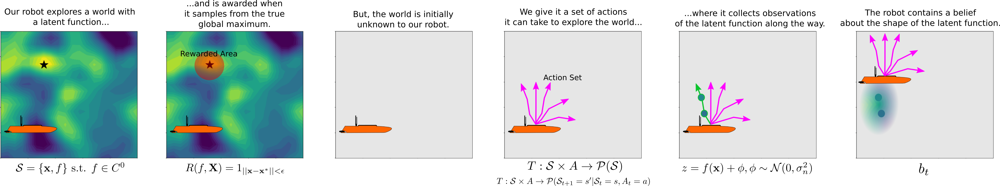
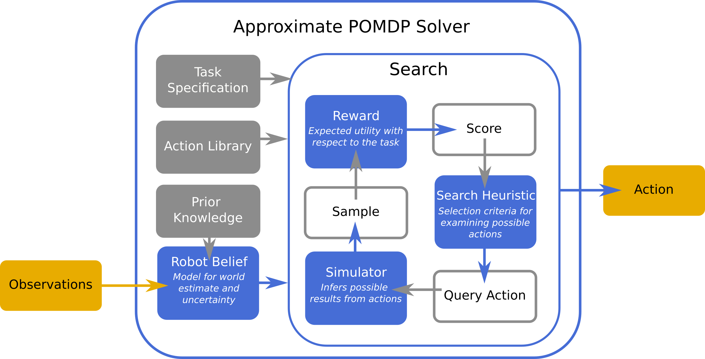
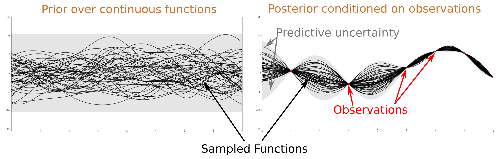
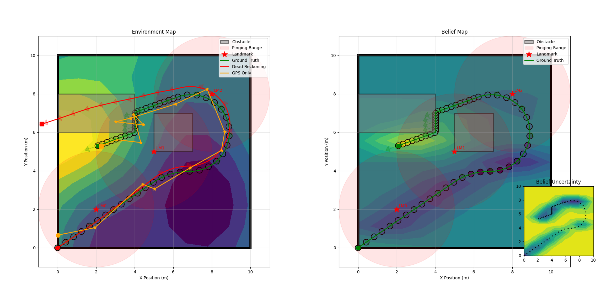

## Today
* POMDPs (continued)
* Approximate POMDP Solvers: Compositional Algorithms
* Robot Beliefs

## For Next Time
* Work on the [Week 11 Day Assignments](https://canvas.olin.edu/courses/1002/assignments/18648) (Due Monday 6th at 7PM).
* Start thinking about the next deep dive project...

## POMDPs (Continued)
Last time we introduced the formalism for a _partially observable Markov decision process_ or POMDP:

$$
\text{POMDP: } \{\mathcal{S}, \mathcal{A}, T, R, \mathcal{Z}, O, b_0, \gamma\}
$$

where:

$$
\mathcal{S} \text{ are the states of the robot/environment}
$$ 

$$
\mathcal{A} \text{ are the actions available to the robot}
$$ 

$$
T: \mathcal{S} \times \mathcal{A} \rightarrow \mathcal{P}(x_{t+1} \vert x_t, u_t) \text{ is the transition function}
$$ 

$$
R: \mathcal{S} \times \mathcal{A} \rightarrow \sum^T_{t=0} \alpha, \alpha \in \mathbb{R} \text{ is the reward function}
$$

$$
\mathcal{Z} \text{ is the space from which an observation can be drawn}
$$

$$
O: \mathcal{S} \rightarrow \mathcal{P}(z_t \vert x_t) \text{ is the observation function}
$$

$$
b_0 \in \mathcal{P}(S_o) \text{ is the initial belief}
$$

$$
\gamma: \text{ is the discount factor}
$$

A POMDP is used when there is _perception uncertainty_ present in a robotics problem: the idea that the state of the robot and/or world is not directly or perfectly observable after any action is executed. As it turns out, this commonly occurs in practice with robotic systems; and yet we still want robots to be able to act autonomously when uncertainty can be _characterized_ or actions of a robot can be made _robust to uncertainty_. 

That is where POMDP solvers come in. A good POMDP solver will simultaneously estimate the state of the world/robot and aim to optimize the robot's actions to perform a task. Last time, we talked about how in some very specific cases value iteration or policy iteration could be used in a POMDP landscape, but that most of the time, we need an approximate solver to make solving a POMDP practically tractable.

Today, we're going to talk about the anatomy of a compositional solver for POMDPs, and dive into detail about one key choice in that solver: the representation of the belief.

### Maximum Seek-and-Sample POMDP for Environmental Fields
Let's consider how the methane-seeking example from earlier in this unit, which we'll abstract to a class of problems called _maximum seek-and-sample_, maps to a POMDP formalism:

<p align="center">

</p>

The approximate solver for this problem ultimately needs to decide: **what actions should the robot take to maximize expected reward over the robot's mission?** 


## Approximate POMDP Solvers: Compositional Algorithms
A modern POMDP solver is likely to be composed of several key parts, as described in the illustration below:

<p align="center">

</p>

Across all solvers, the key is that we need to turn robot observations into actions that the robot can take, which hopefully lead to the robot successfully fulfilling its mission.

There are several key design decisions that need to be made for the solver:
* The robot belief representation
* The reward / value function, which is used to distinguish between actions
* The search heuristic, used to determine which actions to "score" in order to pick the best one and the form of the search itself (horizon, over what spaces, what simulator to use, etc.)

### Solving the MSS POMDP
Over the next several days, we will be implementing a _greedy, information-theoretic compositional POMDP solver_ which makes the following choices:
* **Robot belief**: the state is assumed to be Gaussian, and we can represent our uncertainty over the form of the latent function as a _Gaussian Process_.
* **Reward function**: we will create an approximate reward function that will balance our knowledge about the world and our uncertainty about that knowledge to guess where the maximum is in the world. This reward function is called the _Upper Confidence Bound_.
* **Search heuristic and form of the search**: we will discretize possible actions we can take, simulate and score them using our belief and reward function, and simply pick the best one-step (greedy) option at every timestep.

<p align="center">

</p>

There are many possible ways to solve this problem, and we'll talk about ways to extend this "vanilla solver" as we discuss each choice -- note that this might be cool to think about for your deep dives!

## Robot Beliefs
The first design choice we need to make is how we're going to model the robot's _belief_ about the world / about itself while it is performing its task. This choice requires consideration of:
- Is the state space discrete or continuous? Is it bounded?
- How the observation model informs us of the state - is it direct or indirect?
- How _Gaussian_ is the state (or observations / actions)?

In our methane source seeking robot example, we assume:
- The sensor makes partial, but direct measurements of the methane field
- The methane field is continuous, but bounded to positive real values
- The methane field is smooth, but may contain several maxima
- We either have ground-truth knowledge of where our robot is, or can use an EKF / other inference technique to estimate the robot's state to reasonable accuracy

A good belief representation will afford us a few things:
- It can/will converge to the true latent function with enough observations
- It can provide information about things we haven't seen (e.g., it can _interpolate_ between locations we've been)
- It is fast to sample for our search simulator and fast to update when we collect new observations

### Kalman Filtering and Extended Kalman Filtering as Belief
We've actually already spent a considerable amount of time thinking about a particular type of "belief representation" for the state estimation problem for a robot (and in the SLAM extension, even the world)! As KF and EKF yield a mean estimate and covariance (uncertainty) over the state of the robot / environment, this can be an excellent belief representation in problems like those we've already encountered in this class: discrete metric information in a structured world with state-action effect uncertainty and observation noise. 

However, in our new proposed problem, we have this continuous field that represents methane, and only a point-sensor to observe it. This type of environment-sensor system breaks some of our key requirements for using Kalman filters efficiently...so we need another type of representation to represent the robot's belief about this part of the state space which can handle continuous domains over functions.


### Gaussian Processes for Representing Continuous Latent Functions
A class of belief representations that are common, especially for robots that operate in unstructured spaces and continuous fields, is a _Gaussian Process_ (GP):

$$
f \sim \mathcal{GP}(\mu(\mathbf{x}), \kappa(\mathbf{x},\mathbf{x'}))
$$

$$
\mathbf{x},\mathbf{x'} \in \mathbb{R}^d
$$

A GP places a Gaussian distribution over an entire function space (one way you can think about this: at every point along a function, imagine placing a normal distribution over that point's value). Today, we will focus on GP _regression_, but the technique can also be expanded to some categorical/classification problems under some conditions.

The mean function of a GP, $$\mu(\mathbf{x})$$, represents the best (mean) estimate of the "true" function being inferred by a GP. 

The _kernel function_, $$\kappa(\mathbf{x},\mathbf{x'})$$, indicates the covariance of the GP -- encoding both a sense of uncertainty over values in the field (how wide each Gaussian is at every point) and the _relatedness_ between points in a space (if I make an observation at $$\mathbf{x}$$ what might that tell me about $$\mathbf{x'}$$ without actually observing that point).


<p align="center">

</p>

A GP is a _function approximator_, which means that as observations are drawn, the GP mean function will converge to explain the data (note: the process for _training_ a GP is functionally classical machine learning!) according to the relationship described by the kernel function. Some key identities to consider that come from the definition of a GP:

As observations are collected, the _posterior_ (the informed inference) over an unseen location $$\mathbf{x'}$$ is:

$$
b_t(\mathbf{x'}) \vert \mathbf{x}_{0:n}, z_{0:n} \sim \mathcal{N}(\mu_t(\mathbf{x'}), \sigma_t^2(\mathbf{x'}))
$$

where:

$$
\mu_t(\mathbf{x'}) = \kappa_t(\mathbf{x'})^T(\mathbf{K}_t + \sigma_n^2\mathbf{I})^{-1}z_{0:n}
$$

$$
\sigma_t^2(\mathbf{x'}) = \kappa(\mathbf{x'}, \mathbf{x}) - \kappa(\mathbf{x'})^T(\mathbf{K}_t + \sigma_n^2\mathbf{I})^{-1}\kappa(\mathbf{x'})
$$

with definitions:

$$
\mathbf{K}_t[i,j] = \kappa(x_i, x_j) \forall x_i, x_j \in \mathbf{x}_{0:n}
$$

$$
\kappa(\mathbf{x'}) = [\kappa(x_0,x'),...,\kappa(x_n,x')]^T
$$

Inspecting these equations tells us a few key things:
- As expected, the probability distribution over any unseen point is Gaussian / normal
- The mean estimate for an unseen point is an interpolation characterized by the kernel function over the observation points drawn
- The uncertainty of the inferred point is reduced by the relationship to that point and other points per the kernel function

Indeed, the _kernel function_ is an extremely important internal design choice to make when selecting a GP as a representation for robot belief. There are many choices for GP kernel function; here are a few common ones:

$$
\text{Constant: } \kappa(\mathbf{x}, \mathbf{x'}) = C
$$

$$
\text{Linear: } \kappa(\mathbf{x}, \mathbf{x'}) = \mathbf{x}^T\mathbf{x'}
$$

$$
\text{Radial Basis Function: } \kappa(\mathbf{x}, \mathbf{x'}) = \sigma^2\exp\Bigl(-\frac{\vert\vert\mathbf{x}-\mathbf{x'}\vert\vert^2}{2l^2}\Bigr)
$$

$$
\text{Periodic: } \kappa(\mathbf{x}, \mathbf{x'}) = \exp(\frac{-2}{l^2}\sin^2(d/2))
$$

On inspection, we can see how the kernel function (and its parameters) will control how much _information_ from a single observation might get propagated to otherwise unseen elements of a function. For a _radial basis function_, the proximity of seen points with unseen points matters; for the _periodic function_, information is cyclically cast onto the environment.

Kernels can be added, multiplied, subtracted, divided, etc. in order to describe even more complex relationships in a world. Often, we can view the selection of a kernel as _embedding prior knowledge or physical understanding_ about the latent function dynamics we're studying. For instance, in the methane field example we've been considering, we might choose a radial basis function or some other distance-based kernel function to describe the smoothness to our distribution.


## Today's So What
Today we discussed the form of a compositional approximate solver for a POMDP, and formulated the maximum seek-and-sample (MSS) POMDP. We also started to think through a _belief representation_ for our robot within our approximate solver.

The belief representation for a robot is really where state estimation (of the robot and the environment) is embedded within an approximate solver. Since the state is only partially-observable, alongside finding a policy that the robot should execute, we need to consider estimating the state of the world (for our policy finder to potentially use to refine policy selections). 

The choice for a belief representation is contingent on our estimate for the character of our state space and the observations we can draw about that state space. Today we newly learned about the _Gaussian Process_, a function approximator that estimates the value of a latent continuous multivariate function and estimates uncertainty according to a kernel function that encodes relatedness of variables in the function.


## Going Further
If you would like to learn more about POMDP approximators, Chapter 16 of _Probabilistic Robotics_ contains simple approximation techniques on which modern compositional planners have been developed. 

To learn more about Gaussian Processes, I encourage you to read any reputable machine learning blog. You can also [read the original paper](https://proceedings.neurips.cc/paper_files/paper/1995/file/7cce53cf90577442771720a370c3c723-Paper.pdf) "Gaussian Processes for Regression" by Williams and Rasmussen (1995) for further details!


## Day Activity
Today's day activity focuses on expanding your simulator assignment so that you will eventually implement your own adaptive sampling autonomous robot! We will implement a continuous field in an environment, a continuous field in situ sensor, and a robot belief today.

The code for today's activity builds from the vanilla base proboplayground simulator. It is provided in a fully functional form and can be used directly in today's assignment. You may also consider porting the changes (or some version of these changes) into the state of your current simulator environment, which you have likely customized throughout this course. You can access the base code by fetching from upstream and checking out the `informative_sampling` branch:

```
git fetch upstream
git checkout informative_sampling
pip install -r requirements.txt
```

> Note that there is one new requirement for the simulator, `scikit-learn`, and so updating your install from the requirements.txt is recommended.

> Note you may also have a look at the code directly [here](https://github.com/probrobo26/probo_playground/tree/informative_sampling).


### Problem 0: Reading the Docs
We will be using the `scikit-learn` library to create our belief representations and Gaussian continuous functions for our simulator. Please skim the following two documentation pages:
* [Gaussian Processes](https://scikit-learn.org/stable/modules/gaussian_process.html#gaussian-process)
* [Gaussian Process Regressor](https://scikit-learn.org/stable/modules/generated/sklearn.gaussian_process.GaussianProcessRegressor.html)

And answer the following questions:
* What kernel functions are built-in to `scikit-learn`? Pick two and describe how they would be implemented (e.g., what parameters would need to be provided, and what those parameters represent with respect to the kernel function's behavior).
* What computational limitations of a Gaussian Process are noted in this documentation?
* What is the functional difference between the `sample_y` and `predict` methods of the Gaussian Process Regressor? When do you think you might use one or the other?
* Based on the definition of the `fit` method of the Gaussian Process Regressor, as a robot collects observations, can the GP be updated incrementally, or should it be updated from the entire history of the data at each iteration?

### Problem 1: Adding a Continuous Field to the Simulator Environment
We want to add a continuous field to our simulator environment, generated from a known Gaussian Process model (to simplify comparing our beliefs to our groundtruths later). To do this, we will modify the `environment.py` to do the following:
* Create a `Field` class, which takes in the world's boundaries, kernel parameters, and a random seed and provides access to a randomly generated continuous distribution.
* Allow a `Field` to be added to the instantiation of an `Environment` class, and provide an interface for accessing the ground truth field value at any timestep.

An example `Field` class is provided for you, which implements a field with a radial basis function kernel:
```python
class Field:
    """Creates a continuous function that can be sampled.
    
    Attributes:
        DIMS (Bounds): the four corners of the environment
        variance (float): the variance of the GP kernel
        lengthscale (float): the lengthscale of the GP kernel
        random_seed (int): random seed for setting world draw
    """
    def __init__(
        self,
        dimensions: Bounds,
        variance: float = 0.1,
        lengthscale: float = 1.0,
        random_seed: int = 10,
    ):
        """
        Initialize the continuous field in an environment.

        Args:
            dimensions (Bounds): the four corners of the environment
            variance (float): the variance of the GP kernel
            lengthscale (float): the lengthscale of the GP kernel
            random_seed (int): random seed for setting consistent world draw
        """
        self.DIMS = dimensions
        self.variance = variance
        self.lengthscale = lengthscale
        self.random_seed = random_seed
        self._initialize_field()

    def _initialize_field(self):
        """Initializes the continuous field in an environment."""
        self.kernel = ConstantKernel(1.0, (1e-3, 1e-3)) * RBF([self.lengthscale, self.lengthscale], (self.variance, 100*self.variance))
        field = GaussianProcessRegressor(kernel=self.kernel, n_restarts_optimizer=15, random_state=self.random_seed)
        x, y = np.linspace(self.DIMS.x_min, self.DIMS.x_max, 20), np.linspace(self.DIMS.y_min, self.DIMS.y_max, 20)
        M = np.array(list(product(x, y)))
        init_sample = field.sample_y(M, 1, random_state=self.random_seed)
        field.fit(M, init_sample)
        self.field = field

    def info(self) -> dict:
        return {"Variance": self.variance,
                "Lengthscale": self.lengthscale,
                "Random Seed": self.random_seed,
                "Model": self.field}
```
**Everyone**: Please add comments to the added code in the `environment.py` file that explain the class and ground-truth field method (`Environment.get_gt_field_value`) in your own words.

**Optional Extension**: Consider an abstraction of the field class that allowed you to swap in different kernel functions (or multiple Field class types that had different kernel functions embedded in them). Implement at least one other flavor of kernel.


### Problem 2: Adding an In situ Instrument to the Simulated Robot
Now that we have a field we can measure, let's create a sensor that can measure it! In `sensors.py`, we can add an `InsituInstrument` class, which yields a noisy scalar measurement of the field based on where the robot is in the world. Note that the sensor always yields a measurement from where the robot _actually_ is, and not just where it thinks it is! 

A starter class has been provided for you:

```python
class InsituInstrument(SensorInterface):
    """
    This class represents a sensor that measures from a continuous field in an environment.

    Attributes:
        name (str): reference identifier
        robot (Robot): reference robot
        interval (float): period between measurements
        noise (float): noise of a scalar measurement
    """

    def __init__(
        self,
        robot,
        name,
        interval,
        noise,
    ):
        """
        Initialize an instance of the LandmarkPinger class.

        Args:
            name (str): reference identifier
            robot (Robot): reference robot
            interval (float): period between measurements
            noise (float): noise of a scalar measurement
        """
        super().__init__(name, robot, interval)
        self.noise = noise  # noise character of the sensor

    def sample(self) -> pd.DataFrame:
        """
        Noisily measure the in situ status of the continuous field.

        Returns:
            A dictionary containing the noisy field measurement.
        """
        field_measurement = self.robot.env.get_gt_field_value()
        noisy_measurement = random.gauss(field_measurement, self.noise)
        return pd.DataFrame({self.name: noisy_measurement})
```

All necessary modifications to `robot.py` have been made to integrate this sensor and log its information automatically.

**Everyone:** Go to the `config_example.yaml` file and inspect how the true environmental field and in situ instrument sensor is instantiated. Confirm that the interface there matches the `Field`, modified `Environment`, and `InsituInstrument` class definitions (especially if you've made any changes).

**Optional Extension:** If you can think of a creative way to implement an alternative form of InsituInstrument, go for it! One option could include a multivariate point sample (e.g., an instrument that could measure temperature and methane at the same time) -- although you will need to track your belief over this second value or relate it directly to your quantity of interest later in order to use it, so beware!


### Problem 3: Enabling the Robot to Believe
We now have a continuous field to measure, and a way of partially observing it. Now it is time to give the robot the capability to estimate the continuous field for itself.

In the `robot.py` file and within the `Robot` class, we will need to initialize a belief model, and then provide a method for updating that belief from a given (noisy) measurement and (estimate) pose. This has already been implemented for you in `def __init__` and in the method `def update_belief`:

```python
self.kernel = self.env.continuous_field.kernel  # the same as the environment kernel
self.belief = GaussianProcessRegressor(kernel=self.kernel,
                                        n_restarts_optimizer=15,
                                        random_state=self.env.continuous_field.random_seed)
self.pose_history = []  # store history of observation poses for belief
self.observation_history = []  # store history of observations for belief
```

```python
def update_belief(self, measurement, pose):
    """
    Updates the robot's belief based on a located-observation.

    Inputs:
        measurement (float): value of the field being measured
        pose (Position): location from where the measurement was taken
    """
    self.pose_history.append((pose.pos.x, pose.pos.y))
    self.observation_history.append(measurement)
    self.belief.fit(np.asarray(self.pose_history), np.asarray(self.observation_history))
```

**Everyone:** What major (simplifying) assumption is being made here in the instantiation of our belief model?  

**Optional Extension:** Relax the major (simplifying) assumption by allowing a custom kernel to be passed in to the robot class.


### Problem 4: Setting Up A Simulation
Ok! Everything is now implemented, and we can turn our attention to `simulator.py`. We will naturally need to make sure that everything new gets instantiated (in particular, the `Field` class) and importantly we need to add a way for the robot's belief to be updated over time as measurements from the `InsituInstrument` are drawn. This is already implemented for you in lines 158-163, which places updating the belief after drawing a measurement and before taking a new action:

```python
# Update the robot's belief
try:
    robot.update_belief(measurements["InsituInstrument"].values,
                        robot.env.agent_pose)
except:
    pass  # no measurement available to use
```

**Everyone:** Why is a try-except implemented here?

**Optional Extension:** In this vanilla implementation, the ground truth location of the robot is used. You can consider implementing this within your state-estimation simulation work and pass in the KF/EKF estimate of robot pose instead! This would be the ultimate combination of uncertainty quantification and state estimation for this problem.


### Problem 5: Visualization and Running Experiments
Updated visualization code is provided for you in `viz.py` which will render the groundtruth field underneath your metric world, and will generate a _new figure_ called `dataset_belief_viz.png` which renders the robot's _belief_ underneath the world in addition to an inset that shows the robot's _uncertainty_ over the world. An example of the figure is shown below:

<p align="center">

</p>

**Everyone:** Experiment with the simulator by changing the field kernel parameters, trajectories the robot takes, and configurations of the environment. What do you think about the performance of the belief representation under different path lengths or shapes? 

**Optional Extension**: There are lots of ways to extend the simulator and visualizer; feel free to customize the visuals you produce as you see fit! One particular area you could focus on is implementing the belief representation visualization in the `animate_trajectories` method in `viz.py`.


