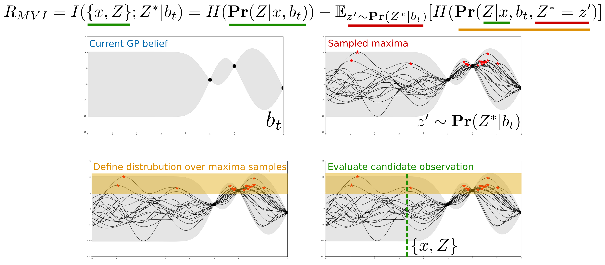
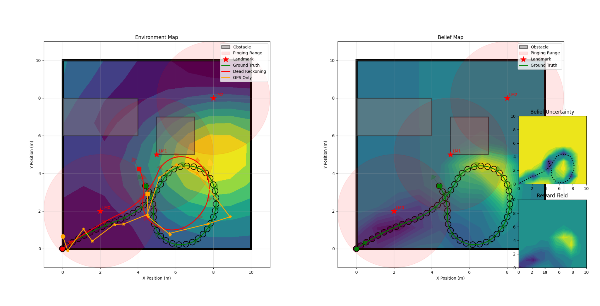

## Today
* Approximate POMDP Solvers: Compositional Algorithms
* Information Theory Crash Course
* Reward Approximation

## For Next Time
* Turn in the [Week 11 Day Assignments](https://canvas.olin.edu/courses/1002/assignments/18648) (Due Today at 7PM).
* Work on the [Week 12 Day Assignments](https://canvas.olin.edu/courses/1002/assignments/18649) (Due April 13th, 7PM).
* Start thinking about the next deep dive project...


## Approximate POMDP Solvers
As we discussed last time, a modern POMDP solver is a _compositional algorithm_ with many design choices that need to be selected.

<p align="center">

</p>

Across all solvers, the key is that we need to turn robot observations into actions that the robot can take, which hopefully lead to the robot successfully fulfilling its mission.

There are several key design decisions that need to be made for the solver:
* The robot belief representation
* The reward / value function, which is used to distinguish between actions
* The search heuristic, used to determine which actions to "score" in order to pick the best one and the form of the search itself (horizon, over what spaces, what simulator to use, etc.)

Today, we will carefully inspect the _reward / value function_ used within an approximate solver for a POMDP.


### Approximating the Reward / Value Function 
Let's consider our MSS POMDP one more time:

<p align="center">

</p>

Notice that our _true_ reward function is very _sparse_. This is something we encountered looking at our MDP scenarios earlier in this unit as well! To overcome this in an MDP, we used value iteration or policy iteration which created an _expected value field_ which allowed us to ultimately select good actions for our policies. Unfortunately, for a POMDP we don't have the computational luxury of performing value iteration or policy iteration directly. We need to think of an alternative way of _approximating_ our value function such that the robot can distinguish between good and bad actions to take.

The form of a POMDP, as an online planning system, implies a certain set of requirements for our approximate value function:
* The approximate reward function should _encourage efficient information-gathering_.
* As our _belief_ converges to the true underlying function of the world, the approximate reward function should _approach_ the true reward function for the task.
* The approximate reward function should be _fast to compute over the entire state space_.

An _evolving_ reward function is desirable when solving a POMDP: when the task can't yet be completed we want to be able to collect strategically useful observations; and once we know enough to complete the task we want to encourage exploitation of that knowledge. This sets up a classic paradigm for solving POMDPS: the **explore-exploit tradeoff**. The form of the approximate reward function directly dictates how a robot acts to explore a world and exploits its knowledge.

If we consider that we want an approximate reward function that evolves with the knowledge that the robot possess, we might conclude that the approximate reward function should be a function that takes in the _belief_ of our robot. So, how do we leverage a belief representation to compute an approximate reward function? Let's take a quick dive into the field of _information theory_.


## Information Theory Crash Course
To start, let's first consider the word "information" -- we understand this term semantically to mean some atomic concept or measurement that can inform on some other concept. As it turns out, this semantic definition is also very close to the formal computational definition too (although with a focus on data as an informative unit). Information theory is a branch of study that considers the quantification, storage, and communication of pieces of information. 

As it relates to our robotic context, information theory presents us a robust and well-described branch of science that we can leverage within our approximate solvers (and especially for our definition of an approximate reward function). In particular, we are interested in utilizing _information measures_ to help us distinguish between what we know, what we don't know, and what we might gain in terms of knowledge by taking certain actions.

### Information Measures
Some forms of informative measures you might already be familiar with include the suite of _statistical measures_ we might use to describe a dataset:
* **Mean**: the sum of all values in a dataset divided by the total number of values in the dataset; also the _expectation_ of a probability distribution
* **Median**: the middle value in an ordered dataset
* **Mode**: the most frequent value in a dataset
* **Range**: the span between the highest and lowest number in a dataset
* **Variance**: the average of square differences from the mean
* **Standard Deviation**: the square root of variance (quantifies the amount of variance in a dataset)
* **Correlation**: the extent to which two variables in a dataset are related
* **Covariance**: how two variables in a dataset change with respect to one another
* **Skewness**: measure of asymmetry in a dataset

Given our belief representation, a Gaussian Process, we naturally can access a measure of the mean and (co)variance over our state space, and many of these other measures we could compute by _taking a sample from our belief_ and treating those samples as a dataset over which these measures could be computed in the standard way.

Information theory also gives us access to a set of special measures, with definitions that may be new to us. These information measures, $$I(\mathcal{P})$$, have key properties like:
* Monotonicity and continuity
* Non-negativity, $$I(\mathcal{P}) \geq 0$$
* When an event is certain to occur, then no information is gained, $$I(1) = 0$$
* Information gain over two independent events is the sum of the information gain for each event, $$I(\mathcal{P}_1,\mathcal{P}_2) = I(\mathcal{P}_1) + I(\mathcal{P}_2)$$

**Entropy**
Entropy quantifies the expected value of information contained in a sample (this is sometimes also stated as the expected log-loss of the distribution over a random variable):

$$
H(X) = -\sum_i\mathbf{Pr}(x_i)\log(\mathbf{Pr}(x_i))
$$

where $$\mathbf{Pr}(x_i)$$ represents the probability density over the value $$x_i \in X$$. Our interpretation of this measure is that the entropy is the weighted average of information contained over the values of a state space. A _high entropy_ indicates that outcomes are evenly distributed in information space, and so the result of any action is harder to predict (uncertainty is high); whereas a _low entropy_ indicates that outcomes are distinctive (uncertainty is low).

In information-gathering missions, it is useful to be able to compare how informative one observation is with respect to another. Relative / conditional entropy quantifies the informativeness over observing a random variable $$Z$$ after observing another random variable $$Y$$:

$$
H(Z \vert Y) = -\sum_{a,b}\mathbf{Pr}(Z = a, Y = b)\log\mathbf{Pr}(Z=a \vert Y=b)
$$

which we can see is the expected log-loss of the conditional distribution with respect to $$Z$$.


**Mutual Information**
Mutual information follows from Entropy, and quantifies how much random variable $$Y$$ reveals about random variable $$Z$$ (equivalently, the average change in log-loss when observing $$Y$$):

$$
I(Z;Y) = H(Z) - H(Z\vert Y) = \sum_{a,b}\mathbf{Pr}(Z =a, Y=b)\log\frac{\mathbf{Pr}(Z =a, Y=b)}{\mathbf{Pr}(Z =a)\mathbf{Pr}(Y=b)}
$$

<!-- **Kullback-Leibler Divergence (AKA Information Gain)**

$$
D_{KL}(\mathcal{P}(X)\vert\vert \mathcal{Q}(X)) = \sum_{x \in X}-\mathcal{P}(x)\log(\mathcal{Q}(x)) - \sum_{x \in X}-\mathcal{P}(x)\log(\mathcal{P}(x)) = \sum_{x \in X}\mathcal{P}(x) \log \frac{\mathcal{P}(x)}{\mathcal{Q}(x)}
$$ -->

## Reward Approximation
Ok, so we have all of these informative measures -- how do we use these for the approximate reward function? Truly, any combination of these measures can be used; this is an open design space for an engineer. But there are a few common _acquisition functions_ that have been adopted for robotic POMDP formulations.

**Upper Confidence Bound (UCB)**
This is perhaps one of the most commonly used approximate reward functions for robotic sampling missions, taking the form:

$$
R_{UCB} = \mu(x) + \sqrt{\beta_t}\sigma(x)
$$

where the UCB is the sum of the predictive mean and scaled (co)variance at a set of queries. One of the powerful things about the UCB is that it is a _submodular_ function, that is, as information is gained over the course of a mission, this function encodes the notion of _diminishing returns_ (as a robot explores, new observations tend to yield less information). Because of this property, use of the UCB reward approximation in a POMDP solver can allow guarantees to be placed on overall solver performance (such as bounding a formal notion of _regret_ over actions selected). 

**Probability of Improvement and Expected Improvement**
This function measures whether a proposed query, $$x$$ is better than the current best measurement, $$x^*$$, which can be written as:

$$
\gamma(x) = \frac{f(x^*) - \mu(x)}{\sigma(x)}
$$

$$
R_{PI} = \mathbf{Pr}(f(x) \geq f(x^*)) = \Phi(\gamma(x))
$$

where $$\Phi(\cdot)$$ is the cumulative density function of a standard normal distribution, and $$f$$ is the unknown function.

A variation on this is the notion of _Expected Improvement_ which is the measure of how much better a proposed measurement will be over the current best measurement:

$$
R_{EI} = \sigma(x)(\gamma(x)\Phi(\gamma(x)) + \epsilon)
$$

where $$\epsilon$$ is normally distributed noise.

**Predictive Entropy Search**
PES aims to find an optimum in the unknown function, and is the measure of the conditional entropy between a proposed measurement and the predicted optimizer of a function $$x^*$$:

$$
R_{PES} = H(\mathbf{Pr}(x^* \vert D)) - \mathbb{E}_{\mathbf{Pr}(z \vert D,x)}[H(\mathbf{Pr}(x^* \vert D \cup x, z))]
$$

$$
R_{PES} = H(\mathbf{Pr}(z \vert D, x)) - \mathbb{E}_{\mathbf{Pr}(x^* \vert D)}[H(\mathbf{Pr}(z \vert D, x, x^*))]
$$

where $$D$$ is the history of measurements and observations. As the true optimizer, $$x^*$$ is unknown, it must be approximated from samples from the belief (this is why it is called _predictive_ entropy search).


### Reward Approximation for the MSS POMDP
We would like to select a reward function that will eventually converge to placing reward at the true maximum (optimum) of the environment, but can guide the robot to collect information strategically. 

**UCB Option**
One possible reward function we can use is the UCB reward. When the belief function is exactly the true underlying function, then the UCB reward converges to awarding the robot according to the mean function. The true optimum of the world should be the peak of the reward function, and so our robot should want to converge to the true maximum to accumulate the most lifetime reward. 

The UCB is fast to compute and has this desirable convergence property, but what happens if our measurements are very noisy, or our local optima are very close in value to our true optimum? Then UCB might not be as robust as we might like. 


**Custom Option: Maximum Value Information**
Instead, we might consider a reward function that measures the mutual information between a collected observation and the true possible optimum observation (similar in format to the predictive entropy search formulation, but over observation space). The _maximum value information_ reward function would take the form:

$$
R_{MVI}(b_t, x) = I(\{x,Z\};Z^* \vert b_t) = H(\mathbf{Pr}(Z \vert x, b_t)) - \mathbb{E}_{z' \sim \mathbf{Pr}(Z^*\vert b_t)}[H(\mathbf{Pr}(Z \vert x, b_t, Z^* = z'))]
$$

The intuition here is that the mutual information is measured between the value of a candidate observation and the predicted maximum value of a field. In practice, this means that many possible maximum values are sampled from the belief of the robot, and for each candidate value, how much information about the true value of the maximum would be revealed by taking the observation is measured.

<p align="center">

</p>

As the predicted maximum value converges, this reward function will only place reward at sampling near that predicted maximum -- essentially converging to our true task reward function. Before enough information is known, this reward function encourages the robot to explore where the maximum value _might_ be found, thus handling the explore-exploit tadeoff.


## Today's So What
Today we considered another key design area for an approximate POMDP solver: the (approximate) reward function. We introduced the notion of the explore-exploit tradeoff, which is an inherent behavioral axis for a robot operating under uncertainty. The form of the reward function directly controls how much a robot leans towards either exploration for new knowledge or exploitation of knowledge it possesses, and the hand-off between these regimes.  


## Going Further
To learn more about information theoretic measures in Bayesian estimation, the following papers may be of interest:
* [Practical Bayesian Optimization of Machine Learning Algorithms](https://proceedings.neurips.cc/paper/2012/file/05311655a15b75fab86956663e1819cd-Paper.pdf), Snoek et al., 2012.
* The background chapters of [Adaptive sampling of transient environmental phenomena with autonomous mobile platforms](https://dspace.mit.edu/handle/1721.1/124212), Preston, 2019.


## Day Assignment
Today's day assignment will focus on reflecting on the behavior of information measures, and implementing a reward function within our simulator.

### Problem 1: Behavior of Information Measures
We introduced a lot of information measures today; let's take a minute to parse them further. Consider the following measurements:
* Entropy
* Mutual Information

In your own words, define these measures. How would you compute each of these measures given a Gaussian Process belief? (note: to answer this question, you may want to read some external sources! A few that you might find useful to start with can be found [here for entropy](https://gregorygundersen.com/blog/2020/09/01/gaussian-entropy/), [here for entropy](https://stats.stackexchange.com/questions/377794/entropy-of-a-gaussian-process-logdeterminantcovariancematrix), and [here for mutual information](https://statproofbook.github.io/P/mvn-mi.html).)

Now consider each of the approximate reward functions we discussed:
* UCB
* Probability of Improvement
* Expected Improvement
* Predictive Entropy Search

As the robot collects information about an environment (and the belief begins to converge with the true underlying function) how does the behavior of the robot change based on each of these functions? (note: this is a question trying to get at how these reward functions handle the explore-exploit trade-off).

### Problem 2: Approximating the MSS POMDP Reward with UCB
We're going to add a reward function calculation to our robot simulation. To start, pull upstream changes to the `informative_sampling` branch:

```
git fetch upstream
git checkout informative_sampling
git pull upstream informative_sampling
```

You'll see in this update that 2 new files have been created: `action.py` and `reward.py`, which set up an `Actions` and `Reward` class, respectively. Let's have a look at these class definitions:

```python
class Actions:
    def __init__(self, action_step, num_actions, vel1_range, vel2_range):
        self.action_step = action_step  # how much time an action is composed of
        self.num_actions = num_actions  # discretization of the action space
        self.vel1_range = vel1_range  # bounds on the first velocity term
        self.vel2_range = vel2_range  # bounds on the second velocity term
        self.command_actions = {}  # list of actions as robot commands
        self._get_actions_as_commands()
    
    def _get_actions_as_commands(self):
        """Creates a list of actions in the robot command space."""
        vel1_options = np.linspace(self.vel1_range[0], self.vel1_range[1], self.num_actions)
        vel2_options = np.linspace(self.vel2_range[0], self.vel2_range[1], self.num_actions)
        Vx, Vy = np.meshgrid(vel1_options, vel2_options)
        for i, (vx, vy) in enumerate(zip(Vx.flatten(), Vy.flatten())):
            self.command_actions[i] = (vx, vy)
    
    def get_actions_as_waypoints(self, robot, drive_type="differential"):
        """Lists actions as states in the world based on robot position."""
        # get robot pose and world boundaries
        robot_pose = robot.env.agent_pose ## can change this to be estimated robot position
        bounds = robot.env.DIMS
        waypoints = {}
        # compute approximate waypoints we would want the robot to go to
        for action in self.command_actions.keys():
            vel1, vel2 = self.command_actions[action]
            if drive_type == "differential":
                if np.abs(vel2) < 0.01:
                    dx = vel1 * self.action_step * np.cos(robot_pose.theta)
                    dy = vel1 * self.action_step * np.sin(robot_pose.theta)
                    dtheta = 0.0
                else:
                    r = vel1 / vel2
                    dtheta = vel2 * self.action_step
                    dx = r * (np.sin(robot_pose.theta + dtheta) - np.sin(robot_pose.theta))
                    dy = -r * (np.cos(robot_pose.theta + dtheta) - np.cos(robot_pose.theta))
                waypoints[action] = (robot_pose.pos.x + dx, robot_pose.pos.y + dy, robot_pose.theta + dtheta)
            elif drive_type == "swerve":
                dx = vel1 * self.action_step
                dy = vel2 * self.action_step
                waypoints[action] = (robot_pose.pos.x + dx, robot_pose.pos.y + dy, 0.0)
        
        # Remove actions that lead to out-of-bounds results
        invalid_actions = []
        for action, waypoint in waypoints.items():
            if waypoint[0] > bounds.x_max or waypoint[0] < bounds.x_min or waypoint[1] > bounds.y_max or waypoint[1] < bounds.y_min:
                invalid_actions.append(action)
        if len(invalid_actions) > 0:
            for action in invalid_actions:
                del waypoints[action]
        
        return waypoints
    
    def convert_action_to_velocity(self, action):
        """Converts an action into a velocity command the robot can execute."""
        return self.command_actions[action]
    
    def info(self):
        """Saves action information."""
        return {
            "Action Step": self.action_step,
            "Num Actions": self.num_actions,
            "Vel1 Range": self.vel1_range,
            "Vel2 Range": self.vel2_range,
            "Command Actions": self.command_actions,
        }
```

```python
class Reward:
    '''Implements a reward function.'''
    def __init__(self, reward_params):
        self.reward_params = reward_params
        self.reward = self._create_reward_function()

    def _create_reward_function(self):
        '''From the params, return the reward function.'''
        if self.reward_params["name"] == "ucb":
            return lambda mean, variance: mean + np.sqrt(self.reward_params["alpha"]) * variance
        elif self.reward_params["name"] == "mvi":  # optional extension exercise
            return lambda mean, variance: 1.0
        else:
            return lambda mean, variance: None

    def info(self):
        """Returns information to save about the reward function."""
        return {
            "Reward Params": self.reward_params,
        }
```

**Everyone**: Explain in your own words the functionality of each class, what their parameters are, and what just-in-time inputs are needed to compute useful actions/rewards. How do you think you would use these classes within a simulation?

**Optional Extension**: Consider implementing more reward functions!

Accordingly, the configuration `config_example.yaml` has been updated to reflect these new additions to our simulator. Another file, `autonomy_simulator.py`, has been added to our repo which modifies the form of `simualtor.py` to swap out the loop for reading rote robot commands, and instead allowing for in-the-loop selection of actions and evaluation of reward.Lines 146-196 are copied below, as these contain the bulk of the major changes: 

```python
# set up start velocity
current_lin_vel, current_ang_vel = 0.0, 0.0

# take a series of random actions
for step in range(int(total_timesteps) + 1):
    # first, sample the environment
    # print(f"\n***TIMESTEP T{env.time}***")
    ground_truth_history = pd.concat(
        [
            ground_truth_history,
            robot.take_gt_snapshot(),
        ],
        ignore_index=True,
    )
        
    measurements = robot.take_sensor_measurements()
    sensor_data_history = pd.concat(
        [
            sensor_data_history,
            measurements,
        ],
        ignore_index=True,
    )

    # Update the robot's belief
    try:
        robot.update_belief(measurements["InsituInstrument"].values,
                            robot.env.agent_pose)
    except:
        pass  # no measurement available to use

    # Select a random action
    elapsed_time = env.DT * step
    elapsed_action_time = env.DT * steps_since_last_action
    if round(elapsed_action_time) >= actions.action_step:
        # select a random valid action
        waypoint_targets = actions.get_actions_as_waypoints(robot, "differential")
        action = np.random.choice(list(waypoint_targets.keys()))

        waypoint = waypoint_targets[action]
        waypoint_mean, waypoint_cov = robot.belief.predict(np.asarray([waypoint[0], waypoint[1]]).reshape(1, -1), return_cov=True)
        action_reward = reward_function(waypoint_mean[0], waypoint_cov[0])
        print(f"Expected Action Reward: {action_reward}")
        
        current_lin_vel, current_ang_vel = actions.command_actions[action]
        steps_since_last_action = 0
        elapsed_action_time = 0.0

    # move the robot with current commands
    robot.agent_step_differential(current_lin_vel, current_ang_vel)
    steps_since_last_action += 1
```

**Everyone**: Ensure that you understand the new simulation loop. When are new actions updated and sent to the robot? When is reward evaluated?

**Optional Extension**: Please feel free to modify this code (or any code) to better suit how you imagine the real-time simulation workflow should operate. One potential modification would be to evaluate the reward function at every project observation point, instead of the end destination, of each candidate action.

Go ahead and run a few simulation examples (by modifying the `config_example.yaml`) file and inspecting the output figures. You'll see that a reward subpanel has been added to the belief figure

<p align="center">

</p>

**Everyone**: As you change the parameter of the UCB function, what do you notice about the reward field and its relationship to the mean and uncertainty of the belief state? As you modify the action space, what do you notice about the expressiveness of the robot's path?

**Optional Extension**: There are lots of ways to extend the simulator and visualizer; feel free to customize the visuals you produce as you see fit! One particular area you could focus on is implementing the belief representation visualization in the `animate_trajectories` method in `viz.py`. You might also think about visualizing each of the action options available at every planning iteration for the robot.


