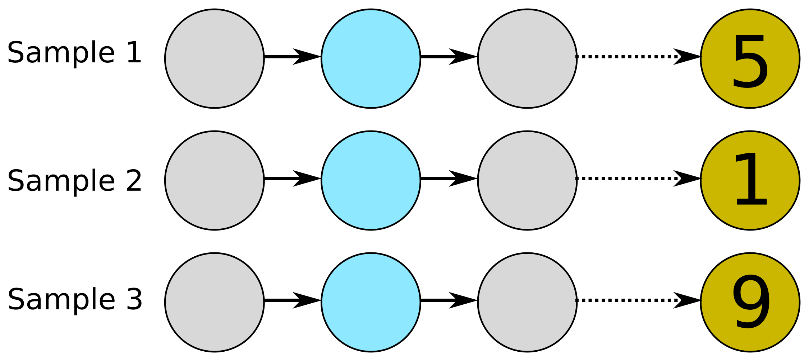
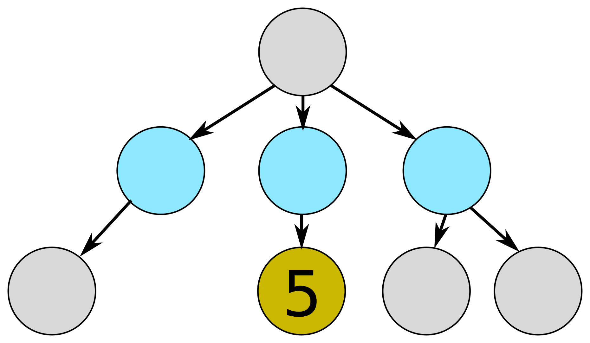
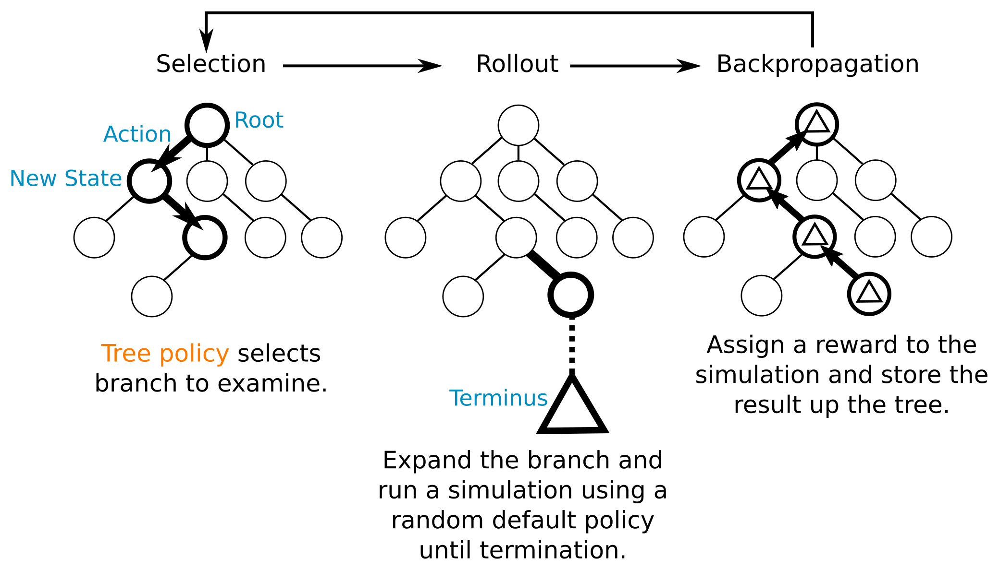
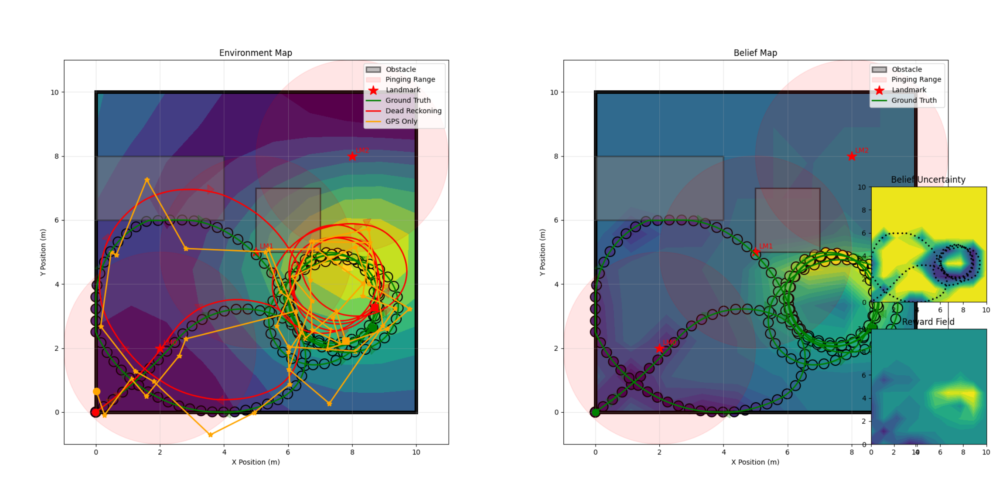

## Today
* Approximate POMDP Solvers: Compositional Algorithms
* Greedy (Myopic) Search
* Nonmyopic Search
* Brainstorming for Deep Dives

## For Next Time
* Work on the [Week 12 Day Assignments](https://canvas.olin.edu/courses/1002/assignments/18649) (Due April 13th, 7PM).
* Submit your [deep dive](../projects/deepdive_2.md) proposals -- [Canvas Submission](https://canvas.olin.edu/courses/1002/assignments/17541) (Due April 13th, 1PM).


## Approximate POMDP Solvers
We have been dissecting a modern POMDP solver over the last few classes.

<p align="center">

</p>

Across all solvers, the key is that we need to turn robot observations into actions that the robot can take, which hopefully lead to the robot successfully fulfilling its mission.

There are several key design decisions that need to be made for the solver:
* The robot belief representation
* The reward / value function, which is used to distinguish between actions
* The search heuristic, used to determine which actions to "score" in order to pick the best one and the form of the search itself (horizon, over what spaces, what simulator to use, etc.)

Today, we will carefully inspect the _search_ algorithm used within an approximate solver for a POMDP. 

### Search in a POMDP Solver
The search part of the approximate solver is the method to select the action that a robot should next perform. Thus, we are typically _searching over the space of actions_ and using some distinguishing criteria to select the best next action for a robot to take. 

The "next best action" is likely the one that maximizes expected approximated reward -- but over what horizon? This is the key design decision we will be inspecting today: over what _planning horizon_ should a next action be considered? 

There are two classes of search:
* **Myopic (Greedy) Search** -- this is a one-step look-ahead, where, based on the approximate reward function, the next best action is the one that maximizes immediate expected reward.
* **Nonmyopic Search** -- this is a multi-step look-ahead, where _chains of actions_ are simulated and scored according to the approximate reward, and the best next action to take is the one that maximizes expected future rewards. Within a nonmyopic search, there are additional design considerations, such as the length of each action chain (the planning horizon), and how chains are formed (the _search policy_).

Coupled with the search algorithm is how the state of actions is represented. You may have an action library (a discrete list of actions that the robot can execute) or you may have a continuous action space, which will need to be sampled in order to have atomic actions to evaluate. For our work today we will assume that the action space is discrete (or can be discretized).


## Greedy Myopic Search
Myopic planners (named after myopia, literally "short-sightedness") simply select the single best action to take at some planning iteration $$t$$ according to the approximate reward function. The simplest interpretation is:

$$
a^* = \arg \max_{a \in \mathcal{A}} R(b_t,a)
$$

where the most rewarding action, $$a^*$$ is selected from all actions in $$\mathcal{A}$$ such that the reward is maximized with respect to the robot's current estimated state. In pseudocode, this search might be executed as:

```
a* = default_policy()
for a in A:
    expected_reward = R(b_t, a)
    if expected_reward > R(b_t, a*):
        a* = a
return a*
```
It may seem obvious here that the choice of a myopic search is sensitive to the form of the action set and the reward function: making only local choices can lead to arbitrarily poor performance in even simple worlds if action sets can't "step" far enough, or the reward function fails to converge effectively to the true task reward as the belief is updated. Consider for example the MSS POMDP -- how might a greedy myopic search fail depending on choice of action set or reward function?


## Nonmyopic Search
In an attempt to address issues with myopic planning, nonmyopic planners trade computational time for more robust action selections. In a nonmyopic planner, the _expected finite horizon reward_ is approximated for each immediate action in the action space. This is often done by simulating many possible chains of actions from a starting action and scoring the expected cumulative reward from each chain.

<p align="center">

</p>

However, naively just sampling the space of trajectories (for instance, using a technique like Monte Carlo evaluation), which straightforward to implement, would require too many samples to get a good estimate of expected reward. Instead, it would be useful to _strategically_ explore the space of actions to select good potential policies. This might be done using a classical _tree search_ structure, through which action chains, possible observations, and possible rewards are computed down different branches of the tree.

<p align="center">

</p>

In practice, however, exhaustive search is impossible, and such a tree can get very, very large -- if any of the action, state, or observation spaces are continuous, then each node in the tree has effectively a probability of 0 in being re-visited, leading to challenges in robust estimation of cumulative reward.


### Monte Carlo Tree Search
You might get the sense that we have set ourselves up with another explore-exploit problem within our own POMDP solver: _how do we strategically explore the space of actions to take in order to get a good estimate of possible reward?_ To manage this problem, there are some forms of tree search that monitor the expansion of a tree utilizing _a tree (expansion) policy_ to select nodes to revisit and control the growth of the tree itself. 

Indeed, this is like embedding another planner in a planner, where the action space is now which node to re-explore or newly add to the tree, and the internal tree policy reward balances explore-exploit within it.

One such common type of guided tree search is Monte Carlo Tree Search (MCTS), which consists of several steps:
1. **Selection**: A valid action from the robot's current state is selected for exploration based on the tree policy.
2. **Rollout**: Forward simulation is run, where the selected action is simulated and a series of random actions (Monte Carlo samples) are then run up to a horizon $$h$$. The reward of the simulated trajectory is computed.
3. **Backup/Backpropagation**: The value of the root action is updated to be the average reward accumulated by the present simulation and all previous simulations run through that node.
4. **Repeat 1-3** until a termination criteria is met (number of planning iterations, allowable compute time, convergence to a best policy)
5. **Return the next best action**

<p align="center">

</p>

A common tree policy is the Upper Confidence bound for Tree search (UCT), which selects the action node to explore based on its current cumulative reward tempered with the number of times the node has been expanded. The tree policy thus can select nodes that may be very high valued, or nodes that have been rarely explored, thus balancing explore-exploit within the tree search itself. You might summarize this policy like: _Actions that are promising should be explored more than actions that seem bad; I should also look at every action at least once_.

$$
Q^*(b_t,a) = Q(b_t,a) + \sqrt{\frac{N(b_t)^{e_d}}{N(b_t,a)}}
$$

where $$Q(b_t,a)$$ is the average accumulated approximate reward over a simulated action sequence, $$N(b_t)$$ is the number of times the node $$b_t$$ has been simulated, $$N(b_t,a)$$ is the number of times the action $$a$$ was simulated from $$b_t$$, and $$e^d$$ is some design parameter.

While nonmyopic search algorithms are a bit more robust to arbitrarily poor performance than greedy solvers, they do contain significantly more design decisions, all of which can have an impact on the ultimate computational efficiency of the algorithm and convergence properties. 


## Today's So What
Today, we learned about search algorithms, the last puzzle piece for creating an approximate POMDP solver. We saw that there are computationally efficient solvers with potentially arbitrarily poor performance and computationally taxing solvers with further design considerations that have more robust performance guarantees. This is a tricky design decision that needs to be made based on pre-supposed understanding of a particular task, and the consequences of task failure or sub-par performance. 

As we've also seen, search is itself an explore-exploit problem, posed in the space of actions and beliefs in a system. This leads to a wealth of possible innovative and creative opportunities for further examination and research.


## Going Further
To learn more about tree searches, you might find the following resources useful:
* The background chapters of [Adaptive sampling of transient environmental phenomena with autonomous mobile platforms](https://dspace.mit.edu/handle/1721.1/124212), Preston, 2019.
* [Continuous upper confidence trees with polynomial exploration - consistency](https://inria.hal.science/hal-00835352v1/document), Auger et al., 2013.
* This [presentation](https://docs.google.com/presentation/d/1EDupQ8LOZwwKld1OWn6qJa4CjbxE1gJ4LOIvfhtrX-Y/edit?slide=id.p#slide=id.p) providing an overview of Remi Coulom's "Efficient Selectivity and Backup Operators in Monte-Carlo Tree Search," 2006.


## Day Assignment
Today's day assignment will implement the last part that we need to have a closed-loop autonomous adaptive sampling robot in our simulator. It also carves out time for brainstorming about your deep dive projects.

### Problem 1: A Simulated Informative Sampler
We're finally going to enable our simulated robot to be fully autonomous. To start, pull upstream changes to the `informative_sampling` branch:

```
git fetch upstream
git checkout informative_sampling
git pull upstream informative_sampling
```

You'll see in this update that 1 new file: `planner.py`, which sets up a `Planner` class.

```python
import numpy as np

class Planner:
    '''Implements a  planner class; greedy by default.'''
    def __init__(self, actions, reward, robot):
        self.actions = actions  # action class
        self.reward = reward  # reward class
        self.robot = robot  # robot class to operate with
    
    def select_action(self):
        # picks the best action according to the reward function
        waypoint_targets = self.actions.get_actions_as_waypoints(self.robot, "differential")
        best_action_value = -1000
        best_action = None
        for action_num in waypoint_targets.keys():
            waypoint = waypoint_targets[action_num]
            waypoint_mean, waypoint_cov = self.robot.belief.predict(np.asarray([waypoint[0], waypoint[1]]).reshape(1, -1), return_cov=True)
            action_reward = self.reward(waypoint_mean[0], waypoint_cov[0])
            if action_reward > best_action_value:
                best_action_value = action_reward
                best_action = action_num
        return best_action
```

**Everyone**: What type of search is implemented here? What might some limitations of this approach be?

This new planner class is implemented in a slightly updated `autonomy_simulator.py`, instantiated at line 135 and utilized at line 184.

**Everyone**: Experiment with this new implementation! How sensitive does the robot's explore-exploit behavior seem to be based on your selected reward function and parameters? Can you get it to converge at a maximum? Does it ever converge somewhere else? How important does the action-set definition seem to be in the performance?

**Optional Extension**: Consider how you might implement another type of search algorithm; what type of interface changes would you need to make in the planner class? How might you think about implementing this other type of search?

<p align="center">

</p>


### Problem 2: Deep Dive Brainstorming
You've now had a chance to walk through the entire process of formulating a robotics problem as a decision process, identifying aspects of an approximate solver for that process, and implementing an experimental test of the approximate solver. This deep dive is your chance to examine more about all or part of this process, or related concepts in decision-making under uncertainty! Take some time with this day assignment to [read through the Deep Dive assignment](../projects/deepdive_2.md) and brainstorm ideas -- feel free to chat with others! Some suggested starting points:
* You might consider any one of the "optional extensions" as a starting point for a deep dive.
* Check out the "Going Further" sections in this unit for some related resources.
* Do a brief literature search in a field or problem you think would be neat to solve with an autonomous robot.
